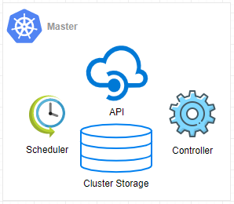
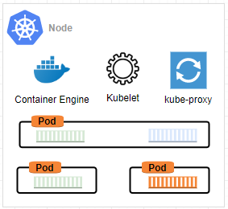
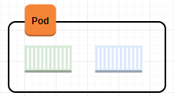

## Masters

## Nodes

## Pods

## Services

## Deployments

## Installation:
[Install kubectl on Windows](https://kubernetes.io/docs/tasks/tools/install-kubectl/#install-kubectl-on-windows)

[Installing minikube on Windows](https://kubernetes.io/docs/tasks/tools/install-minikube/)
