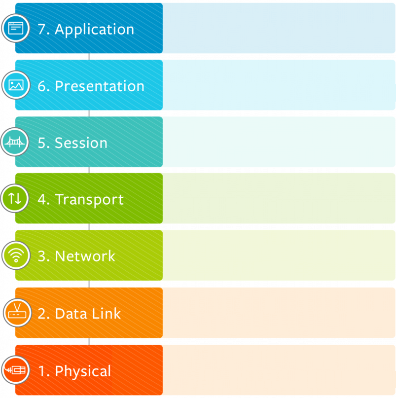
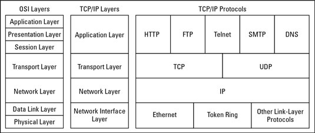

# Networking Concepts and Protocols

## OSI Model (Open Systems Interconnection)

## TCP/IP Model

## Protocols and Port Numbers
## TCP and UDP
## Binary and Hexadecimal
## IP Addressing
## Subnetting Networks
## IPv6
## Ethernet and Switching
## Switching Features
## IP Routing
## Network Services

