- [Code Quality and Security | SonarQube](https://www.sonarqube.org/)
- [Install](https://docs.sonarqube.org/latest/setup/get-started-2-minutes/)
- [Install the Server](https://docs.sonarqube.org/latest/setup/install-server/)
- [SonarScanner for MSBuild](https://docs.sonarqube.org/latest/analysis/scan/sonarscanner-for-msbuild/)

## Install JDK
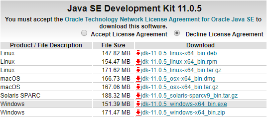
##
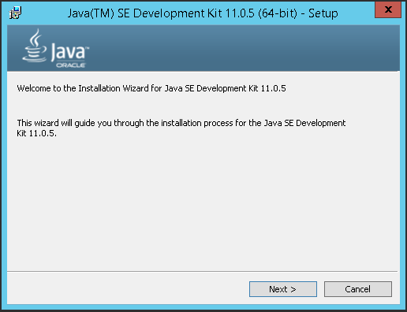
##
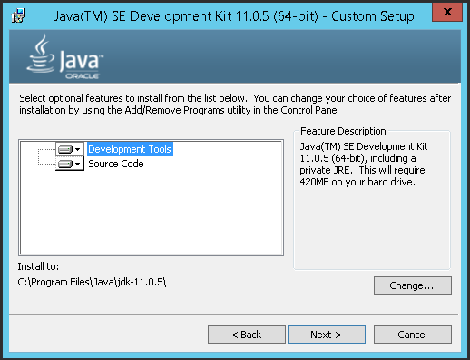
##
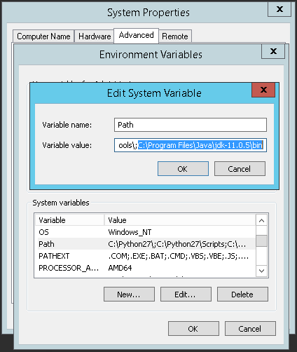
##

## Install SonarQube
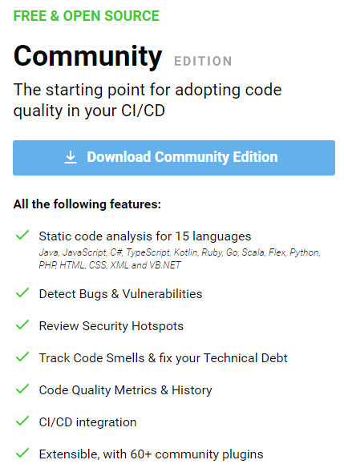
##
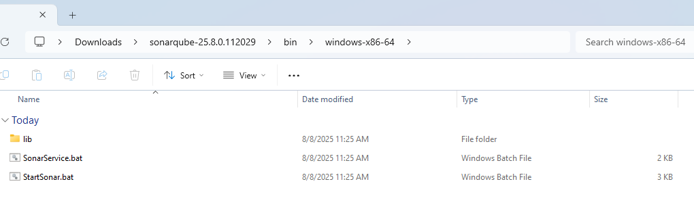
##
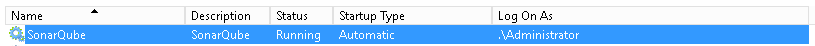
##
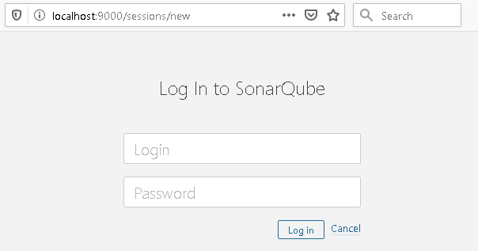
##

## Configure MS SQL Server DB
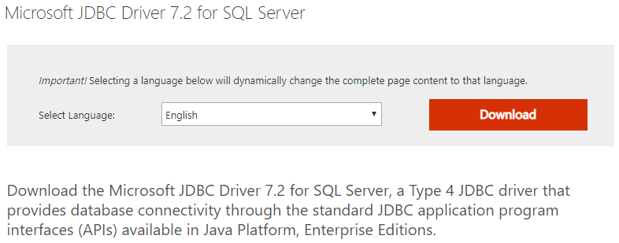
##
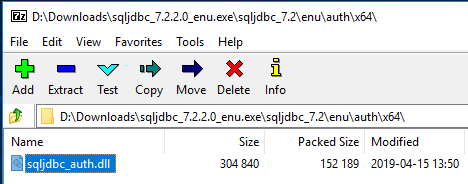
##
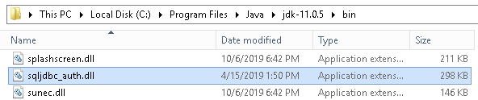
##
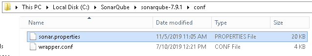
##
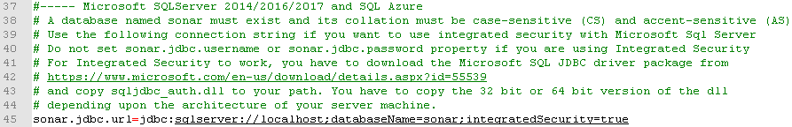
##

## Configre Sonar Scanner MSBuild
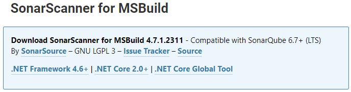
##
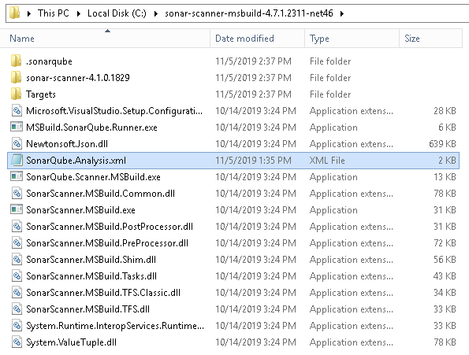
##
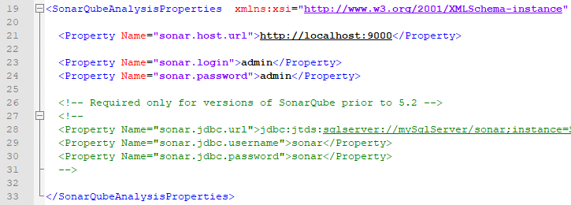
##

```ps
"C:\sonar-scanner-msbuild-4.7.1.2311-net46\SonarScanner.MSBuild.exe" begin /k:"Project-Key" /v:"%build.number%"
"C:\Program Files (x86)\Microsoft Visual Studio\2017\BuildTools\MSBuild\15.0\Bin\MSBuild.exe" "%teamcity.build.checkoutDir%\SolutionName.sln" /t:Rebuild /v:m
"C:\sonar-scanner-msbuild-4.7.1.2311-net46\SonarScanner.MSBuild.exe" end
```