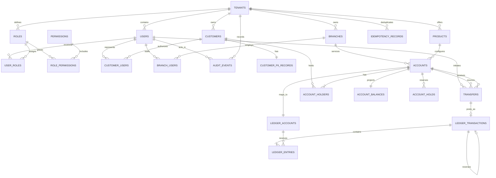
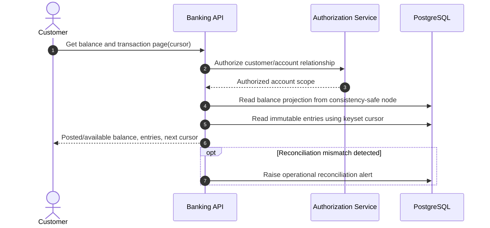
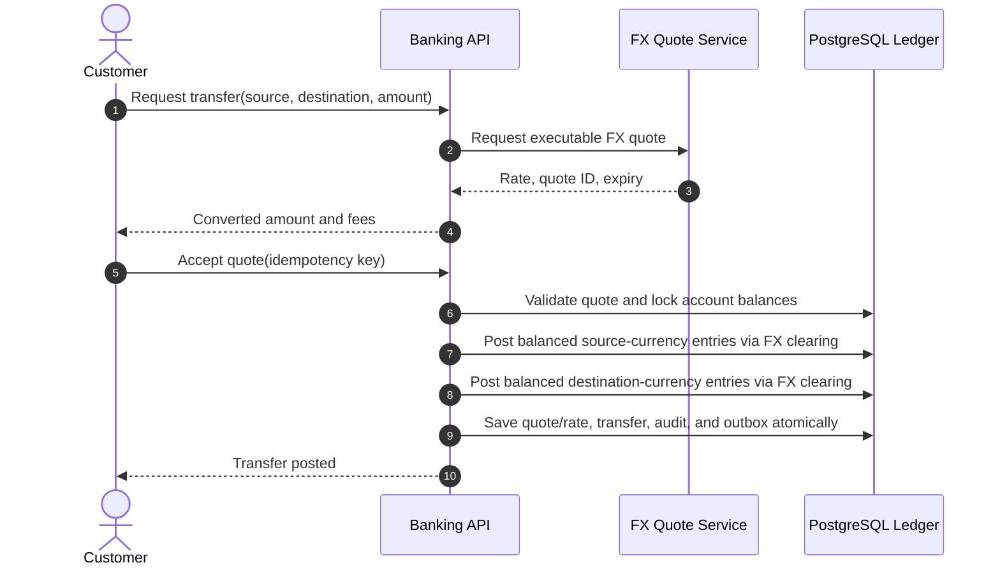

# Banking Database Design

This document defines a production-oriented relational database for a retail banking system. The design uses PostgreSQL, an immutable double-entry ledger, and separate workflow records for money movement. It supports customer and joint accounts, internal transfers, holds, fees, reversals, auditability, and high-volume balance reads.

## Scope and assumptions

- One deployment can serve multiple legal entities through `tenant_id`.
- Every account has one product and one currency. Cross-currency transfers are modeled as linked postings through FX clearing accounts.
- Posted ledger entries are immutable. Corrections create compensating transactions; they never update or delete history.
- Monetary values use `numeric(19,4)` (or the institution's required precision), never floating-point or PostgreSQL `money`.
- UTC is used for all instants (`timestamptz`). Business dates are stored separately where required.
- Authentication secrets, card PANs, and documents are outside this core schema. Store them in dedicated identity, card-vault, or object-storage systems and retain only references here.

## Core invariants

1. A posted ledger transaction balances: total debits equal total credits for each currency.
2. Every ledger entry belongs to exactly one posted transaction and has a positive amount.
3. Posted transactions and entries cannot be mutated or deleted.
4. An account and its customer-facing ledger account use the same currency.
5. A request with the same `(tenant_id, idempotency_key)` has exactly one business outcome.
6. A reversal references the original transaction and uses equal, opposite entries. A transaction can be fully reversed only once.
7. A transfer cannot make available funds negative unless the account's product permits overdraft.
8. Balance updates, ledger postings, and workflow state changes commit in one database transaction.

## Identity and authorization tables

Authentication identities are separate from banking customers. One user may represent multiple customer relationships, and organizational customers may have multiple users.

| Table | Important columns | Purpose and constraints |
|---|---|---|
| `users` | `user_id`, `tenant_id`, `identity_subject`, `email_hash`, `status`, login timestamps | Application identity linked to an external identity provider; no passwords or tokens are stored here. |
| `roles` | `role_id`, `tenant_id`, `role_code`, `name`, `description`, `is_system` | Tenant-scoped role such as customer, teller, operations, auditor, or administrator. |
| `permissions` | `permission_id`, `permission_code`, `description` | Global permission catalog such as `accounts.read` or `ledger.post`. |
| `user_roles` | `user_role_id`, `tenant_id`, `user_id`, `role_id`, optional scope, assignment/expiry fields | Assigns global or resource-scoped roles to users with an auditable grantor. |
| `role_permissions` | `tenant_id`, `role_id`, `permission_id`, `granted_at` | Normalized many-to-many role permission grants. |
| `customer_users` | `customer_id`, `user_id`, `relationship_type`, validity/status fields | Links login identities to person or organization customers; supports several users per organization and one user acting for several customers. |
| `branch_users` | `branch_id`, `user_id`, `job_title`, validity/status fields | Links employee identities to their operating branch; permissions still come from roles. |

The access path is `users → customer_users/branch_users → domain principal`, while authorization is `users → user_roles → roles → role_permissions → permissions`. Money-moving and audit rows point back to the responsible identity through `initiated_by_user_id` or `actor_user_id`.

## High-level data model



`ACCOUNT` represents the customer's banking product. `LEDGER_ACCOUNT` represents a posting destination in the chart of accounts. A customer account has one primary ledger account; the chart also contains internal accounts for cash, settlement, suspense, fees, interest, and FX clearing.

## Tables

All primary keys are UUIDs unless noted. Prefer UUIDv7 for time-ordered inserts. Every tenant-owned unique constraint includes `tenant_id` so identifiers cannot collide across legal entities.

### Party and product tables

| Table | Important columns | Purpose and constraints |
|---|---|---|
| `tenants` | `tenant_id`, `code`, `name`, `base_currency`, `status` | Legal entity or bank partition. `code` is unique. |
| `branches` | `branch_id`, `tenant_id`, `branch_code`, `name`, `timezone`, `status` | Servicing branch. Unique `(tenant_id, branch_code)`. |
| `customers` | `customer_id`, `tenant_id`, `customer_number`, `customer_type`, `status`, `risk_rating`, `created_at` | Non-sensitive customer record. Type is `PERSON` or `ORGANIZATION`. |
| `customer_pii_records` | `customer_id`, `legal_name_ciphertext`, `date_of_birth_ciphertext`, `tax_id_hash`, `contact_ciphertext`, `encryption_key_version` | Encrypted PII, isolated for stricter access control. Searchable identifiers use keyed hashes. |
| `products` | `product_id`, `tenant_id`, `product_code`, `account_type`, `currency`, `minimum_balance`, `overdraft_limit`, `interest_rule_version`, `status` | Versioned account configuration. Avoid changing terms retroactively; create a new version. |
| `accounts` | `account_id`, `tenant_id`, `account_number_token`, `account_number_hash`, `product_id`, `branch_id`, `currency`, `status`, `opened_at`, `closed_at`, `version` | Customer-facing deposit or loan account. Display numbers are tokenized; deterministic keyed hashes support lookup. Optimistic `version` guards workflow updates. |
| `account_holders` | `account_id`, `customer_id`, `role`, `ownership_percent`, `valid_from`, `valid_to` | Supports primary, joint, trustee, and authorized-signatory relationships. Unique active relationship per account/customer/role. |

The `currency` column duplicated on `accounts` is intentional for efficient validation and must be checked against `products.currency` by the account-opening service or a trigger.

### Ledger tables

| Table | Important columns | Purpose and constraints |
|---|---|---|
| `ledger_accounts` | `ledger_account_id`, `tenant_id`, `account_id NULL`, `code`, `name`, `account_class`, `normal_side`, `currency`, `status` | Chart of accounts. `account_id` is set for customer subledger accounts and null for internal GL accounts. Classes: `ASSET`, `LIABILITY`, `EQUITY`, `REVENUE`, `EXPENSE`. |
| `ledger_transactions` | `ledger_transaction_id`, `tenant_id`, `transaction_type`, `business_date`, `posted_at`, `reference`, `idempotency_key`, `reversal_of NULL`, `metadata` | Immutable posting header. Unique `(tenant_id, idempotency_key)` and unique non-null `reversal_of`. |
| `ledger_entries` | `entry_id bigint`, `tenant_id`, `ledger_transaction_id`, `ledger_account_id`, `side`, `amount`, `currency`, `sequence_no`, `created_at` | Immutable debit or credit line. Check `amount > 0`; unique `(ledger_transaction_id, sequence_no)`. |
| `account_balances` | `ledger_account_id`, `tenant_id`, `debit_total`, `credit_total`, `posted_balance`, `available_balance`, `as_of_entry_id`, `version`, `updated_at` | Strongly consistent projection updated in the posting transaction. It is rebuildable from entries and not the source of truth. |

For an account with `normal_side = CREDIT` (for example, a customer deposit liability), `posted_balance = credit_total - debit_total`. For an account with `normal_side = DEBIT` (for example, a loan asset), it is `debit_total - credit_total`.

### Money-movement and operational tables

| Table | Important columns | Purpose and constraints |
|---|---|---|
| `transfers` | `transfer_id`, `tenant_id`, `source_account_id`, `destination_account_id`, `amount`, `currency`, `status`, `client_reference`, `idempotency_key`, `ledger_transaction_id NULL`, `failure_code`, `created_at`, `updated_at`, `version` | Transfer workflow. Status: `CREATED`, `AUTHORIZED`, `POSTED`, `FAILED`, `CANCELLED`. Unique tenant/idempotency key. |
| `account_holds` | `hold_id`, `tenant_id`, `account_id`, `amount`, `currency`, `status`, `reason`, `expires_at`, `captured_transaction_id NULL`, `created_at`, `version` | Reservation that reduces available balance without changing posted balance. Status: `ACTIVE`, `CAPTURED`, `RELEASED`, `EXPIRED`. |
| `idempotency_records` | `tenant_id`, `idempotency_key`, `operation`, `request_hash`, `resource_type`, `resource_id`, `response_code`, `response_body`, `expires_at`, `created_at` | Replays the original result and rejects reuse of a key with a different request hash. Primary key `(tenant_id, idempotency_key)`. |
| `outbox_events` | `event_id bigint`, `tenant_id`, `aggregate_type`, `aggregate_id`, `event_type`, `payload`, `occurred_at`, `published_at NULL`, `attempt_count` | Transactional outbox for reliable event publication. Inserted in the same commit as the domain change. |
| `audit_events` | `audit_event_id bigint`, `tenant_id`, `occurred_at`, `actor_type`, `actor_id`, `action`, `resource_type`, `resource_id`, `request_id`, `source_ip`, `before_hash`, `after_hash`, `details` | Append-only security and administrative audit trail. Do not place plaintext PII or secrets in `details`. |

## Complete PostgreSQL schema, constraints, and indexes

The following dependency-ordered DDL creates the complete relational model documented above. Enums may be replaced with reference tables when values need to change without a migration.

```sql
CREATE EXTENSION IF NOT EXISTS pgcrypto;

CREATE TYPE ledger_side AS ENUM ('DEBIT', 'CREDIT');
CREATE TYPE ledger_account_class AS ENUM
  ('ASSET', 'LIABILITY', 'EQUITY', 'REVENUE', 'EXPENSE');

CREATE TABLE currencies (
    code        char(3) PRIMARY KEY,
    minor_units smallint NOT NULL CHECK (minor_units BETWEEN 0 AND 6),
    enabled     boolean NOT NULL DEFAULT true
);

CREATE TABLE tenants (
    tenant_id    uuid PRIMARY KEY DEFAULT gen_random_uuid(),
    code         text NOT NULL UNIQUE,
    name         text NOT NULL,
    base_currency char(3) NOT NULL REFERENCES currencies(code),
    status       text NOT NULL CHECK (status IN ('ACTIVE','SUSPENDED','CLOSED')),
    created_at   timestamptz NOT NULL DEFAULT clock_timestamp()
);

CREATE TABLE branches (
    branch_id   uuid PRIMARY KEY DEFAULT gen_random_uuid(),
    tenant_id  uuid NOT NULL REFERENCES tenants(tenant_id),
    branch_code text NOT NULL,
    name        text NOT NULL,
    timezone    text NOT NULL,
    status      text NOT NULL CHECK (status IN ('ACTIVE','CLOSED')),
    UNIQUE (tenant_id, branch_id),
    UNIQUE (tenant_id, branch_code)
);

CREATE TABLE users (
    user_id uuid PRIMARY KEY DEFAULT gen_random_uuid(),
    tenant_id uuid NOT NULL REFERENCES tenants(tenant_id),
    identity_subject text NOT NULL, email_hash bytea NULL,
    status text NOT NULL CHECK (status IN ('INVITED','ACTIVE','LOCKED','DISABLED')),
    last_login_at timestamptz NULL,
    created_at timestamptz NOT NULL DEFAULT clock_timestamp(),
    updated_at timestamptz NOT NULL DEFAULT clock_timestamp(),
    UNIQUE (tenant_id, user_id), UNIQUE (tenant_id, identity_subject)
);

CREATE TABLE roles (
    role_id uuid PRIMARY KEY DEFAULT gen_random_uuid(),
    tenant_id uuid NOT NULL REFERENCES tenants(tenant_id),
    role_code text NOT NULL, name text NOT NULL, description text NULL,
    is_system boolean NOT NULL DEFAULT false,
    created_at timestamptz NOT NULL DEFAULT clock_timestamp(),
    UNIQUE (tenant_id, role_id), UNIQUE (tenant_id, role_code)
);

CREATE TABLE permissions (
    permission_id uuid PRIMARY KEY DEFAULT gen_random_uuid(),
    permission_code text NOT NULL UNIQUE, description text NOT NULL
);

CREATE TABLE role_permissions (
    tenant_id uuid NOT NULL, role_id uuid NOT NULL,
    permission_id uuid NOT NULL REFERENCES permissions(permission_id),
    granted_at timestamptz NOT NULL DEFAULT clock_timestamp(),
    PRIMARY KEY (role_id, permission_id),
    FOREIGN KEY (tenant_id, role_id) REFERENCES roles(tenant_id, role_id)
);

CREATE TABLE user_roles (
    user_role_id uuid PRIMARY KEY DEFAULT gen_random_uuid(),
    tenant_id uuid NOT NULL, user_id uuid NOT NULL, role_id uuid NOT NULL,
    scope_type text NULL, scope_id uuid NULL,
    assigned_by_user_id uuid NULL,
    assigned_at timestamptz NOT NULL DEFAULT clock_timestamp(),
    expires_at timestamptz NULL,
    FOREIGN KEY (tenant_id, user_id) REFERENCES users(tenant_id, user_id),
    FOREIGN KEY (tenant_id, role_id) REFERENCES roles(tenant_id, role_id),
    FOREIGN KEY (tenant_id, assigned_by_user_id) REFERENCES users(tenant_id, user_id),
    CHECK ((scope_type IS NULL) = (scope_id IS NULL)),
    CHECK (expires_at IS NULL OR expires_at > assigned_at)
);

CREATE TABLE customers (
    customer_id     uuid PRIMARY KEY DEFAULT gen_random_uuid(),
    tenant_id       uuid NOT NULL REFERENCES tenants(tenant_id),
    customer_number text NOT NULL,
    customer_type   text NOT NULL CHECK (customer_type IN ('PERSON','ORGANIZATION')),
    status          text NOT NULL CHECK (status IN ('PENDING','ACTIVE','RESTRICTED','CLOSED')),
    risk_rating     text NULL,
    created_at      timestamptz NOT NULL DEFAULT clock_timestamp(),
    UNIQUE (tenant_id, customer_id),
    UNIQUE (tenant_id, customer_number)
);

CREATE TABLE customer_pii_records (
    customer_id              uuid PRIMARY KEY REFERENCES customers(customer_id),
    legal_name_ciphertext    bytea NOT NULL,
    date_of_birth_ciphertext bytea NULL,
    tax_id_hash              bytea NULL,
    contact_ciphertext       bytea NULL,
    encryption_key_version   integer NOT NULL CHECK (encryption_key_version > 0),
    updated_at               timestamptz NOT NULL DEFAULT clock_timestamp()
);

CREATE TABLE products (
    product_id            uuid PRIMARY KEY DEFAULT gen_random_uuid(),
    tenant_id             uuid NOT NULL REFERENCES tenants(tenant_id),
    product_code          text NOT NULL,
    version_no            integer NOT NULL CHECK (version_no > 0),
    account_type          text NOT NULL CHECK (account_type IN ('CHECKING','SAVINGS','LOAN')),
    currency              char(3) NOT NULL REFERENCES currencies(code),
    minimum_balance       numeric(19,4) NOT NULL DEFAULT 0,
    overdraft_limit       numeric(19,4) NOT NULL DEFAULT 0 CHECK (overdraft_limit >= 0),
    interest_rule_version text NULL,
    status                text NOT NULL CHECK (status IN ('DRAFT','ACTIVE','RETIRED')),
    UNIQUE (tenant_id, product_code, version_no)
);

CREATE TABLE accounts (
    account_id           uuid PRIMARY KEY DEFAULT gen_random_uuid(),
    tenant_id            uuid NOT NULL REFERENCES tenants(tenant_id),
    account_number_token text NOT NULL,
    account_number_hash  bytea NOT NULL,
    product_id           uuid NOT NULL REFERENCES products(product_id),
    branch_id            uuid NOT NULL REFERENCES branches(branch_id),
    currency             char(3) NOT NULL REFERENCES currencies(code),
    status               text NOT NULL CHECK (status IN ('PENDING','ACTIVE','FROZEN','CLOSED')),
    opened_at            timestamptz NOT NULL,
    closed_at            timestamptz NULL,
    version              bigint NOT NULL DEFAULT 0,
    CHECK (closed_at IS NULL OR closed_at >= opened_at),
    CHECK (status <> 'CLOSED' OR closed_at IS NOT NULL),
    UNIQUE (tenant_id, account_id),
    UNIQUE (tenant_id, account_number_hash)
);

CREATE TABLE account_holders (
    tenant_id           uuid NOT NULL,
    account_id          uuid NOT NULL,
    customer_id         uuid NOT NULL,
    role                text NOT NULL CHECK (role IN ('PRIMARY','JOINT','TRUSTEE','SIGNATORY')),
    ownership_percent   numeric(5,2) NULL CHECK
        (ownership_percent IS NULL OR ownership_percent BETWEEN 0 AND 100),
    valid_from          date NOT NULL,
    valid_to            date NULL,
    PRIMARY KEY (account_id, customer_id, role, valid_from),
    FOREIGN KEY (tenant_id, account_id) REFERENCES accounts(tenant_id, account_id),
    FOREIGN KEY (tenant_id, customer_id) REFERENCES customers(tenant_id, customer_id),
    CHECK (valid_to IS NULL OR valid_to >= valid_from)
);

CREATE TABLE customer_users (
    tenant_id uuid NOT NULL, customer_id uuid NOT NULL, user_id uuid NOT NULL,
    relationship_type text NOT NULL CHECK
        (relationship_type IN ('SELF','OWNER','AUTHORIZED_REPRESENTATIVE','EMPLOYEE')),
    status text NOT NULL CHECK (status IN ('ACTIVE','SUSPENDED','REVOKED')),
    valid_from timestamptz NOT NULL DEFAULT clock_timestamp(), valid_to timestamptz NULL,
    PRIMARY KEY (customer_id, user_id, valid_from),
    FOREIGN KEY (tenant_id, customer_id) REFERENCES customers(tenant_id, customer_id),
    FOREIGN KEY (tenant_id, user_id) REFERENCES users(tenant_id, user_id),
    CHECK (valid_to IS NULL OR valid_to > valid_from)
);

CREATE TABLE branch_users (
    tenant_id uuid NOT NULL, branch_id uuid NOT NULL, user_id uuid NOT NULL,
    job_title text NULL,
    status text NOT NULL CHECK (status IN ('ACTIVE','SUSPENDED','REVOKED')),
    valid_from timestamptz NOT NULL DEFAULT clock_timestamp(), valid_to timestamptz NULL,
    PRIMARY KEY (branch_id, user_id, valid_from),
    FOREIGN KEY (tenant_id, branch_id) REFERENCES branches(tenant_id, branch_id),
    FOREIGN KEY (tenant_id, user_id) REFERENCES users(tenant_id, user_id),
    CHECK (valid_to IS NULL OR valid_to > valid_from)
);

CREATE TABLE ledger_accounts (
    ledger_account_id uuid PRIMARY KEY DEFAULT gen_random_uuid(),
    tenant_id         uuid NOT NULL REFERENCES tenants(tenant_id),
    account_id        uuid NULL REFERENCES accounts(account_id),
    code              text NOT NULL,
    name              text NOT NULL,
    account_class     ledger_account_class NOT NULL,
    normal_side       ledger_side NOT NULL,
    currency          char(3) NOT NULL,
    status            text NOT NULL CHECK (status IN ('ACTIVE', 'FROZEN', 'CLOSED')),
    created_at        timestamptz NOT NULL DEFAULT clock_timestamp(),
    UNIQUE (tenant_id, code),
    UNIQUE (account_id)
);

CREATE TABLE ledger_transactions (
    ledger_transaction_id uuid PRIMARY KEY DEFAULT gen_random_uuid(),
    tenant_id              uuid NOT NULL REFERENCES tenants(tenant_id),
    transaction_type       text NOT NULL,
    business_date          date NOT NULL,
    posted_at              timestamptz NOT NULL DEFAULT clock_timestamp(),
    reference              text NULL,
    idempotency_key        text NOT NULL,
    reversal_of            uuid NULL REFERENCES ledger_transactions(ledger_transaction_id),
    metadata               jsonb NOT NULL DEFAULT '{}'::jsonb,
    UNIQUE (tenant_id, idempotency_key),
    UNIQUE (reversal_of)
);

CREATE TABLE ledger_entries (
    entry_id               bigint GENERATED ALWAYS AS IDENTITY PRIMARY KEY,
    tenant_id              uuid NOT NULL REFERENCES tenants(tenant_id),
    ledger_transaction_id  uuid NOT NULL REFERENCES ledger_transactions(ledger_transaction_id),
    ledger_account_id      uuid NOT NULL REFERENCES ledger_accounts(ledger_account_id),
    side                   ledger_side NOT NULL,
    amount                 numeric(19,4) NOT NULL CHECK (amount > 0),
    currency               char(3) NOT NULL,
    sequence_no            smallint NOT NULL CHECK (sequence_no > 0),
    created_at             timestamptz NOT NULL DEFAULT clock_timestamp(),
    UNIQUE (ledger_transaction_id, sequence_no)
);

CREATE TABLE account_balances (
    ledger_account_id uuid PRIMARY KEY REFERENCES ledger_accounts(ledger_account_id),
    tenant_id         uuid NOT NULL REFERENCES tenants(tenant_id),
    debit_total       numeric(19,4) NOT NULL DEFAULT 0 CHECK (debit_total >= 0),
    credit_total      numeric(19,4) NOT NULL DEFAULT 0 CHECK (credit_total >= 0),
    posted_balance    numeric(19,4) NOT NULL DEFAULT 0,
    available_balance numeric(19,4) NOT NULL DEFAULT 0,
    as_of_entry_id    bigint NULL,
    version           bigint NOT NULL DEFAULT 0,
    updated_at        timestamptz NOT NULL DEFAULT clock_timestamp()
);

CREATE TABLE transfers (
    transfer_id           uuid PRIMARY KEY DEFAULT gen_random_uuid(),
    tenant_id             uuid NOT NULL REFERENCES tenants(tenant_id),
    initiated_by_user_id  uuid NULL,
    source_account_id     uuid NOT NULL REFERENCES accounts(account_id),
    destination_account_id uuid NOT NULL REFERENCES accounts(account_id),
    amount                numeric(19,4) NOT NULL CHECK (amount > 0),
    currency              char(3) NOT NULL REFERENCES currencies(code),
    status                text NOT NULL CHECK
        (status IN ('CREATED','AUTHORIZED','POSTED','FAILED','CANCELLED')),
    client_reference      text NULL,
    idempotency_key       text NOT NULL,
    ledger_transaction_id uuid NULL REFERENCES ledger_transactions(ledger_transaction_id),
    failure_code          text NULL,
    version               bigint NOT NULL DEFAULT 0,
    created_at            timestamptz NOT NULL DEFAULT clock_timestamp(),
    updated_at            timestamptz NOT NULL DEFAULT clock_timestamp(),
    FOREIGN KEY (tenant_id, initiated_by_user_id) REFERENCES users(tenant_id, user_id),
    CHECK (source_account_id <> destination_account_id),
    CHECK (status <> 'POSTED' OR ledger_transaction_id IS NOT NULL),
    UNIQUE (tenant_id, idempotency_key)
);

CREATE TABLE account_holds (
    hold_id                 uuid PRIMARY KEY DEFAULT gen_random_uuid(),
    tenant_id               uuid NOT NULL REFERENCES tenants(tenant_id),
    account_id              uuid NOT NULL REFERENCES accounts(account_id),
    amount                  numeric(19,4) NOT NULL CHECK (amount > 0),
    currency                char(3) NOT NULL REFERENCES currencies(code),
    status                  text NOT NULL CHECK
        (status IN ('ACTIVE','CAPTURED','RELEASED','EXPIRED')),
    reason                  text NULL,
    expires_at              timestamptz NOT NULL,
    captured_transaction_id uuid NULL REFERENCES ledger_transactions(ledger_transaction_id),
    version                 bigint NOT NULL DEFAULT 0,
    created_at              timestamptz NOT NULL DEFAULT clock_timestamp(),
    CHECK (status <> 'CAPTURED' OR captured_transaction_id IS NOT NULL)
);

CREATE TABLE idempotency_records (
    tenant_id       uuid NOT NULL REFERENCES tenants(tenant_id),
    idempotency_key text NOT NULL,
    operation       text NOT NULL,
    request_hash    bytea NOT NULL,
    resource_type   text NULL,
    resource_id     uuid NULL,
    response_code   integer NULL CHECK (response_code BETWEEN 100 AND 599),
    response_body   jsonb NULL,
    expires_at      timestamptz NOT NULL,
    created_at      timestamptz NOT NULL DEFAULT clock_timestamp(),
    PRIMARY KEY (tenant_id, idempotency_key)
);

CREATE TABLE outbox_events (
    event_id       bigint GENERATED ALWAYS AS IDENTITY PRIMARY KEY,
    tenant_id      uuid NOT NULL REFERENCES tenants(tenant_id),
    aggregate_type text NOT NULL,
    aggregate_id   uuid NOT NULL,
    event_type     text NOT NULL,
    payload        jsonb NOT NULL,
    occurred_at    timestamptz NOT NULL DEFAULT clock_timestamp(),
    published_at   timestamptz NULL,
    attempt_count  integer NOT NULL DEFAULT 0 CHECK (attempt_count >= 0)
);

CREATE TABLE audit_events (
    audit_event_id bigint GENERATED ALWAYS AS IDENTITY PRIMARY KEY,
    tenant_id      uuid NOT NULL REFERENCES tenants(tenant_id),
    actor_user_id  uuid NULL,
    occurred_at    timestamptz NOT NULL DEFAULT clock_timestamp(),
    actor_type     text NOT NULL,
    actor_id       text NULL,
    action         text NOT NULL,
    resource_type  text NOT NULL,
    resource_id    text NOT NULL,
    request_id     text NULL,
    source_ip      inet NULL,
    before_hash    bytea NULL,
    after_hash     bytea NULL,
    details        jsonb NOT NULL DEFAULT '{}'::jsonb,
    FOREIGN KEY (tenant_id, actor_user_id) REFERENCES users(tenant_id, user_id)
);

CREATE UNIQUE INDEX ux_user_roles_global
    ON user_roles (user_id, role_id) WHERE scope_type IS NULL;
CREATE UNIQUE INDEX ux_user_roles_scoped
    ON user_roles (user_id, role_id, scope_type, scope_id) WHERE scope_type IS NOT NULL;
CREATE INDEX ix_user_roles_active
    ON user_roles (tenant_id, user_id, expires_at);
CREATE INDEX ix_users_email_hash
    ON users (tenant_id, email_hash) WHERE email_hash IS NOT NULL;
CREATE UNIQUE INDEX ux_customer_users_active
    ON customer_users (customer_id, user_id) WHERE status = 'ACTIVE' AND valid_to IS NULL;
CREATE INDEX ix_customer_users_user ON customer_users (tenant_id, user_id, status);
CREATE UNIQUE INDEX ux_branch_users_active
    ON branch_users (branch_id, user_id) WHERE status = 'ACTIVE' AND valid_to IS NULL;
CREATE INDEX ix_branch_users_user ON branch_users (tenant_id, user_id, status);

CREATE INDEX ix_entry_account_history
    ON ledger_entries (tenant_id, ledger_account_id, entry_id DESC);
CREATE INDEX ix_transaction_posted_at
    ON ledger_transactions (tenant_id, posted_at DESC);
CREATE INDEX ix_outbox_unpublished
    ON outbox_events (event_id) WHERE published_at IS NULL;
CREATE INDEX ix_active_hold_expiry
    ON account_holds (expires_at) WHERE status = 'ACTIVE';
CREATE INDEX ix_account_customer_active
    ON account_holders (tenant_id, customer_id, valid_to);
CREATE INDEX ix_transfer_source_history
    ON transfers (tenant_id, source_account_id, created_at DESC);
CREATE INDEX ix_transfer_destination_history
    ON transfers (tenant_id, destination_account_id, created_at DESC);
CREATE INDEX ix_audit_resource_time
    ON audit_events (tenant_id, resource_type, resource_id, occurred_at DESC);
```

Foreign keys containing only an ID do not by themselves prove tenant consistency. In the complete migration, add composite alternate keys such as `UNIQUE (tenant_id, account_id)` and use composite foreign keys `(tenant_id, account_id)` for every tenant-owned relationship.

### Constraints that require triggers or the posting procedure

PostgreSQL `CHECK` constraints cannot aggregate sibling rows, so a deferred constraint trigger or a single privileged posting procedure must enforce:

```text
for every ledger_transaction and currency:
    SUM(amount WHERE side = 'DEBIT') = SUM(amount WHERE side = 'CREDIT')

for every ledger_entry:
    entry.tenant_id  = transaction.tenant_id = ledger_account.tenant_id
    entry.currency   = ledger_account.currency
```

Database roles used by applications should receive `EXECUTE` on the posting procedure, not direct `INSERT`, `UPDATE`, or `DELETE` rights on ledger tables. An immutability trigger must reject updates and deletes after insertion.

## Main use-case sequence diagrams

Read the diagrams from top to bottom. The sequence follows the business lifecycle, with alternative and failure paths branching from the relevant step.

**Lifecycle:** Account setup → account inquiry → fund reservation → internal movement → currency conversion → external settlement → correction

### 1. Open a customer account

```mermaid
sequenceDiagram
    autonumber
    actor Customer
    participant API as Banking API
    participant KYC as KYC/AML Service
    participant DB as PostgreSQL
    participant Docs as Document Store

    Customer->>API: Apply for account(product, identity data)
    API->>KYC: Submit verification with application ID
    KYC-->>API: Decision and opaque case reference
    alt Approved
        API->>DB: Create customer/account relationships and PENDING account
        API->>Docs: Store signed terms and disclosures
        Docs-->>API: Document references and checksums
        API->>DB: Activate account; append audit/outbox atomically
        API-->>Customer: Account opened
    else Review or rejected
        API->>DB: Record decision reference and application state
        API-->>Customer: Review/rejection status
    end
```

### 2. Retrieve balance and statement



### 3. Hold and capture

```mermaid
sequenceDiagram
    autonumber
    actor Client
    participant API as Banking API
    participant DB as PostgreSQL
    participant Expiry as Hold Expiry Worker

    Client->>API: Create hold(account, amount, key)
    API->>DB: Lock balance; check available funds
    API->>DB: Insert ACTIVE hold; reduce available balance
    API-->>Client: Hold created
    alt Merchant captures
        Client->>API: Capture hold
        API->>DB: Lock ACTIVE hold and balance
        API->>DB: Post ledger entries; mark CAPTURED atomically
        API-->>Client: Capture posted
    else Hold expires or is released
        Expiry->>DB: Claim due ACTIVE hold with SKIP LOCKED
        Expiry->>DB: Restore availability; mark EXPIRED atomically
    end
```

#### Flow details

- Creating a hold locks the balance row, checks funds, inserts an `ACTIVE` hold, and decreases only `available_balance`.
- Capturing posts normal ledger entries and atomically changes the hold to `CAPTURED`; it must not subtract the amount twice.
- Release or expiry restores available funds and changes status exactly once using the optimistic `version`.
- The expiry worker claims small batches with `FOR UPDATE SKIP LOCKED`.

### 4. Internal account transfer

```mermaid
sequenceDiagram
    autonumber
    actor Customer
    participant API as Banking API
    participant Auth as Authorization/Risk
    participant DB as PostgreSQL
    participant Bus as Event Bus

    Customer->>API: Transfer(source, destination, amount, idempotency key)
    API->>DB: Claim idempotency key
    alt Replayed request
        DB-->>API: Stored response
        API-->>Customer: Original result
    else New request
        API->>Auth: Validate actor, limits, and policy
        Auth-->>API: Approved
        API->>DB: BEGIN; lock balance rows in ID order
        DB-->>API: Accounts and available balance
        alt Funds and account state valid
            API->>DB: Insert balanced ledger entries
            API->>DB: Update balance projections and transfer
            API->>DB: Insert audit and outbox events; COMMIT
            API-->>Customer: Transfer posted
            DB-->>Bus: Publish transfer event from outbox
        else Validation fails
            API->>DB: Record failure; ROLLBACK/COMMIT result
            API-->>Customer: Transfer declined
        end
    end
```

#### Flow details

Both customer deposit accounts are liabilities to the bank. For a transfer of 100 USD:

| Sequence | Ledger account | Debit | Credit |
|---:|---|---:|---:|
| 1 | Source deposit liability | 100.00 | — |
| 2 | Destination deposit liability | — | 100.00 |

Within one serializable or carefully locked database transaction:

1. Claim the idempotency key and verify its request hash.
2. Lock the source and destination `account_balances` rows in deterministic `ledger_account_id` order.
3. Confirm account status, currency, limits, and sufficient available balance, including any allowed overdraft.
4. Insert the balanced ledger transaction and entries.
5. Update debit/credit totals and balance projections.
6. Mark the transfer `POSTED`, attach its ledger transaction, and insert outbox/audit events.
7. Commit and return the stored idempotent response.

### 5. Cross-currency transfer



#### Flow details

Persist the executable quote ID and rate, then post separately balanced legs in each currency through controlled FX clearing accounts. The source currency balances between the source and its FX account; the destination currency balances between its FX account and the destination. Never force two currencies into one arithmetic balance.

### 6. External payment settlement

```mermaid
sequenceDiagram
    autonumber
    actor Customer
    participant API as Banking API
    participant DB as Ledger/PostgreSQL
    participant Worker as Payment Worker
    participant Network as Payment Network

    Customer->>API: Submit outgoing payment
    API->>DB: Post customer debit and settlement-liability credit
    API->>DB: Save payment command and outbox event atomically
    API-->>Customer: Payment accepted
    Worker->>DB: Claim unpublished payment command
    Worker->>Network: Send payment with stable command ID
    Network-->>Worker: Settled or failed
    alt Settled
        Worker->>DB: Debit settlement liability; credit cash/nostro
        Worker->>DB: Mark settled and append events atomically
    else Failed
        Worker->>DB: Post linked reversal and mark failed atomically
    end
```

#### Flow details

At initiation, debit the customer's deposit liability and credit an outgoing-settlement liability. At network settlement, debit that liability and credit the bank's cash/nostro asset. A failed payment creates an explicit linked reversal; it never deletes the original posting.

### 7. Reverse a posted transaction

```mermaid
sequenceDiagram
    autonumber
    actor Operator
    participant API as Banking API
    participant Policy as Authorization/Policy
    participant DB as PostgreSQL Ledger
    participant Bus as Event Bus

    Operator->>API: Reverse transaction(reason, idempotency key)
    API->>Policy: Verify permission and reversal eligibility
    Policy-->>API: Approved
    API->>DB: Lock original transaction and affected balances
    alt Not previously reversed
        API->>DB: Insert linked transaction with entry sides swapped
        API->>DB: Update projections; append audit/outbox atomically
        DB-->>Bus: Publish transaction.reversed
        API-->>Operator: Reversal posted
    else Already reversed
        DB-->>API: Existing reversal
        API-->>Operator: Original idempotent result
    end
```

#### Flow details

A reversal inserts a new `ledger_transactions` row whose `reversal_of` points to the original, copying every original entry with `DEBIT` and `CREDIT` swapped. The unique constraint on `reversal_of` prevents duplicate full reversals. Partial refunds are separate linked business transactions.


## Non-functional Requirements

The targets below are initial service objectives and must be reconciled with regulatory, product-tier, and regional commitments.

### Exception Handling

- Return stable error codes with a correlation ID; do not expose account, ledger, or policy internals.
- Treat validation failures as terminal, dependency timeouts as retryable with bounded exponential backoff, and ambiguous commits as retries using the original idempotency key.
- Never repair financial errors by editing posted entries. Create linked reversals or adjustments and route reconciliation breaks to operations.

- Use `READ COMMITTED` with explicit balance-row locks, or `SERIALIZABLE` with bounded retries; never check and later debit a balance outside the protected transaction.
- Acquire multiple balance locks in deterministic ID order and use conditional state updates so concurrent workers cannot post twice.
- Continuously reconcile immutable entries to `account_balances`; any mismatch creates an operational exception.

### Availability

- Target 99.99% monthly availability for posting and balance APIs, excluding approved maintenance.
- Run the primary database across failure domains with automated failover; target RPO ≤ 5 minutes and RTO ≤ 30 minutes.
- Degrade noncritical functions such as statement enrichment and notifications without blocking ledger posting.

- Use synchronous in-region PostgreSQL replication plus encrypted point-in-time recovery backups in another failure domain.
- Route read-your-writes statements and balances to the primary; use replicas only for lag-tolerant history and analytics.
- Regularly test failover, point-in-time restore, reconciliation, key recovery, and replay of unpublished outbox events.

### Scalability

- Scale stateless API and worker tiers horizontally; partition ledger, audit, and outbox history by business date when volume requires it.
- Isolate heavy tenants and reporting workloads with quotas, read replicas, and workload-specific pools.
- Apply backpressure to event consumers and process retry/dead-letter queues in bounded batches.

- Index account lookup by `(tenant_id, account_number_hash)`, customer relationships by `(tenant_id, customer_id, valid_to)`, and transfer history by source and destination.
- Partition ledger transactions/entries, audit events, and outbox history by business date; preserve global idempotency in an unpartitioned registry when needed.

### Performance

- Target p95 ≤ 300 ms and p99 ≤ 750 ms for internal posting, excluding step-up authentication and external networks.
- Target p95 ≤ 150 ms for current-balance reads from the authoritative projection.
- Use keyset pagination for statements and keep posting transactions short with deterministic lock ordering.

- Use monotonic `entry_id` keyset pagination for statements and keep sanctions or other remote calls outside short posting transactions.

### Security

- Require phishing-resistant MFA for staff and high-risk customer actions; enforce RBAC/ABAC with tenant and account scope.
- Use TLS for every network hop, managed secret rotation, least-privilege database roles, and a privileged posting procedure for ledger writes.
- Rate-limit authentication and money movement; evaluate device, sanctions, fraud, and transaction limits before posting.

- Separate database roles for migration, posting, support reads, reporting, audit, and break-glass administration.
- Enable tenant row-level security from trusted connection context; only the posting routine may write ledger tables.

### Data Protection

- Encrypt databases, backups, and object storage; use envelope encryption or tokenization for account numbers and regulated PII.
- Apply data classification, jurisdiction-aware residency, purpose-limited access, and documented retention/deletion schedules.
- Test encrypted backup restoration and cryptographic key recovery; preserve legally required ledger records when PII is anonymized.

- Retain ledger and regulatory audit evidence for its legal period while anonymizing or cryptographically erasing removable PII.
- Archive reconciled partitions only to encrypted immutable storage after restore testing; keep KYC/AML files in a restricted bounded context referenced by opaque ID.

### Logging

- Emit structured operational logs with timestamp, service, environment, trace/request ID, severity, outcome, latency, and stable error code.
- Redact credentials, tokens, raw account identifiers, PII, and transaction payloads; use sampling only for non-error diagnostic events.
- Centralize logs with access controls, alerting, clock synchronization, and retention appropriate to incident investigation.

### Audit Logging

- Record actor, delegated authority, action, resource, reason, request ID, source, before/after hashes, and outcome for privileged and financial actions.
- Commit audit records atomically with the business transition, then copy them to tamper-evident or write-once storage.
- Restrict audit access, monitor gaps or alteration attempts, and retain records for the applicable financial and regulatory period.

## Validation checklist

- Concurrent debits cannot overspend an account.
- Duplicate, concurrent, timed-out, and retried requests produce one posting.
- Every posting balances per currency and tenant.
- Tenant and currency mismatches are rejected at the database boundary.
- Holds race safely with capture, release, and expiry.
- Reversals are opposite, linked, and cannot be duplicated.
- Posted entries cannot be updated or deleted, including by normal administrative roles.
- Balance projections rebuild exactly from ledger entries.
- Failover after an ambiguous commit is safe when the client retries.
- Backups restore within the stated RPO/RTO, and restored balances reconcile.

## Deliberate non-goals

Card authorization messaging, loan amortization schedules, interest accrual engines, regulatory reporting, fraud scoring, KYC/AML case management, and payment-network adapters require additional bounded-context schemas. They should post their financial effects through the same ledger API rather than writing ledger tables directly.
