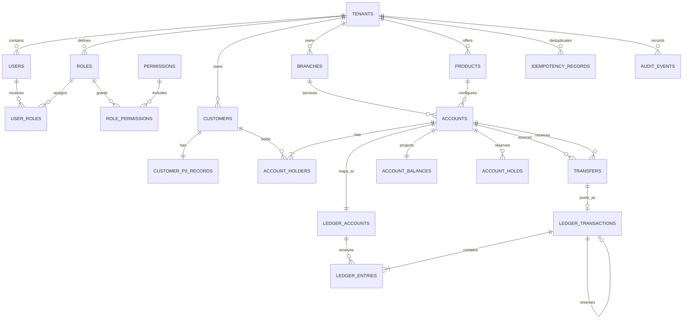

# Banking Database Design

This document defines a production-oriented relational database for a retail banking system. The design uses PostgreSQL, an immutable double-entry ledger, and separate workflow records for money movement. It supports customer and joint accounts, internal transfers, holds, fees, reversals, auditability, and high-volume balance reads.

## Scope and assumptions

- One deployment can serve multiple legal entities through `tenant_id`.
- Every account has one product and one currency. Cross-currency transfers are modeled as linked postings through FX clearing accounts.
- Posted ledger entries are immutable. Corrections create compensating transactions; they never update or delete history.
- Monetary values use `numeric(19,4)` (or the institution's required precision), never floating-point or PostgreSQL `money`.
- UTC is used for all instants (`timestamptz`). Business dates are stored separately where required.
- Authentication secrets, card PANs, and documents are outside this core schema. Store them in dedicated identity, card-vault, or object-storage systems and retain only references here.

## Core invariants

1. A posted ledger transaction balances: total debits equal total credits for each currency.
2. Every ledger entry belongs to exactly one posted transaction and has a positive amount.
3. Posted transactions and entries cannot be mutated or deleted.
4. An account and its customer-facing ledger account use the same currency.
5. A request with the same `(tenant_id, idempotency_key)` has exactly one business outcome.
6. A reversal references the original transaction and uses equal, opposite entries. A transaction can be fully reversed only once.
7. A transfer cannot make available funds negative unless the account's product permits overdraft.
8. Balance updates, ledger postings, and workflow state changes commit in one database transaction.

## Identity and authorization tables

Authentication identities are separate from banking customers. One user may represent multiple customer relationships, and organizational customers may have multiple users.

| Table | Important columns | Purpose and constraints |
|---|---|---|
| `users` | `user_id`, `tenant_id`, `identity_subject`, `email_hash`, `status`, login timestamps | Application identity linked to an external identity provider; no passwords or tokens are stored here. |
| `roles` | `role_id`, `tenant_id`, `role_code`, `name`, `description`, `is_system` | Tenant-scoped role such as customer, teller, operations, auditor, or administrator. |
| `permissions` | `permission_id`, `permission_code`, `description` | Global permission catalog such as `accounts.read` or `ledger.post`. |
| `user_roles` | `user_role_id`, `tenant_id`, `user_id`, `role_id`, optional scope, assignment/expiry fields | Assigns global or resource-scoped roles to users with an auditable grantor. |
| `role_permissions` | `tenant_id`, `role_id`, `permission_id`, `granted_at` | Normalized many-to-many role permission grants. |

## High-level data model



`ACCOUNT` represents the customer's banking product. `LEDGER_ACCOUNT` represents a posting destination in the chart of accounts. A customer account has one primary ledger account; the chart also contains internal accounts for cash, settlement, suspense, fees, interest, and FX clearing.

## Tables

All primary keys are UUIDs unless noted. Prefer UUIDv7 for time-ordered inserts. Every tenant-owned unique constraint includes `tenant_id` so identifiers cannot collide across legal entities.

### Party and product tables

| Table | Important columns | Purpose and constraints |
|---|---|---|
| `tenants` | `tenant_id`, `code`, `name`, `base_currency`, `status` | Legal entity or bank partition. `code` is unique. |
| `branches` | `branch_id`, `tenant_id`, `branch_code`, `name`, `timezone`, `status` | Servicing branch. Unique `(tenant_id, branch_code)`. |
| `customers` | `customer_id`, `tenant_id`, `customer_number`, `customer_type`, `status`, `risk_rating`, `created_at` | Non-sensitive customer record. Type is `PERSON` or `ORGANIZATION`. |
| `customer_pii_records` | `customer_id`, `legal_name_ciphertext`, `date_of_birth_ciphertext`, `tax_id_hash`, `contact_ciphertext`, `encryption_key_version` | Encrypted PII, isolated for stricter access control. Searchable identifiers use keyed hashes. |
| `products` | `product_id`, `tenant_id`, `product_code`, `account_type`, `currency`, `minimum_balance`, `overdraft_limit`, `interest_rule_version`, `status` | Versioned account configuration. Avoid changing terms retroactively; create a new version. |
| `accounts` | `account_id`, `tenant_id`, `account_number_token`, `account_number_hash`, `product_id`, `branch_id`, `currency`, `status`, `opened_at`, `closed_at`, `version` | Customer-facing deposit or loan account. Display numbers are tokenized; deterministic keyed hashes support lookup. Optimistic `version` guards workflow updates. |
| `account_holders` | `account_id`, `customer_id`, `role`, `ownership_percent`, `valid_from`, `valid_to` | Supports primary, joint, trustee, and authorized-signatory relationships. Unique active relationship per account/customer/role. |

The `currency` column duplicated on `accounts` is intentional for efficient validation and must be checked against `products.currency` by the account-opening service or a trigger.

### Ledger tables

| Table | Important columns | Purpose and constraints |
|---|---|---|
| `ledger_accounts` | `ledger_account_id`, `tenant_id`, `account_id NULL`, `code`, `name`, `account_class`, `normal_side`, `currency`, `status` | Chart of accounts. `account_id` is set for customer subledger accounts and null for internal GL accounts. Classes: `ASSET`, `LIABILITY`, `EQUITY`, `REVENUE`, `EXPENSE`. |
| `ledger_transactions` | `ledger_transaction_id`, `tenant_id`, `transaction_type`, `business_date`, `posted_at`, `reference`, `idempotency_key`, `reversal_of NULL`, `metadata` | Immutable posting header. Unique `(tenant_id, idempotency_key)` and unique non-null `reversal_of`. |
| `ledger_entries` | `entry_id bigint`, `tenant_id`, `ledger_transaction_id`, `ledger_account_id`, `side`, `amount`, `currency`, `sequence_no`, `created_at` | Immutable debit or credit line. Check `amount > 0`; unique `(ledger_transaction_id, sequence_no)`. |
| `account_balances` | `ledger_account_id`, `tenant_id`, `debit_total`, `credit_total`, `posted_balance`, `available_balance`, `as_of_entry_id`, `version`, `updated_at` | Strongly consistent projection updated in the posting transaction. It is rebuildable from entries and not the source of truth. |

For an account with `normal_side = CREDIT` (for example, a customer deposit liability), `posted_balance = credit_total - debit_total`. For an account with `normal_side = DEBIT` (for example, a loan asset), it is `debit_total - credit_total`.

### Money-movement and operational tables

| Table | Important columns | Purpose and constraints |
|---|---|---|
| `transfers` | `transfer_id`, `tenant_id`, `source_account_id`, `destination_account_id`, `amount`, `currency`, `status`, `client_reference`, `idempotency_key`, `ledger_transaction_id NULL`, `failure_code`, `created_at`, `updated_at`, `version` | Transfer workflow. Status: `CREATED`, `AUTHORIZED`, `POSTED`, `FAILED`, `CANCELLED`. Unique tenant/idempotency key. |
| `account_holds` | `hold_id`, `tenant_id`, `account_id`, `amount`, `currency`, `status`, `reason`, `expires_at`, `captured_transaction_id NULL`, `created_at`, `version` | Reservation that reduces available balance without changing posted balance. Status: `ACTIVE`, `CAPTURED`, `RELEASED`, `EXPIRED`. |
| `idempotency_records` | `tenant_id`, `idempotency_key`, `operation`, `request_hash`, `resource_type`, `resource_id`, `response_code`, `response_body`, `expires_at`, `created_at` | Replays the original result and rejects reuse of a key with a different request hash. Primary key `(tenant_id, idempotency_key)`. |
| `outbox_events` | `event_id bigint`, `tenant_id`, `aggregate_type`, `aggregate_id`, `event_type`, `payload`, `occurred_at`, `published_at NULL`, `attempt_count` | Transactional outbox for reliable event publication. Inserted in the same commit as the domain change. |
| `audit_events` | `audit_event_id bigint`, `tenant_id`, `occurred_at`, `actor_type`, `actor_id`, `action`, `resource_type`, `resource_id`, `request_id`, `source_ip`, `before_hash`, `after_hash`, `details` | Append-only security and administrative audit trail. Do not place plaintext PII or secrets in `details`. |

## Complete PostgreSQL schema, constraints, and indexes

The following dependency-ordered DDL creates the complete relational model documented above. Enums may be replaced with reference tables when values need to change without a migration.

```sql
CREATE EXTENSION IF NOT EXISTS pgcrypto;

CREATE TYPE ledger_side AS ENUM ('DEBIT', 'CREDIT');
CREATE TYPE ledger_account_class AS ENUM
  ('ASSET', 'LIABILITY', 'EQUITY', 'REVENUE', 'EXPENSE');

CREATE TABLE currencies (
    code        char(3) PRIMARY KEY,
    minor_units smallint NOT NULL CHECK (minor_units BETWEEN 0 AND 6),
    enabled     boolean NOT NULL DEFAULT true
);

CREATE TABLE tenants (
    tenant_id    uuid PRIMARY KEY DEFAULT gen_random_uuid(),
    code         text NOT NULL UNIQUE,
    name         text NOT NULL,
    base_currency char(3) NOT NULL REFERENCES currencies(code),
    status       text NOT NULL CHECK (status IN ('ACTIVE','SUSPENDED','CLOSED')),
    created_at   timestamptz NOT NULL DEFAULT clock_timestamp()
);

CREATE TABLE branches (
    branch_id   uuid PRIMARY KEY DEFAULT gen_random_uuid(),
    tenant_id  uuid NOT NULL REFERENCES tenants(tenant_id),
    branch_code text NOT NULL,
    name        text NOT NULL,
    timezone    text NOT NULL,
    status      text NOT NULL CHECK (status IN ('ACTIVE','CLOSED')),
    UNIQUE (tenant_id, branch_code)
);

CREATE TABLE users (
    user_id uuid PRIMARY KEY DEFAULT gen_random_uuid(),
    tenant_id uuid NOT NULL REFERENCES tenants(tenant_id),
    identity_subject text NOT NULL, email_hash bytea NULL,
    status text NOT NULL CHECK (status IN ('INVITED','ACTIVE','LOCKED','DISABLED')),
    last_login_at timestamptz NULL,
    created_at timestamptz NOT NULL DEFAULT clock_timestamp(),
    updated_at timestamptz NOT NULL DEFAULT clock_timestamp(),
    UNIQUE (tenant_id, user_id), UNIQUE (tenant_id, identity_subject)
);

CREATE TABLE roles (
    role_id uuid PRIMARY KEY DEFAULT gen_random_uuid(),
    tenant_id uuid NOT NULL REFERENCES tenants(tenant_id),
    role_code text NOT NULL, name text NOT NULL, description text NULL,
    is_system boolean NOT NULL DEFAULT false,
    created_at timestamptz NOT NULL DEFAULT clock_timestamp(),
    UNIQUE (tenant_id, role_id), UNIQUE (tenant_id, role_code)
);

CREATE TABLE permissions (
    permission_id uuid PRIMARY KEY DEFAULT gen_random_uuid(),
    permission_code text NOT NULL UNIQUE, description text NOT NULL
);

CREATE TABLE role_permissions (
    tenant_id uuid NOT NULL, role_id uuid NOT NULL,
    permission_id uuid NOT NULL REFERENCES permissions(permission_id),
    granted_at timestamptz NOT NULL DEFAULT clock_timestamp(),
    PRIMARY KEY (role_id, permission_id),
    FOREIGN KEY (tenant_id, role_id) REFERENCES roles(tenant_id, role_id)
);

CREATE TABLE user_roles (
    user_role_id uuid PRIMARY KEY DEFAULT gen_random_uuid(),
    tenant_id uuid NOT NULL, user_id uuid NOT NULL, role_id uuid NOT NULL,
    scope_type text NULL, scope_id uuid NULL,
    assigned_by_user_id uuid NULL,
    assigned_at timestamptz NOT NULL DEFAULT clock_timestamp(),
    expires_at timestamptz NULL,
    FOREIGN KEY (tenant_id, user_id) REFERENCES users(tenant_id, user_id),
    FOREIGN KEY (tenant_id, role_id) REFERENCES roles(tenant_id, role_id),
    FOREIGN KEY (tenant_id, assigned_by_user_id) REFERENCES users(tenant_id, user_id),
    CHECK ((scope_type IS NULL) = (scope_id IS NULL)),
    CHECK (expires_at IS NULL OR expires_at > assigned_at)
);

CREATE TABLE customers (
    customer_id     uuid PRIMARY KEY DEFAULT gen_random_uuid(),
    tenant_id       uuid NOT NULL REFERENCES tenants(tenant_id),
    customer_number text NOT NULL,
    customer_type   text NOT NULL CHECK (customer_type IN ('PERSON','ORGANIZATION')),
    status          text NOT NULL CHECK (status IN ('PENDING','ACTIVE','RESTRICTED','CLOSED')),
    risk_rating     text NULL,
    created_at      timestamptz NOT NULL DEFAULT clock_timestamp(),
    UNIQUE (tenant_id, customer_id),
    UNIQUE (tenant_id, customer_number)
);

CREATE TABLE customer_pii_records (
    customer_id              uuid PRIMARY KEY REFERENCES customers(customer_id),
    legal_name_ciphertext    bytea NOT NULL,
    date_of_birth_ciphertext bytea NULL,
    tax_id_hash              bytea NULL,
    contact_ciphertext       bytea NULL,
    encryption_key_version   integer NOT NULL CHECK (encryption_key_version > 0),
    updated_at               timestamptz NOT NULL DEFAULT clock_timestamp()
);

CREATE TABLE products (
    product_id            uuid PRIMARY KEY DEFAULT gen_random_uuid(),
    tenant_id             uuid NOT NULL REFERENCES tenants(tenant_id),
    product_code          text NOT NULL,
    version_no            integer NOT NULL CHECK (version_no > 0),
    account_type          text NOT NULL CHECK (account_type IN ('CHECKING','SAVINGS','LOAN')),
    currency              char(3) NOT NULL REFERENCES currencies(code),
    minimum_balance       numeric(19,4) NOT NULL DEFAULT 0,
    overdraft_limit       numeric(19,4) NOT NULL DEFAULT 0 CHECK (overdraft_limit >= 0),
    interest_rule_version text NULL,
    status                text NOT NULL CHECK (status IN ('DRAFT','ACTIVE','RETIRED')),
    UNIQUE (tenant_id, product_code, version_no)
);

CREATE TABLE accounts (
    account_id           uuid PRIMARY KEY DEFAULT gen_random_uuid(),
    tenant_id            uuid NOT NULL REFERENCES tenants(tenant_id),
    account_number_token text NOT NULL,
    account_number_hash  bytea NOT NULL,
    product_id           uuid NOT NULL REFERENCES products(product_id),
    branch_id            uuid NOT NULL REFERENCES branches(branch_id),
    currency             char(3) NOT NULL REFERENCES currencies(code),
    status               text NOT NULL CHECK (status IN ('PENDING','ACTIVE','FROZEN','CLOSED')),
    opened_at            timestamptz NOT NULL,
    closed_at            timestamptz NULL,
    version              bigint NOT NULL DEFAULT 0,
    CHECK (closed_at IS NULL OR closed_at >= opened_at),
    CHECK (status <> 'CLOSED' OR closed_at IS NOT NULL),
    UNIQUE (tenant_id, account_id),
    UNIQUE (tenant_id, account_number_hash)
);

CREATE TABLE account_holders (
    tenant_id           uuid NOT NULL,
    account_id          uuid NOT NULL,
    customer_id         uuid NOT NULL,
    role                text NOT NULL CHECK (role IN ('PRIMARY','JOINT','TRUSTEE','SIGNATORY')),
    ownership_percent   numeric(5,2) NULL CHECK
        (ownership_percent IS NULL OR ownership_percent BETWEEN 0 AND 100),
    valid_from          date NOT NULL,
    valid_to            date NULL,
    PRIMARY KEY (account_id, customer_id, role, valid_from),
    FOREIGN KEY (tenant_id, account_id) REFERENCES accounts(tenant_id, account_id),
    FOREIGN KEY (tenant_id, customer_id) REFERENCES customers(tenant_id, customer_id),
    CHECK (valid_to IS NULL OR valid_to >= valid_from)
);

CREATE TABLE ledger_accounts (
    ledger_account_id uuid PRIMARY KEY DEFAULT gen_random_uuid(),
    tenant_id         uuid NOT NULL REFERENCES tenants(tenant_id),
    account_id        uuid NULL REFERENCES accounts(account_id),
    code              text NOT NULL,
    name              text NOT NULL,
    account_class     ledger_account_class NOT NULL,
    normal_side       ledger_side NOT NULL,
    currency          char(3) NOT NULL,
    status            text NOT NULL CHECK (status IN ('ACTIVE', 'FROZEN', 'CLOSED')),
    created_at        timestamptz NOT NULL DEFAULT clock_timestamp(),
    UNIQUE (tenant_id, code),
    UNIQUE (account_id)
);

CREATE TABLE ledger_transactions (
    ledger_transaction_id uuid PRIMARY KEY DEFAULT gen_random_uuid(),
    tenant_id              uuid NOT NULL REFERENCES tenants(tenant_id),
    transaction_type       text NOT NULL,
    business_date          date NOT NULL,
    posted_at              timestamptz NOT NULL DEFAULT clock_timestamp(),
    reference              text NULL,
    idempotency_key        text NOT NULL,
    reversal_of            uuid NULL REFERENCES ledger_transactions(ledger_transaction_id),
    metadata               jsonb NOT NULL DEFAULT '{}'::jsonb,
    UNIQUE (tenant_id, idempotency_key),
    UNIQUE (reversal_of)
);

CREATE TABLE ledger_entries (
    entry_id               bigint GENERATED ALWAYS AS IDENTITY PRIMARY KEY,
    tenant_id              uuid NOT NULL REFERENCES tenants(tenant_id),
    ledger_transaction_id  uuid NOT NULL REFERENCES ledger_transactions(ledger_transaction_id),
    ledger_account_id      uuid NOT NULL REFERENCES ledger_accounts(ledger_account_id),
    side                   ledger_side NOT NULL,
    amount                 numeric(19,4) NOT NULL CHECK (amount > 0),
    currency               char(3) NOT NULL,
    sequence_no            smallint NOT NULL CHECK (sequence_no > 0),
    created_at             timestamptz NOT NULL DEFAULT clock_timestamp(),
    UNIQUE (ledger_transaction_id, sequence_no)
);

CREATE TABLE account_balances (
    ledger_account_id uuid PRIMARY KEY REFERENCES ledger_accounts(ledger_account_id),
    tenant_id         uuid NOT NULL REFERENCES tenants(tenant_id),
    debit_total       numeric(19,4) NOT NULL DEFAULT 0 CHECK (debit_total >= 0),
    credit_total      numeric(19,4) NOT NULL DEFAULT 0 CHECK (credit_total >= 0),
    posted_balance    numeric(19,4) NOT NULL DEFAULT 0,
    available_balance numeric(19,4) NOT NULL DEFAULT 0,
    as_of_entry_id    bigint NULL,
    version           bigint NOT NULL DEFAULT 0,
    updated_at        timestamptz NOT NULL DEFAULT clock_timestamp()
);

CREATE TABLE transfers (
    transfer_id           uuid PRIMARY KEY DEFAULT gen_random_uuid(),
    tenant_id             uuid NOT NULL REFERENCES tenants(tenant_id),
    source_account_id     uuid NOT NULL REFERENCES accounts(account_id),
    destination_account_id uuid NOT NULL REFERENCES accounts(account_id),
    amount                numeric(19,4) NOT NULL CHECK (amount > 0),
    currency              char(3) NOT NULL REFERENCES currencies(code),
    status                text NOT NULL CHECK
        (status IN ('CREATED','AUTHORIZED','POSTED','FAILED','CANCELLED')),
    client_reference      text NULL,
    idempotency_key       text NOT NULL,
    ledger_transaction_id uuid NULL REFERENCES ledger_transactions(ledger_transaction_id),
    failure_code          text NULL,
    version               bigint NOT NULL DEFAULT 0,
    created_at            timestamptz NOT NULL DEFAULT clock_timestamp(),
    updated_at            timestamptz NOT NULL DEFAULT clock_timestamp(),
    CHECK (source_account_id <> destination_account_id),
    CHECK (status <> 'POSTED' OR ledger_transaction_id IS NOT NULL),
    UNIQUE (tenant_id, idempotency_key)
);

CREATE TABLE account_holds (
    hold_id                 uuid PRIMARY KEY DEFAULT gen_random_uuid(),
    tenant_id               uuid NOT NULL REFERENCES tenants(tenant_id),
    account_id              uuid NOT NULL REFERENCES accounts(account_id),
    amount                  numeric(19,4) NOT NULL CHECK (amount > 0),
    currency                char(3) NOT NULL REFERENCES currencies(code),
    status                  text NOT NULL CHECK
        (status IN ('ACTIVE','CAPTURED','RELEASED','EXPIRED')),
    reason                  text NULL,
    expires_at              timestamptz NOT NULL,
    captured_transaction_id uuid NULL REFERENCES ledger_transactions(ledger_transaction_id),
    version                 bigint NOT NULL DEFAULT 0,
    created_at              timestamptz NOT NULL DEFAULT clock_timestamp(),
    CHECK (status <> 'CAPTURED' OR captured_transaction_id IS NOT NULL)
);

CREATE TABLE idempotency_records (
    tenant_id       uuid NOT NULL REFERENCES tenants(tenant_id),
    idempotency_key text NOT NULL,
    operation       text NOT NULL,
    request_hash    bytea NOT NULL,
    resource_type   text NULL,
    resource_id     uuid NULL,
    response_code   integer NULL CHECK (response_code BETWEEN 100 AND 599),
    response_body   jsonb NULL,
    expires_at      timestamptz NOT NULL,
    created_at      timestamptz NOT NULL DEFAULT clock_timestamp(),
    PRIMARY KEY (tenant_id, idempotency_key)
);

CREATE TABLE outbox_events (
    event_id       bigint GENERATED ALWAYS AS IDENTITY PRIMARY KEY,
    tenant_id      uuid NOT NULL REFERENCES tenants(tenant_id),
    aggregate_type text NOT NULL,
    aggregate_id   uuid NOT NULL,
    event_type     text NOT NULL,
    payload        jsonb NOT NULL,
    occurred_at    timestamptz NOT NULL DEFAULT clock_timestamp(),
    published_at   timestamptz NULL,
    attempt_count  integer NOT NULL DEFAULT 0 CHECK (attempt_count >= 0)
);

CREATE TABLE audit_events (
    audit_event_id bigint GENERATED ALWAYS AS IDENTITY PRIMARY KEY,
    tenant_id      uuid NOT NULL REFERENCES tenants(tenant_id),
    occurred_at    timestamptz NOT NULL DEFAULT clock_timestamp(),
    actor_type     text NOT NULL,
    actor_id       text NULL,
    action         text NOT NULL,
    resource_type  text NOT NULL,
    resource_id    text NOT NULL,
    request_id     text NULL,
    source_ip      inet NULL,
    before_hash    bytea NULL,
    after_hash     bytea NULL,
    details        jsonb NOT NULL DEFAULT '{}'::jsonb
);

CREATE UNIQUE INDEX ux_user_roles_global
    ON user_roles (user_id, role_id) WHERE scope_type IS NULL;
CREATE UNIQUE INDEX ux_user_roles_scoped
    ON user_roles (user_id, role_id, scope_type, scope_id) WHERE scope_type IS NOT NULL;
CREATE INDEX ix_user_roles_active
    ON user_roles (tenant_id, user_id, expires_at);
CREATE INDEX ix_users_email_hash
    ON users (tenant_id, email_hash) WHERE email_hash IS NOT NULL;

CREATE INDEX ix_entry_account_history
    ON ledger_entries (tenant_id, ledger_account_id, entry_id DESC);
CREATE INDEX ix_transaction_posted_at
    ON ledger_transactions (tenant_id, posted_at DESC);
CREATE INDEX ix_outbox_unpublished
    ON outbox_events (event_id) WHERE published_at IS NULL;
CREATE INDEX ix_active_hold_expiry
    ON account_holds (expires_at) WHERE status = 'ACTIVE';
CREATE INDEX ix_account_customer_active
    ON account_holders (tenant_id, customer_id, valid_to);
CREATE INDEX ix_transfer_source_history
    ON transfers (tenant_id, source_account_id, created_at DESC);
CREATE INDEX ix_transfer_destination_history
    ON transfers (tenant_id, destination_account_id, created_at DESC);
CREATE INDEX ix_audit_resource_time
    ON audit_events (tenant_id, resource_type, resource_id, occurred_at DESC);
```

Foreign keys containing only an ID do not by themselves prove tenant consistency. In the complete migration, add composite alternate keys such as `UNIQUE (tenant_id, account_id)` and use composite foreign keys `(tenant_id, account_id)` for every tenant-owned relationship.

### Constraints that require triggers or the posting procedure

PostgreSQL `CHECK` constraints cannot aggregate sibling rows, so a deferred constraint trigger or a single privileged posting procedure must enforce:

```text
for every ledger_transaction and currency:
    SUM(amount WHERE side = 'DEBIT') = SUM(amount WHERE side = 'CREDIT')

for every ledger_entry:
    entry.tenant_id  = transaction.tenant_id = ledger_account.tenant_id
    entry.currency   = ledger_account.currency
```

Database roles used by applications should receive `EXECUTE` on the posting procedure, not direct `INSERT`, `UPDATE`, or `DELETE` rights on ledger tables. An immutability trigger must reject updates and deletes after insertion.

## Posting flows

### Internal transfer of 100 USD

Both customer deposit accounts are liabilities to the bank. Moving money from Alice to Bob reduces the bank's liability to Alice and increases its liability to Bob.

| Sequence | Ledger account | Debit | Credit |
|---:|---|---:|---:|
| 1 | Alice deposit liability | 100.00 | — |
| 2 | Bob deposit liability | — | 100.00 |

Within one serializable or carefully locked database transaction:

1. Claim the idempotency key and verify its request hash.
2. Lock the source and destination `account_balances` rows in deterministic `ledger_account_id` order to prevent deadlocks.
3. Confirm account status, currency, limits, and `available_balance >= amount` (including allowed overdraft).
4. Insert the balanced ledger transaction and entries.
5. Update debit/credit totals and the balance projections.
6. Mark the transfer `POSTED`, attach its `ledger_transaction_id`, and insert outbox/audit events.
7. Commit, then return the stored idempotent response.

### External outgoing payment

At initiation, debit the customer's deposit liability and credit an outgoing-settlement liability. When the payment network settles, debit that settlement liability and credit the bank's cash/nostro asset. Failed payments use an explicit reversal; they do not delete the original posting.

### Holds and capture

- Creating a hold locks the balance row, checks funds, inserts an `ACTIVE` hold, and decreases only `available_balance`.
- Capturing a hold posts normal ledger entries and atomically changes the hold to `CAPTURED`; do not subtract the amount twice from available funds.
- Release or expiry restores available funds and changes the hold status exactly once using its optimistic `version`.
- A worker expires holds in small batches with `FOR UPDATE SKIP LOCKED`.

### Reversal

A reversal creates a new `ledger_transactions` whose `reversal_of` points to the original. Each original entry is copied with `DEBIT` and `CREDIT` swapped. The unique constraint on `reversal_of` prevents duplicate full reversals. Partial refunds are new business transactions linked through metadata or a dedicated refund table.

### Cross-currency transfer

A cross-currency operation records the quoted rate and quote ID in a transfer/FX-order record and posts balanced legs in each currency through controlled FX clearing accounts. For example, the USD entries balance among the source and USD FX account, while the EUR entries balance among the EUR FX account and destination. Never force two currencies into a single arithmetic balance.

## Consistency and isolation

- Use `READ COMMITTED` with explicit row locks for the well-defined posting path, or `SERIALIZABLE` with bounded retry handling. Do not read a balance and later update it without a lock or atomic predicate.
- Acquire multiple balance locks in a deterministic order.
- Keep database transactions short; perform sanctions checks or remote calls before posting, then revalidate mutable account state inside the transaction.
- Treat ambiguous commit results as retryable with the same idempotency key.
- Use an atomic conditional update or locked row when changing workflow states so two workers cannot post one transfer twice.
- Reconciliation must recompute totals from immutable entries and compare them with `account_balances`; any difference raises an operational alert.

## Indexing, partitioning, and retention

- Index account lookup by `(tenant_id, account_number_hash)` and customer relationships by `(tenant_id, customer_id, valid_to)`.
- Index transfer history by both `(tenant_id, source_account_id, created_at DESC)` and destination account.
- Partition `ledger_entries`, `ledger_transactions`, `audit_events`, and `outbox_events` by monthly `business_date`/timestamp when volume justifies it. Preserve uniqueness by including the partition key or maintain idempotency in a small unpartitioned registry.
- Use monotonic `entry_id` as a statement cursor. Keyset pagination (`entry_id < :cursor`) is more stable than offset pagination.
- Keep ledger and regulatory audit data for the required legal retention period. PII erasure should anonymize or cryptographically erase PII while retaining legally required financial records.
- Archive old partitions to encrypted, immutable storage only after reconciliation and restore testing.

## Security controls

- Separate roles for migrations, posting, customer-service reads, reporting replicas, audit, and break-glass administration.
- Enable row-level security by `tenant_id` as defense in depth; set tenant context from a trusted connection pool path, not client input alone.
- Encrypt storage and backups, use application/column-level envelope encryption for PII, and rotate keys by version.
- Tokenize account numbers and never log raw identifiers, secrets, access tokens, or PII.
- Store actor, request, and trace IDs in append-only audits. Stream audit copies to write-once storage with integrity verification.
- Apply least privilege: only the posting routine owns ledger write privileges, and reporting workloads use read replicas.
- Keep KYC/AML case details and uploaded documents in access-controlled bounded contexts; reference them by opaque ID.

## Availability and disaster recovery

- Run PostgreSQL with synchronous high-availability replication within the primary region and encrypted point-in-time recovery backups in a separate failure domain.
- Define explicit targets, for example RPO ≤ 5 minutes and RTO ≤ 30 minutes, based on business requirements.
- Publish events with the transactional outbox; consumers must also be idempotent.
- Route statements and balance reads requiring read-your-writes consistency to the primary. Replicas are suitable for analytics and older history.
- Regularly test failover, point-in-time restore, reconciliation, key recovery, and replay of unpublished outbox events.

## Validation checklist

- Concurrent debits cannot overspend an account.
- Duplicate, concurrent, timed-out, and retried requests produce one posting.
- Every posting balances per currency and tenant.
- Tenant and currency mismatches are rejected at the database boundary.
- Holds race safely with capture, release, and expiry.
- Reversals are opposite, linked, and cannot be duplicated.
- Posted entries cannot be updated or deleted, including by normal administrative roles.
- Balance projections rebuild exactly from ledger entries.
- Failover after an ambiguous commit is safe when the client retries.
- Backups restore within the stated RPO/RTO, and restored balances reconcile.

## Deliberate non-goals

Card authorization messaging, loan amortization schedules, interest accrual engines, regulatory reporting, fraud scoring, KYC/AML case management, and payment-network adapters require additional bounded-context schemas. They should post their financial effects through the same ledger API rather than writing ledger tables directly.
