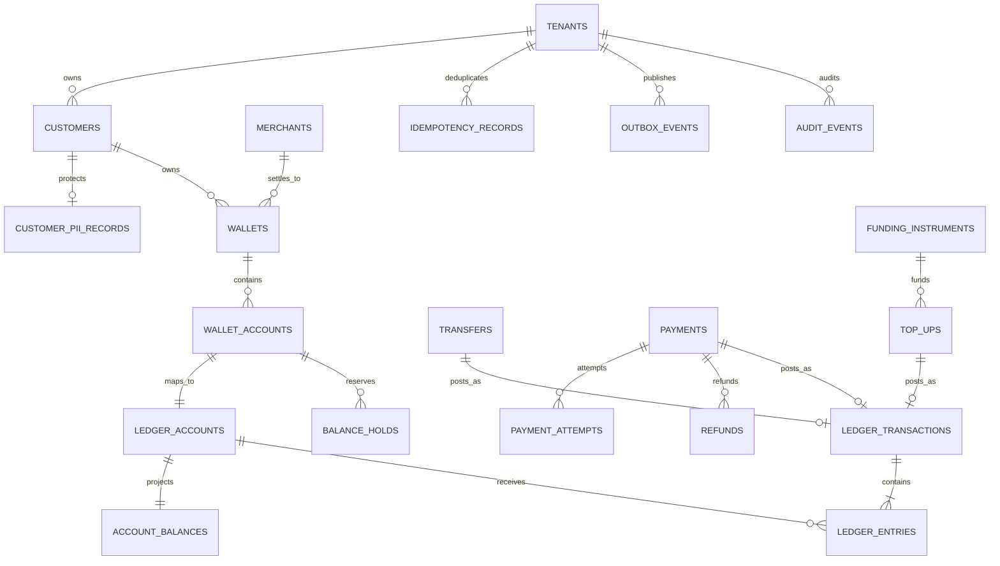

# E-Wallet Database Design

This design targets a multi-tenant consumer and merchant wallet built on PostgreSQL. It supports multi-currency wallets, peer-to-peer transfers, merchant payments, cash-in/cash-out, holds, refunds, fees, and reliable event publication. The financial source of truth is an immutable double-entry ledger.

## Scope and principles

- A customer owns one logical wallet with one wallet account per currency.
- All posted value movement is represented by balanced ledger entries; cached balances are rebuildable projections.
- Workflow records such as payments and transfers may change state, but posted ledger records never change.
- Monetary values use `numeric(19,4)` and ISO 4217 currency codes. Validate the permitted scale for each currency.
- Authentication secrets, raw card details, KYC documents, and bank credentials stay in dedicated identity, vault, or document services.
- All instants use UTC `timestamptz`; business dates remain explicit where settlement requires them.

## Critical invariants

1. For every posted ledger transaction and currency, total debits equal total credits.
2. Ledger entries are positive, append-only, and tenant/currency consistent with their ledger accounts.
3. A wallet has at most one active wallet account per currency.
4. Available balance cannot fall below the configured overdraft floor; consumer wallets normally use zero.
5. The same `(tenant_id, idempotency_key)` produces one business outcome, even after timeouts or retries.
6. Capture, release, and expiry can transition a hold only once.
7. Refunds and reversals create new opposite postings and never edit original entries.
8. Ledger postings, balance projections, workflow state, audit, and outbox events commit atomically.

## Entity relationship model



`wallet_accounts` is the customer-facing balance container. `ledger_accounts` is a posting target and also represents system accounts such as processor receivables, bank settlement, fee revenue, suspense, and promotional liabilities.

## Core tables

Every tenant-owned table contains `tenant_id`; composite foreign keys should include it to prevent cross-tenant references.

| Table | Key columns | Purpose and constraints |
|---|---|---|
| `tenants` | `tenant_id`, `code`, `base_currency`, `status` | Wallet operator or legal entity. |
| `currencies` | `code`, `minor_units`, `enabled` | Permitted currencies and scale validation. |
| `customers` | `customer_id`, `tenant_id`, `customer_number`, `type`, `status`, `kyc_status`, `risk_level`, `created_at` | Consumer or organization without plaintext sensitive data. |
| `customer_pii_records` | `tenant_id`, `customer_id`, encrypted name/contact fields, `search_hashes`, `key_version` | Encrypted PII with more restrictive permissions. |
| `merchants` | `merchant_id`, `tenant_id`, `customer_id`, `merchant_code`, `settlement_policy`, `status` | Merchant-specific profile and settlement rules. |
| `wallets` | `wallet_id`, `tenant_id`, `customer_id`, `merchant_id NULL`, `status`, `created_at`, `version` | Logical wallet. A merchant wallet may reference a merchant profile. |
| `wallet_accounts` | `wallet_account_id`, `tenant_id`, `wallet_id`, `currency`, `status`, `overdraft_floor`, `created_at` | Unique active `(tenant_id, wallet_id, currency)`. |
| `funding_instruments` | `instrument_id`, `tenant_id`, `customer_id`, `type`, `provider_token`, `display_hint`, `status`, `verified_at` | Token/reference to a card or bank account; never store PAN or bank credentials. |

## Ledger and balance tables

| Table | Key columns | Purpose and constraints |
|---|---|---|
| `ledger_accounts` | `ledger_account_id`, `tenant_id`, `wallet_account_id NULL`, `code`, `class`, `normal_side`, `currency`, `status` | Customer and internal chart-of-account nodes. Unique non-null `wallet_account_id`. |
| `ledger_transactions` | `ledger_transaction_id`, `tenant_id`, `type`, `business_date`, `posted_at`, `idempotency_key`, `reversal_of NULL`, `metadata` | Immutable posting header. Unique tenant/idempotency key and unique non-null reversal target. |
| `ledger_entries` | `entry_id bigint`, `tenant_id`, `ledger_transaction_id`, `ledger_account_id`, `side`, `amount`, `currency`, `sequence_no` | Immutable `DEBIT`/`CREDIT` lines; `amount > 0`. |
| `account_balances` | `ledger_account_id`, `tenant_id`, `debit_total`, `credit_total`, `posted_balance`, `available_balance`, `as_of_entry_id`, `version` | Strongly consistent projection updated by the posting transaction. |
| `balance_holds` | `hold_id`, `tenant_id`, `wallet_account_id`, `amount`, `currency`, `status`, `reason`, `expires_at`, `captured_transaction_id NULL`, `version` | Reduces available, not posted, balance while active. |

For normal-credit wallet liability accounts, `posted_balance = credit_total - debit_total`. Available balance is posted balance less active holds, adjusted only for an explicitly configured overdraft floor or credit facility.

## Workflow and reliability tables

| Table | Key columns | Purpose and constraints |
|---|---|---|
| `transfers` | `transfer_id`, `tenant_id`, source/destination wallet account IDs, `amount`, `currency`, `status`, `idempotency_key`, `ledger_transaction_id`, `version` | P2P movement. States: `CREATED`, `AUTHORIZED`, `POSTED`, `FAILED`, `CANCELLED`. |
| `payments` | `payment_id`, `tenant_id`, payer account, merchant, `amount`, `currency`, `status`, `client_reference`, `idempotency_key`, posting IDs, `version` | Merchant purchase lifecycle with captured/refunded totals. |
| `payment_attempts` | `attempt_id`, `payment_id`, `provider`, `provider_reference`, `status`, `failure_code`, `started_at`, `completed_at` | Append-oriented record of provider interactions. |
| `refunds` | `refund_id`, `tenant_id`, `payment_id`, `amount`, `status`, `idempotency_key`, `ledger_transaction_id` | Partial/full refund. Sum of posted refunds cannot exceed captured amount. |
| `top_ups` | `top_up_id`, `tenant_id`, `wallet_account_id`, `instrument_id`, `amount`, `currency`, `status`, provider and ledger references | Cash-in; provider callbacks are deduplicated by provider/reference. |
| `cash_outs` | `cash_out_id`, `tenant_id`, `wallet_account_id`, destination token, `amount`, `fee`, `status`, settlement reference | Cash-out through bank, agent, or processor. |
| `idempotency_records` | `tenant_id`, `idempotency_key`, `operation`, `request_hash`, result fields, `expires_at` | Stores the original response and rejects a key reused with different input. |
| `outbox_events` | `event_id bigint`, `tenant_id`, aggregate fields, `event_type`, `payload`, `occurred_at`, `published_at` | Transactional outbox for at-least-once delivery. |
| `audit_events` | `audit_event_id bigint`, `tenant_id`, actor/request/resource fields, `action`, hashes, `occurred_at` | Append-only administrative and security history without plaintext PII. |

## Complete PostgreSQL schema, constraints, and indexes

The following dependency-ordered DDL creates the complete relational model documented above. Production migrations should retain tenant-inclusive composite foreign keys throughout.

```sql
CREATE EXTENSION IF NOT EXISTS pgcrypto;

CREATE TABLE currencies (
    code        char(3) PRIMARY KEY,
    minor_units smallint NOT NULL CHECK (minor_units BETWEEN 0 AND 6),
    enabled     boolean NOT NULL DEFAULT true
);

CREATE TABLE tenants (
    tenant_id     uuid PRIMARY KEY DEFAULT gen_random_uuid(),
    code          text NOT NULL UNIQUE,
    name          text NOT NULL,
    base_currency char(3) NOT NULL REFERENCES currencies(code),
    status        text NOT NULL CHECK (status IN ('ACTIVE','SUSPENDED','CLOSED')),
    created_at    timestamptz NOT NULL DEFAULT clock_timestamp()
);

CREATE TABLE customers (
    customer_id     uuid PRIMARY KEY DEFAULT gen_random_uuid(),
    tenant_id       uuid NOT NULL REFERENCES tenants(tenant_id),
    customer_number text NOT NULL,
    customer_type   text NOT NULL CHECK (customer_type IN ('PERSON','ORGANIZATION')),
    status          text NOT NULL CHECK (status IN ('PENDING','ACTIVE','RESTRICTED','CLOSED')),
    kyc_status      text NOT NULL CHECK (kyc_status IN ('NOT_STARTED','PENDING','VERIFIED','REJECTED','EXPIRED')),
    risk_level      text NULL,
    created_at      timestamptz NOT NULL DEFAULT clock_timestamp(),
    UNIQUE (tenant_id, customer_id),
    UNIQUE (tenant_id, customer_number)
);

CREATE TABLE customer_pii_records (
    customer_id           uuid PRIMARY KEY REFERENCES customers(customer_id),
    legal_name_ciphertext bytea NOT NULL,
    contact_ciphertext    bytea NULL,
    search_hashes         jsonb NOT NULL DEFAULT '{}'::jsonb,
    key_version           integer NOT NULL CHECK (key_version > 0),
    updated_at            timestamptz NOT NULL DEFAULT clock_timestamp()
);

CREATE TABLE merchants (
    merchant_id       uuid PRIMARY KEY DEFAULT gen_random_uuid(),
    tenant_id         uuid NOT NULL REFERENCES tenants(tenant_id),
    customer_id       uuid NOT NULL UNIQUE REFERENCES customers(customer_id),
    merchant_code     text NOT NULL,
    settlement_policy jsonb NOT NULL DEFAULT '{}'::jsonb,
    status            text NOT NULL CHECK (status IN ('PENDING','ACTIVE','SUSPENDED','CLOSED')),
    UNIQUE (tenant_id, merchant_id),
    UNIQUE (tenant_id, merchant_code)
);

CREATE TABLE wallets (
    wallet_id   uuid PRIMARY KEY DEFAULT gen_random_uuid(),
    tenant_id   uuid NOT NULL REFERENCES tenants(tenant_id),
    customer_id uuid NOT NULL REFERENCES customers(customer_id),
    merchant_id uuid NULL REFERENCES merchants(merchant_id),
    status      text NOT NULL CHECK (status IN ('ACTIVE','FROZEN','CLOSED')),
    version     bigint NOT NULL DEFAULT 0,
    created_at  timestamptz NOT NULL DEFAULT clock_timestamp(),
    UNIQUE (tenant_id, wallet_id),
    UNIQUE (tenant_id, customer_id, merchant_id)
);

CREATE TABLE funding_instruments (
    instrument_id  uuid PRIMARY KEY DEFAULT gen_random_uuid(),
    tenant_id      uuid NOT NULL REFERENCES tenants(tenant_id),
    customer_id    uuid NOT NULL REFERENCES customers(customer_id),
    instrument_type text NOT NULL CHECK (instrument_type IN ('CARD','BANK_ACCOUNT','AGENT')),
    provider_token text NOT NULL,
    display_hint   text NOT NULL,
    status         text NOT NULL CHECK (status IN ('PENDING','VERIFIED','DISABLED','EXPIRED')),
    verified_at    timestamptz NULL,
    created_at     timestamptz NOT NULL DEFAULT clock_timestamp(),
    UNIQUE (tenant_id, provider_token)
);

CREATE TABLE wallet_accounts (
    wallet_account_id uuid PRIMARY KEY DEFAULT gen_random_uuid(),
    tenant_id         uuid NOT NULL REFERENCES tenants(tenant_id),
    wallet_id         uuid NOT NULL REFERENCES wallets(wallet_id),
    currency          char(3) NOT NULL REFERENCES currencies(code),
    status            text NOT NULL CHECK (status IN ('ACTIVE','FROZEN','CLOSED')),
    overdraft_floor   numeric(19,4) NOT NULL DEFAULT 0 CHECK (overdraft_floor <= 0),
    created_at        timestamptz NOT NULL DEFAULT clock_timestamp(),
    UNIQUE (tenant_id, wallet_account_id),
    UNIQUE (tenant_id, wallet_id, currency)
);

CREATE TABLE ledger_accounts (
    ledger_account_id uuid PRIMARY KEY DEFAULT gen_random_uuid(),
    tenant_id         uuid NOT NULL REFERENCES tenants(tenant_id),
    wallet_account_id uuid NULL UNIQUE REFERENCES wallet_accounts(wallet_account_id),
    code              text NOT NULL,
    account_class     text NOT NULL CHECK
        (account_class IN ('ASSET','LIABILITY','EQUITY','REVENUE','EXPENSE')),
    normal_side       text NOT NULL CHECK (normal_side IN ('DEBIT','CREDIT')),
    currency          char(3) NOT NULL REFERENCES currencies(code),
    status            text NOT NULL CHECK (status IN ('ACTIVE','FROZEN','CLOSED')),
    UNIQUE (tenant_id, ledger_account_id),
    UNIQUE (tenant_id, code)
);

CREATE TABLE ledger_transactions (
    ledger_transaction_id uuid PRIMARY KEY DEFAULT gen_random_uuid(),
    tenant_id              uuid NOT NULL REFERENCES tenants(tenant_id),
    transaction_type       text NOT NULL,
    business_date          date NOT NULL,
    posted_at              timestamptz NOT NULL DEFAULT clock_timestamp(),
    idempotency_key        text NOT NULL,
    reversal_of            uuid NULL UNIQUE REFERENCES ledger_transactions(ledger_transaction_id),
    metadata               jsonb NOT NULL DEFAULT '{}'::jsonb,
    UNIQUE (tenant_id, ledger_transaction_id),
    UNIQUE (tenant_id, idempotency_key)
);

CREATE TABLE ledger_entries (
    entry_id              bigint GENERATED ALWAYS AS IDENTITY PRIMARY KEY,
    tenant_id             uuid NOT NULL,
    ledger_transaction_id uuid NOT NULL,
    ledger_account_id     uuid NOT NULL,
    side                  text NOT NULL CHECK (side IN ('DEBIT','CREDIT')),
    amount                numeric(19,4) NOT NULL CHECK (amount > 0),
    currency              char(3) NOT NULL REFERENCES currencies(code),
    sequence_no           smallint NOT NULL CHECK (sequence_no > 0),
    created_at            timestamptz NOT NULL DEFAULT clock_timestamp(),
    FOREIGN KEY (tenant_id, ledger_transaction_id)
        REFERENCES ledger_transactions(tenant_id, ledger_transaction_id),
    FOREIGN KEY (tenant_id, ledger_account_id)
        REFERENCES ledger_accounts(tenant_id, ledger_account_id),
    UNIQUE (ledger_transaction_id, sequence_no)
);

CREATE TABLE balance_holds (
    hold_id                 uuid PRIMARY KEY DEFAULT gen_random_uuid(),
    tenant_id               uuid NOT NULL REFERENCES tenants(tenant_id),
    wallet_account_id       uuid NOT NULL REFERENCES wallet_accounts(wallet_account_id),
    amount                  numeric(19,4) NOT NULL CHECK (amount > 0),
    currency                char(3) NOT NULL REFERENCES currencies(code),
    status                  text NOT NULL CHECK
        (status IN ('ACTIVE','CAPTURED','RELEASED','EXPIRED')),
    expires_at              timestamptz NOT NULL,
    captured_transaction_id uuid NULL REFERENCES ledger_transactions(ledger_transaction_id),
    version                 bigint NOT NULL DEFAULT 0,
    created_at              timestamptz NOT NULL DEFAULT clock_timestamp(),
    CHECK (status <> 'CAPTURED' OR captured_transaction_id IS NOT NULL)
);

CREATE TABLE transfers (
    transfer_id                  uuid PRIMARY KEY DEFAULT gen_random_uuid(),
    tenant_id                    uuid NOT NULL REFERENCES tenants(tenant_id),
    source_wallet_account_id     uuid NOT NULL REFERENCES wallet_accounts(wallet_account_id),
    destination_wallet_account_id uuid NOT NULL REFERENCES wallet_accounts(wallet_account_id),
    amount                       numeric(19,4) NOT NULL CHECK (amount > 0),
    currency                     char(3) NOT NULL REFERENCES currencies(code),
    status                       text NOT NULL CHECK
        (status IN ('CREATED','AUTHORIZED','POSTED','FAILED','CANCELLED')),
    idempotency_key              text NOT NULL,
    ledger_transaction_id        uuid NULL REFERENCES ledger_transactions(ledger_transaction_id),
    version                      bigint NOT NULL DEFAULT 0,
    created_at                   timestamptz NOT NULL DEFAULT clock_timestamp(),
    CHECK (source_wallet_account_id <> destination_wallet_account_id),
    CHECK (status <> 'POSTED' OR ledger_transaction_id IS NOT NULL),
    UNIQUE (tenant_id, idempotency_key)
);

CREATE TABLE account_balances (
    ledger_account_id uuid PRIMARY KEY REFERENCES ledger_accounts(ledger_account_id),
    tenant_id         uuid NOT NULL REFERENCES tenants(tenant_id),
    debit_total       numeric(19,4) NOT NULL DEFAULT 0 CHECK (debit_total >= 0),
    credit_total      numeric(19,4) NOT NULL DEFAULT 0 CHECK (credit_total >= 0),
    posted_balance    numeric(19,4) NOT NULL DEFAULT 0,
    available_balance numeric(19,4) NOT NULL DEFAULT 0,
    as_of_entry_id    bigint NULL REFERENCES ledger_entries(entry_id),
    version           bigint NOT NULL DEFAULT 0,
    updated_at        timestamptz NOT NULL DEFAULT clock_timestamp()
);

CREATE TABLE payments (
    payment_id             uuid PRIMARY KEY DEFAULT gen_random_uuid(),
    tenant_id              uuid NOT NULL REFERENCES tenants(tenant_id),
    payer_wallet_account_id uuid NOT NULL REFERENCES wallet_accounts(wallet_account_id),
    merchant_id            uuid NOT NULL REFERENCES merchants(merchant_id),
    amount                 numeric(19,4) NOT NULL CHECK (amount > 0),
    currency               char(3) NOT NULL REFERENCES currencies(code),
    status                 text NOT NULL CHECK
        (status IN ('CREATED','AUTHORIZED','CAPTURED','PARTIALLY_REFUNDED','REFUNDED','VOIDED','FAILED')),
    client_reference       text NULL,
    idempotency_key        text NOT NULL,
    ledger_transaction_id  uuid NULL REFERENCES ledger_transactions(ledger_transaction_id),
    captured_amount        numeric(19,4) NOT NULL DEFAULT 0 CHECK (captured_amount >= 0),
    refunded_amount        numeric(19,4) NOT NULL DEFAULT 0 CHECK (refunded_amount >= 0),
    version                bigint NOT NULL DEFAULT 0,
    created_at             timestamptz NOT NULL DEFAULT clock_timestamp(),
    CHECK (captured_amount <= amount),
    CHECK (refunded_amount <= captured_amount),
    UNIQUE (tenant_id, payment_id),
    UNIQUE (tenant_id, idempotency_key)
);

CREATE TABLE payment_attempts (
    attempt_id        uuid PRIMARY KEY DEFAULT gen_random_uuid(),
    tenant_id         uuid NOT NULL,
    payment_id        uuid NOT NULL,
    provider          text NOT NULL,
    provider_reference text NULL,
    operation         text NOT NULL CHECK (operation IN ('AUTHORIZE','CAPTURE','VOID','REFUND')),
    status            text NOT NULL CHECK (status IN ('PENDING','SUCCEEDED','FAILED','UNKNOWN')),
    failure_code      text NULL,
    started_at        timestamptz NOT NULL,
    completed_at      timestamptz NULL,
    FOREIGN KEY (tenant_id, payment_id) REFERENCES payments(tenant_id, payment_id),
    CHECK (completed_at IS NULL OR completed_at >= started_at),
    UNIQUE (provider, provider_reference, operation)
);

CREATE TABLE refunds (
    refund_id            uuid PRIMARY KEY DEFAULT gen_random_uuid(),
    tenant_id            uuid NOT NULL,
    payment_id           uuid NOT NULL,
    amount               numeric(19,4) NOT NULL CHECK (amount > 0),
    status               text NOT NULL CHECK (status IN ('CREATED','POSTED','FAILED','CANCELLED')),
    idempotency_key      text NOT NULL,
    ledger_transaction_id uuid NULL REFERENCES ledger_transactions(ledger_transaction_id),
    created_at           timestamptz NOT NULL DEFAULT clock_timestamp(),
    FOREIGN KEY (tenant_id, payment_id) REFERENCES payments(tenant_id, payment_id),
    CHECK (status <> 'POSTED' OR ledger_transaction_id IS NOT NULL),
    UNIQUE (tenant_id, idempotency_key)
);

CREATE TABLE top_ups (
    top_up_id            uuid PRIMARY KEY DEFAULT gen_random_uuid(),
    tenant_id            uuid NOT NULL REFERENCES tenants(tenant_id),
    wallet_account_id    uuid NOT NULL REFERENCES wallet_accounts(wallet_account_id),
    instrument_id        uuid NOT NULL REFERENCES funding_instruments(instrument_id),
    amount               numeric(19,4) NOT NULL CHECK (amount > 0),
    currency             char(3) NOT NULL REFERENCES currencies(code),
    status               text NOT NULL CHECK (status IN ('CREATED','PENDING','POSTED','FAILED','REVERSED')),
    provider_reference   text NULL,
    idempotency_key      text NOT NULL,
    ledger_transaction_id uuid NULL REFERENCES ledger_transactions(ledger_transaction_id),
    created_at           timestamptz NOT NULL DEFAULT clock_timestamp(),
    UNIQUE (tenant_id, idempotency_key),
    UNIQUE (tenant_id, provider_reference)
);

CREATE TABLE cash_outs (
    cash_out_id          uuid PRIMARY KEY DEFAULT gen_random_uuid(),
    tenant_id            uuid NOT NULL REFERENCES tenants(tenant_id),
    wallet_account_id    uuid NOT NULL REFERENCES wallet_accounts(wallet_account_id),
    destination_token    text NOT NULL,
    amount               numeric(19,4) NOT NULL CHECK (amount > 0),
    fee                  numeric(19,4) NOT NULL DEFAULT 0 CHECK (fee >= 0),
    currency             char(3) NOT NULL REFERENCES currencies(code),
    status               text NOT NULL CHECK (status IN ('CREATED','PENDING','POSTED','FAILED','REVERSED')),
    settlement_reference text NULL,
    idempotency_key      text NOT NULL,
    ledger_transaction_id uuid NULL REFERENCES ledger_transactions(ledger_transaction_id),
    created_at           timestamptz NOT NULL DEFAULT clock_timestamp(),
    UNIQUE (tenant_id, idempotency_key)
);

CREATE TABLE idempotency_records (
    tenant_id       uuid NOT NULL REFERENCES tenants(tenant_id),
    idempotency_key text NOT NULL,
    operation       text NOT NULL,
    request_hash    bytea NOT NULL,
    resource_type   text NULL,
    resource_id     uuid NULL,
    response_code   integer NULL CHECK (response_code BETWEEN 100 AND 599),
    response_body   jsonb NULL,
    expires_at      timestamptz NOT NULL,
    created_at      timestamptz NOT NULL DEFAULT clock_timestamp(),
    PRIMARY KEY (tenant_id, idempotency_key)
);

CREATE TABLE outbox_events (
    event_id       bigint GENERATED ALWAYS AS IDENTITY PRIMARY KEY,
    tenant_id      uuid NOT NULL REFERENCES tenants(tenant_id),
    aggregate_type text NOT NULL,
    aggregate_id   uuid NOT NULL,
    event_type     text NOT NULL,
    payload        jsonb NOT NULL,
    occurred_at    timestamptz NOT NULL DEFAULT clock_timestamp(),
    published_at   timestamptz NULL,
    attempt_count  integer NOT NULL DEFAULT 0 CHECK (attempt_count >= 0)
);

CREATE TABLE audit_events (
    audit_event_id bigint GENERATED ALWAYS AS IDENTITY PRIMARY KEY,
    tenant_id      uuid NOT NULL REFERENCES tenants(tenant_id),
    actor_type     text NOT NULL,
    actor_id       text NULL,
    action         text NOT NULL,
    resource_type  text NOT NULL,
    resource_id    text NOT NULL,
    request_id     text NULL,
    before_hash    bytea NULL,
    after_hash     bytea NULL,
    occurred_at    timestamptz NOT NULL DEFAULT clock_timestamp(),
    details        jsonb NOT NULL DEFAULT '{}'::jsonb
);

CREATE INDEX ix_wallet_account_owner
    ON wallet_accounts (tenant_id, wallet_id, status);
CREATE INDEX ix_ledger_entry_history
    ON ledger_entries (tenant_id, ledger_account_id, entry_id DESC);
CREATE INDEX ix_ledger_transaction_posted
    ON ledger_transactions (tenant_id, posted_at DESC);
CREATE INDEX ix_transfer_source_history
    ON transfers (tenant_id, source_wallet_account_id, created_at DESC);
CREATE INDEX ix_transfer_destination_history
    ON transfers (tenant_id, destination_wallet_account_id, created_at DESC);
CREATE INDEX ix_active_hold_expiry
    ON balance_holds (expires_at) WHERE status = 'ACTIVE';
CREATE INDEX ix_outbox_unpublished
    ON outbox_events (event_id) WHERE published_at IS NULL;
CREATE INDEX ix_payment_merchant_history
    ON payments (tenant_id, merchant_id, created_at DESC);
CREATE INDEX ix_top_up_account_history
    ON top_ups (tenant_id, wallet_account_id, created_at DESC);
CREATE INDEX ix_cash_out_account_history
    ON cash_outs (tenant_id, wallet_account_id, created_at DESC);
CREATE INDEX ix_audit_resource_time
    ON audit_events (tenant_id, resource_type, resource_id, occurred_at DESC);
```

A deferred constraint trigger must verify that each ledger transaction balances per currency and that entry currency equals ledger-account currency. The posting procedure must atomically enforce available funds and update projections; aggregate balance rules cannot be expressed as row-level `CHECK` constraints. Immutability triggers deny `UPDATE` and `DELETE` on posted transactions and entries.

## Posting examples

### P2P transfer of 25 USD

Both customer balances are liabilities of the wallet operator.

| Ledger account | Debit | Credit |
|---|---:|---:|
| Sender wallet liability | 25.00 | — |
| Recipient wallet liability | — | 25.00 |

### Card-funded top-up of 100 USD with a 2 USD fee

| Ledger account | Debit | Credit |
|---|---:|---:|
| Card-processor receivable | 102.00 | — |
| Customer wallet liability | — | 100.00 |
| Fee revenue | — | 2.00 |

When processor settlement arrives, clear the receivable against the bank cash account. Chargebacks create linked compensating postings and a dispute workflow.

## Safe posting procedure

All services call one privileged database procedure or a tightly controlled posting module:

1. Insert/claim the idempotency record and compare the canonical request hash.
2. Lock affected balance rows in ascending `ledger_account_id` order.
3. Revalidate wallet state, currency, limits, KYC/risk decisions, and available funds.
4. Insert the ledger transaction and all entries; a deferred trigger checks balance per currency.
5. Update balance totals/projections using the same entries.
6. Transition the workflow row with its expected `version`, then insert audit and outbox events.
7. Commit and persist the exact response for retries.

Application roles receive `EXECUTE` on this path, not direct ledger update/delete privileges. Immutability triggers reject updates and deletes on posting tables.

## Concurrency, indexing, and scale

- Use short transactions with explicit `FOR UPDATE` balance locks, or `SERIALIZABLE` plus bounded retries. Never check funds outside the protected transaction.
- Index wallet lookup `(tenant_id, customer_id, status)`, account lookup `(tenant_id, wallet_id, currency)`, and history `(tenant_id, ledger_account_id, entry_id DESC)`.
- Add unique provider callback keys and partial indexes for pending workflows, active holds, and unpublished outbox events.
- Partition ledger entries, transactions, audit events, and provider attempts by monthly business date at high volume. Preserve global idempotency in an unpartitioned registry.
- Use `entry_id` keyset pagination for statements. Rebuild and reconcile balance projections from entries continuously.
- Expire holds and publish outbox rows in small batches with `FOR UPDATE SKIP LOCKED`.

## Security and operations

- Apply tenant-scoped row-level security, least-privilege roles, encrypted backups, and envelope encryption for PII.
- Tokenize all external funding credentials and restrict provider payload retention. Do not log raw identifiers or secrets.
- Enforce velocity and transaction limits in a dedicated limits service/table, then recheck authoritative balance/account state when posting.
- Use synchronous HA in-region, point-in-time recovery, cross-failure-domain backups, and tested reconciliation/failover runbooks.
- Consumers of outbox events must be idempotent. Read-your-writes balance requests go to the primary; analytics use replicas.
- Retain financial and audit records per regulation while cryptographically erasing or anonymizing PII where legally permitted.

## Validation checklist

- Concurrent debits, holds, and cash-outs cannot overspend.
- Duplicate API calls and provider callbacks result in one outcome.
- Every transaction balances by tenant and currency.
- Capture/release/expiry and refund/capture races resolve exactly once.
- Refund totals cannot exceed captured value.
- Reversals are linked, opposite, and non-duplicated.
- Normal roles cannot mutate posted entries.
- Rebuilt balances match projections after failure and restore.
