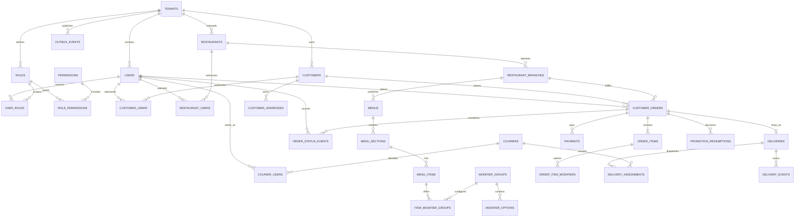
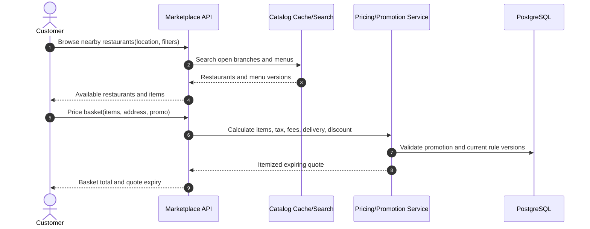
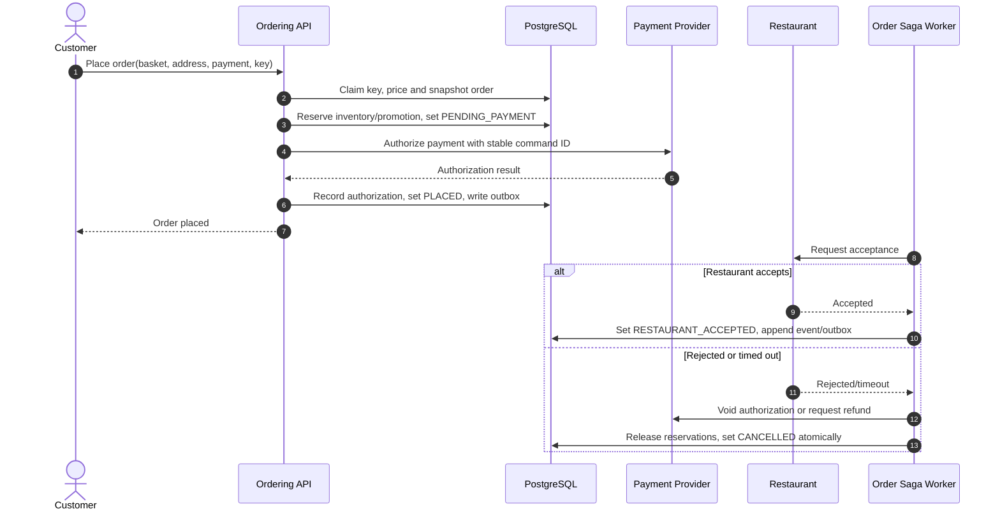
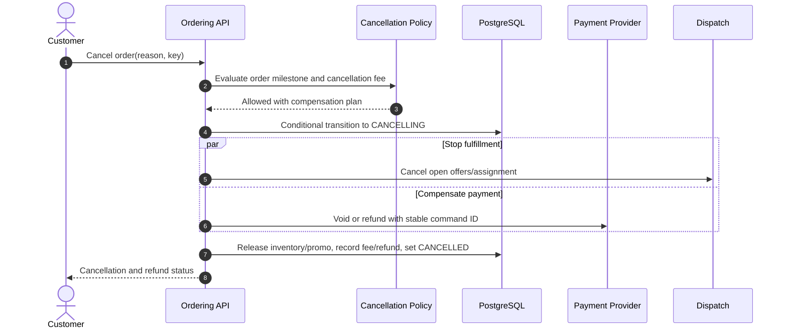
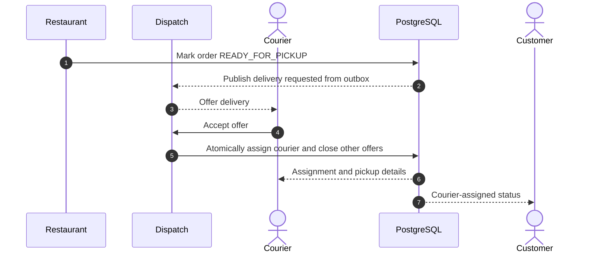
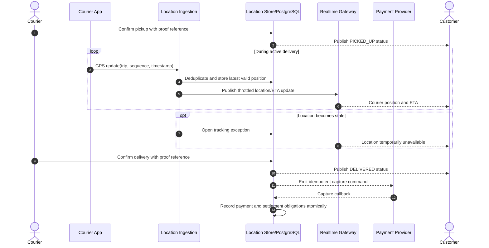
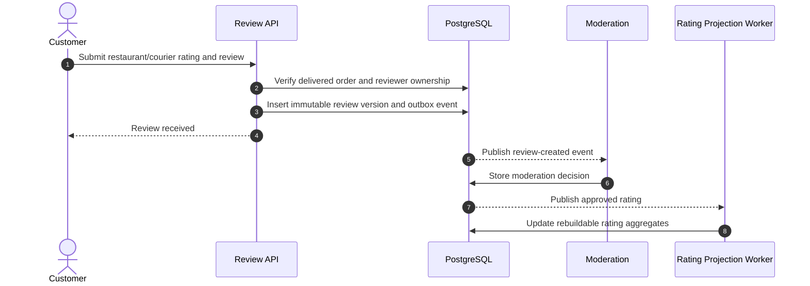

# Food Delivery Database Design

This design models a multi-tenant food-delivery marketplace using PostgreSQL with PostGIS. PostgreSQL is the transactional source of truth for restaurants, menus, orders, payments, courier assignments, and state history. Search indexes, caches, routing engines, and event streams are derived systems and must tolerate replay.

## Scope and principles

- Supports customers, restaurant branches, versioned menus and modifiers, scheduled/immediate orders, promotions, tax, tips, payments/refunds, courier dispatch, and proof of delivery.
- An accepted order stores immutable item, price, tax, address, and policy snapshots so later catalog edits cannot rewrite history.
- Order, payment, restaurant-fulfillment, and delivery state are separate state machines coordinated by a saga.
- Monetary values use `numeric(19,4)` with explicit currency; coordinates use PostGIS `geography(Point,4326)`.
- Authentication secrets, raw payment credentials, and sensitive media live in dedicated identity, payment-vault, and object-storage systems.

## Critical invariants

1. An order belongs to exactly one customer, tenant, restaurant branch, and currency.
2. Accepted item prices and totals are immutable snapshots and recompute to the stored grand total.
3. Order state transitions are valid, monotonic, and recorded as append-only events.
4. A payment capture/refund amount cannot exceed the authorized/captured remainder.
5. An order has at most one active delivery assignment; a courier cannot have conflicting active jobs unless batching is explicitly enabled.
6. Inventory reservations are atomic and cannot drive tracked stock below zero.
7. Duplicate client calls, provider callbacks, and courier events have one outcome.
8. Transactional state changes and outbox events commit together.

## Identity and authorization tables

Authentication identities are separate from customer, restaurant, and courier profiles.

| Table | Key columns | Purpose and constraints |
|---|---|---|
| `users` | `user_id`, `tenant_id`, `identity_subject`, `email_hash`, `status`, login timestamps | External identity-provider subject without stored credentials. |
| `roles` | `role_id`, `tenant_id`, `role_code`, `name`, `description`, `is_system` | Customer, courier, restaurant operator, support, finance, or administrator role. |
| `permissions` | `permission_id`, `permission_code`, `description` | Global action catalog. |
| `user_roles` | `user_role_id`, `tenant_id`, user/role IDs, optional scope, assignment/expiry fields | Auditable role assignment, optionally scoped to a restaurant or branch. |
| `role_permissions` | `tenant_id`, `role_id`, `permission_id`, `granted_at` | Role-to-permission grants. |
| `customer_users` | customer/user IDs, validity/status fields | Connects consumer identities to customer profiles. |
| `restaurant_users` | restaurant/user IDs, relationship type, validity/status fields | Connects owners and staff to restaurant profiles. |
| `courier_users` | courier/user IDs, validity/status fields | Connects delivery identities to courier profiles. |

The access path is `users → customer_users/restaurant_users/courier_users → domain profile`; authorization flows through roles and permissions. Orders and human-generated order events retain `placed_by_user_id` or `actor_user_id`.

## Entity relationship model



## Marketplace and catalog tables

Every tenant-owned relationship should use composite foreign keys containing `tenant_id` to make cross-tenant references impossible.

| Table | Key columns | Purpose and constraints |
|---|---|---|
| `tenants` | `tenant_id`, `code`, `name`, `default_currency`, `timezone`, `status` | Marketplace/legal-entity boundary. |
| `customers` | `customer_id`, `tenant_id`, `customer_number`, `status`, encrypted PII reference, `created_at` | Ordering customer without plaintext secrets. |
| `customer_addresses` | `address_id`, `tenant_id`, `customer_id`, encrypted address fields, `location`, `delivery_instructions_ciphertext`, `version` | Saved address; order copies an immutable delivery snapshot. |
| `restaurants` | `restaurant_id`, `tenant_id`, legal/display names, cuisine tags, settlement account reference, `status` | Restaurant business. |
| `restaurant_branches` | `branch_id`, `tenant_id`, `restaurant_id`, branch code, encrypted address, `location`, timezone, service radius/polygon, `status` | Physical fulfillment location. |
| `business_hours` | `branch_id`, `day_of_week`, local open/close, effective dates, exception calendar reference | Versioned availability windows. |
| `menus` | `menu_id`, `branch_id`, `name`, `currency`, `valid_from`, `valid_to`, `status`, `version` | Scheduled/versioned menu. Only one applicable published version per branch/time/channel. |
| `menu_sections` | `section_id`, `menu_id`, `name`, `sort_order` | Menu grouping. |
| `menu_items` | `item_id`, `section_id`, SKU, name/description, `base_price`, tax category, prep seconds, `is_available`, `version` | Sellable item; historical orders retain snapshots. |
| `modifier_groups` | `modifier_group_id`, `tenant_id`, name, `min_select`, `max_select` | Reusable choice group. Check nonnegative limits and `min_select <= max_select`. |
| `modifier_options` | `option_id`, `modifier_group_id`, name, `price_delta`, `is_available` | Choice such as size or topping. |
| `item_modifier_groups` | `item_id`, `modifier_group_id`, optional selection overrides, `sort_order` | Menu item/modifier many-to-many relation. |
| `inventory_items` | `inventory_item_id`, `branch_id`, `item_id`, `on_hand`, `reserved`, `version` | Optional coarse inventory. Check `on_hand >= reserved >= 0`. |

## Order, pricing, and payment tables

| Table | Key columns | Purpose and constraints |
|---|---|---|
| `customer_orders` | `order_id`, `tenant_id`, `order_number`, `customer_id`, `branch_id`, `currency`, `order_type`, `status`, delivery/contact snapshots, scheduled/placed timestamps, subtotal/tax/fee/tip/discount/grand totals, pricing/rule versions, `idempotency_key`, `version` | Aggregate root. Unique tenant order number and idempotency key. |
| `order_items` | `order_item_id`, `order_id`, source item ID, immutable SKU/name/tax snapshots, quantity, unit price, modifier total, line subtotal/tax/discount/total | Historical line item; checks quantity and arithmetic. |
| `order_item_modifiers` | `order_item_modifier_id`, `order_item_id`, source option ID, immutable name/price snapshot, quantity | Historical selected option. |
| `order_status_events` | `event_id bigint`, `order_id`, `sequence_no`, `from_status`, `to_status`, actor/reason fields, `occurred_at`, `metadata` | Append-only state history, unique order/sequence. |
| `promotions` | `promotion_id`, `tenant_id`, code, eligibility/rule version, budget/usage limits, effective window, `status` | Versioned promotion definition. |
| `promotion_redemptions` | `redemption_id`, `promotion_id`, `order_id`, `customer_id`, discount amount, `status`, `reserved_at`, `consumed_at` | Atomic reservation prevents limit oversubscription. |
| `payments` | `payment_id`, `order_id`, `provider`, `provider_payment_id`, `status`, authorized/captured/refunded amounts, `idempotency_key`, `version` | Payment aggregate; unique provider/reference. |
| `payment_attempts` | `attempt_id`, `payment_id`, operation, provider request/response references, status/failure code, timestamps | Append-oriented callback/attempt history. |
| `refunds` | `refund_id`, `payment_id`, `amount`, `reason`, `status`, provider/idempotency references | Full or partial refund; posted total cannot exceed captured value. |

Compute totals on the server from current catalog/rules, then store the full snapshot. A database check can enforce `grand_total = subtotal + tax + fees + tip - discount`; a pricing-version reference explains how components were produced.

## Delivery and courier tables

| Table | Key columns | Purpose and constraints |
|---|---|---|
| `couriers` | `courier_id`, `tenant_id`, identity reference, `status`, vehicle type, capacity, rating aggregates, `version` | Courier profile and eligibility state. |
| `courier_availabilities` | `courier_id`, `status`, `last_location`, `location_at`, current capacity, `version` | Small current-state projection; live locations may be cached/streamed separately. |
| `deliveries` | `delivery_id`, `tenant_id`, `order_id`, pickup/dropoff snapshots, `status`, estimated/actual timestamps, route/distance, proof reference, `version` | One delivery aggregate per order. |
| `delivery_assignments` | `assignment_id`, `delivery_id`, `courier_id`, `offer_status`, `offered_at`, `expires_at`, `responded_at`, `attempt_no` | Dispatch offers/assignments. A partial unique index enforces one accepted active assignment per delivery. |
| `delivery_events` | `event_id bigint`, `delivery_id`, `sequence_no`, type, courier/actor, optional location, `occurred_at`, `received_at`, metadata | Append-only tracking history with source sequence/idempotency. |

Use PostGIS `ST_DWithin`/GiST indexes for candidate discovery at modest scale. At large scale, maintain courier geocells in an in-memory geo index, but validate the selected courier and assignment atomically in PostgreSQL.

## Complete PostgreSQL schema, constraints, and indexes

The following dependency-ordered DDL creates the complete relational model documented above. PostGIS is required for geospatial columns and indexes.

```sql
CREATE EXTENSION IF NOT EXISTS pgcrypto;
CREATE EXTENSION IF NOT EXISTS postgis;

CREATE TABLE tenants (
    tenant_id uuid PRIMARY KEY DEFAULT gen_random_uuid(),
    code text NOT NULL UNIQUE, name text NOT NULL,
    default_currency char(3) NOT NULL, timezone text NOT NULL,
    status text NOT NULL CHECK (status IN ('ACTIVE','SUSPENDED','CLOSED'))
);

CREATE TABLE users (
    user_id uuid PRIMARY KEY DEFAULT gen_random_uuid(),
    tenant_id uuid NOT NULL REFERENCES tenants(tenant_id),
    identity_subject text NOT NULL, email_hash bytea NULL,
    status text NOT NULL CHECK (status IN ('INVITED','ACTIVE','LOCKED','DISABLED')),
    last_login_at timestamptz NULL,
    created_at timestamptz NOT NULL DEFAULT clock_timestamp(),
    updated_at timestamptz NOT NULL DEFAULT clock_timestamp(),
    UNIQUE (tenant_id, user_id), UNIQUE (tenant_id, identity_subject)
);

CREATE TABLE roles (
    role_id uuid PRIMARY KEY DEFAULT gen_random_uuid(),
    tenant_id uuid NOT NULL REFERENCES tenants(tenant_id),
    role_code text NOT NULL, name text NOT NULL, description text NULL,
    is_system boolean NOT NULL DEFAULT false,
    created_at timestamptz NOT NULL DEFAULT clock_timestamp(),
    UNIQUE (tenant_id, role_id), UNIQUE (tenant_id, role_code)
);

CREATE TABLE permissions (
    permission_id uuid PRIMARY KEY DEFAULT gen_random_uuid(),
    permission_code text NOT NULL UNIQUE, description text NOT NULL
);

CREATE TABLE role_permissions (
    tenant_id uuid NOT NULL, role_id uuid NOT NULL,
    permission_id uuid NOT NULL REFERENCES permissions(permission_id),
    granted_at timestamptz NOT NULL DEFAULT clock_timestamp(),
    PRIMARY KEY (role_id, permission_id),
    FOREIGN KEY (tenant_id, role_id) REFERENCES roles(tenant_id, role_id)
);

CREATE TABLE user_roles (
    user_role_id uuid PRIMARY KEY DEFAULT gen_random_uuid(),
    tenant_id uuid NOT NULL, user_id uuid NOT NULL, role_id uuid NOT NULL,
    scope_type text NULL, scope_id uuid NULL,
    assigned_by_user_id uuid NULL,
    assigned_at timestamptz NOT NULL DEFAULT clock_timestamp(),
    expires_at timestamptz NULL,
    FOREIGN KEY (tenant_id, user_id) REFERENCES users(tenant_id, user_id),
    FOREIGN KEY (tenant_id, role_id) REFERENCES roles(tenant_id, role_id),
    FOREIGN KEY (tenant_id, assigned_by_user_id) REFERENCES users(tenant_id, user_id),
    CHECK ((scope_type IS NULL) = (scope_id IS NULL)),
    CHECK (expires_at IS NULL OR expires_at > assigned_at)
);

CREATE TABLE customers (
    customer_id uuid PRIMARY KEY DEFAULT gen_random_uuid(),
    tenant_id uuid NOT NULL REFERENCES tenants(tenant_id),
    customer_number text NOT NULL, pii_reference text NOT NULL,
    status text NOT NULL CHECK (status IN ('ACTIVE','RESTRICTED','CLOSED')),
    created_at timestamptz NOT NULL DEFAULT clock_timestamp(),
    UNIQUE (tenant_id, customer_id), UNIQUE (tenant_id, customer_number)
);

CREATE TABLE customer_addresses (
    address_id uuid PRIMARY KEY DEFAULT gen_random_uuid(),
    tenant_id uuid NOT NULL REFERENCES tenants(tenant_id),
    customer_id uuid NOT NULL REFERENCES customers(customer_id),
    address_ciphertext bytea NOT NULL,
    location geography(Point,4326) NOT NULL,
    delivery_instructions_ciphertext bytea NULL,
    version bigint NOT NULL DEFAULT 0
);

CREATE TABLE restaurants (
    restaurant_id uuid PRIMARY KEY DEFAULT gen_random_uuid(),
    tenant_id uuid NOT NULL REFERENCES tenants(tenant_id),
    legal_name text NOT NULL, display_name text NOT NULL,
    cuisine_tags text[] NOT NULL DEFAULT '{}', settlement_reference text NOT NULL,
    status text NOT NULL CHECK (status IN ('PENDING','ACTIVE','SUSPENDED','CLOSED')),
    UNIQUE (tenant_id, restaurant_id)
);

CREATE TABLE restaurant_branches (
    branch_id uuid PRIMARY KEY DEFAULT gen_random_uuid(),
    tenant_id uuid NOT NULL REFERENCES tenants(tenant_id),
    restaurant_id uuid NOT NULL REFERENCES restaurants(restaurant_id),
    branch_code text NOT NULL, address_ciphertext bytea NOT NULL,
    location geography(Point,4326) NOT NULL, timezone text NOT NULL,
    service_area geography(MultiPolygon,4326) NULL,
    status text NOT NULL CHECK (status IN ('ACTIVE','PAUSED','CLOSED')),
    UNIQUE (tenant_id, branch_id), UNIQUE (tenant_id, branch_code)
);

CREATE TABLE business_hours (
    business_hour_id uuid PRIMARY KEY DEFAULT gen_random_uuid(),
    branch_id uuid NOT NULL REFERENCES restaurant_branches(branch_id),
    day_of_week smallint NOT NULL CHECK (day_of_week BETWEEN 0 AND 6),
    local_open time NOT NULL, local_close time NOT NULL,
    valid_from date NOT NULL, valid_to date NULL,
    exception_calendar_ref text NULL,
    CHECK (valid_to IS NULL OR valid_to >= valid_from),
    UNIQUE (branch_id, day_of_week, local_open, valid_from)
);

CREATE TABLE menus (
    menu_id uuid PRIMARY KEY DEFAULT gen_random_uuid(),
    branch_id uuid NOT NULL REFERENCES restaurant_branches(branch_id),
    name text NOT NULL, currency char(3) NOT NULL,
    valid_from timestamptz NOT NULL, valid_to timestamptz NULL,
    status text NOT NULL CHECK (status IN ('DRAFT','PUBLISHED','RETIRED')),
    version bigint NOT NULL DEFAULT 0,
    CHECK (valid_to IS NULL OR valid_to > valid_from)
);

CREATE TABLE menu_sections (
    section_id uuid PRIMARY KEY DEFAULT gen_random_uuid(),
    menu_id uuid NOT NULL REFERENCES menus(menu_id),
    name text NOT NULL, sort_order integer NOT NULL CHECK (sort_order >= 0),
    UNIQUE (menu_id, sort_order)
);

CREATE TABLE menu_items (
    item_id uuid PRIMARY KEY DEFAULT gen_random_uuid(),
    section_id uuid NOT NULL REFERENCES menu_sections(section_id),
    sku text NOT NULL, name text NOT NULL, description text NULL,
    base_price numeric(19,4) NOT NULL CHECK (base_price >= 0),
    tax_category text NOT NULL,
    prep_seconds integer NOT NULL DEFAULT 0 CHECK (prep_seconds >= 0),
    is_available boolean NOT NULL DEFAULT true, version bigint NOT NULL DEFAULT 0,
    UNIQUE (section_id, sku)
);

CREATE TABLE modifier_groups (
    modifier_group_id uuid PRIMARY KEY DEFAULT gen_random_uuid(),
    tenant_id uuid NOT NULL REFERENCES tenants(tenant_id), name text NOT NULL,
    min_select integer NOT NULL DEFAULT 0 CHECK (min_select >= 0),
    max_select integer NOT NULL CHECK (max_select > 0),
    CHECK (min_select <= max_select)
);

CREATE TABLE modifier_options (
    option_id uuid PRIMARY KEY DEFAULT gen_random_uuid(),
    modifier_group_id uuid NOT NULL REFERENCES modifier_groups(modifier_group_id),
    name text NOT NULL, price_delta numeric(19,4) NOT NULL DEFAULT 0,
    is_available boolean NOT NULL DEFAULT true
);

CREATE TABLE item_modifier_groups (
    item_id uuid NOT NULL REFERENCES menu_items(item_id),
    modifier_group_id uuid NOT NULL REFERENCES modifier_groups(modifier_group_id),
    min_select_override integer NULL CHECK (min_select_override >= 0),
    max_select_override integer NULL CHECK (max_select_override > 0),
    sort_order integer NOT NULL DEFAULT 0 CHECK (sort_order >= 0),
    PRIMARY KEY (item_id, modifier_group_id),
    CHECK (min_select_override IS NULL OR max_select_override IS NULL
           OR min_select_override <= max_select_override)
);

CREATE TABLE couriers (
    courier_id uuid PRIMARY KEY DEFAULT gen_random_uuid(),
    tenant_id uuid NOT NULL REFERENCES tenants(tenant_id),
    identity_reference text NOT NULL,
    status text NOT NULL CHECK (status IN ('PENDING','ACTIVE','PAUSED','SUSPENDED','CLOSED')),
    vehicle_type text NOT NULL, capacity integer NOT NULL DEFAULT 1 CHECK (capacity > 0),
    rating_sum numeric(18,4) NOT NULL DEFAULT 0 CHECK (rating_sum >= 0),
    rating_count bigint NOT NULL DEFAULT 0 CHECK (rating_count >= 0),
    version bigint NOT NULL DEFAULT 0,
    UNIQUE (tenant_id, courier_id)
);

CREATE TABLE customer_users (
    tenant_id uuid NOT NULL, customer_id uuid NOT NULL, user_id uuid NOT NULL,
    status text NOT NULL CHECK (status IN ('ACTIVE','SUSPENDED','REVOKED')),
    valid_from timestamptz NOT NULL DEFAULT clock_timestamp(), valid_to timestamptz NULL,
    PRIMARY KEY (customer_id, user_id, valid_from),
    FOREIGN KEY (tenant_id, customer_id) REFERENCES customers(tenant_id, customer_id),
    FOREIGN KEY (tenant_id, user_id) REFERENCES users(tenant_id, user_id),
    CHECK (valid_to IS NULL OR valid_to > valid_from)
);

CREATE TABLE restaurant_users (
    tenant_id uuid NOT NULL, restaurant_id uuid NOT NULL, user_id uuid NOT NULL,
    relationship_type text NOT NULL CHECK (relationship_type IN ('OWNER','MANAGER','STAFF','FINANCE')),
    status text NOT NULL CHECK (status IN ('ACTIVE','SUSPENDED','REVOKED')),
    valid_from timestamptz NOT NULL DEFAULT clock_timestamp(), valid_to timestamptz NULL,
    PRIMARY KEY (restaurant_id, user_id, valid_from),
    FOREIGN KEY (tenant_id, restaurant_id) REFERENCES restaurants(tenant_id, restaurant_id),
    FOREIGN KEY (tenant_id, user_id) REFERENCES users(tenant_id, user_id),
    CHECK (valid_to IS NULL OR valid_to > valid_from)
);

CREATE TABLE courier_users (
    tenant_id uuid NOT NULL, courier_id uuid NOT NULL, user_id uuid NOT NULL,
    status text NOT NULL CHECK (status IN ('ACTIVE','SUSPENDED','REVOKED')),
    valid_from timestamptz NOT NULL DEFAULT clock_timestamp(), valid_to timestamptz NULL,
    PRIMARY KEY (courier_id, user_id, valid_from),
    FOREIGN KEY (tenant_id, courier_id) REFERENCES couriers(tenant_id, courier_id),
    FOREIGN KEY (tenant_id, user_id) REFERENCES users(tenant_id, user_id),
    CHECK (valid_to IS NULL OR valid_to > valid_from)
);

CREATE TABLE customer_orders (
    order_id          uuid PRIMARY KEY DEFAULT gen_random_uuid(),
    tenant_id         uuid NOT NULL REFERENCES tenants(tenant_id),
    placed_by_user_id uuid NULL,
    order_number      text NOT NULL,
    customer_id       uuid NOT NULL REFERENCES customers(customer_id),
    branch_id         uuid NOT NULL REFERENCES restaurant_branches(branch_id),
    currency          char(3) NOT NULL,
    order_type        text NOT NULL CHECK (order_type IN ('DELIVERY','PICKUP')),
    status            text NOT NULL CHECK (status IN
        ('DRAFT','PENDING_PAYMENT','PLACED','RESTAURANT_ACCEPTED','PREPARING',
         'READY_FOR_PICKUP','PICKED_UP','DELIVERED','CANCELLED','FAILED')),
    delivery_snapshot jsonb NULL,
    scheduled_at      timestamptz NULL,
    placed_at         timestamptz NULL,
    subtotal          numeric(19,4) NOT NULL CHECK (subtotal >= 0),
    tax_total         numeric(19,4) NOT NULL CHECK (tax_total >= 0),
    fee_total         numeric(19,4) NOT NULL CHECK (fee_total >= 0),
    tip_total         numeric(19,4) NOT NULL DEFAULT 0 CHECK (tip_total >= 0),
    discount_total    numeric(19,4) NOT NULL DEFAULT 0 CHECK (discount_total >= 0),
    grand_total       numeric(19,4) NOT NULL CHECK (grand_total >= 0),
    pricing_version   text NOT NULL,
    idempotency_key   text NOT NULL,
    version           bigint NOT NULL DEFAULT 0,
    created_at        timestamptz NOT NULL DEFAULT clock_timestamp(),
    updated_at        timestamptz NOT NULL DEFAULT clock_timestamp(),
    FOREIGN KEY (tenant_id, placed_by_user_id) REFERENCES users(tenant_id, user_id),
    CHECK (grand_total = subtotal + tax_total + fee_total + tip_total - discount_total),
    CHECK (order_type = 'PICKUP' OR delivery_snapshot IS NOT NULL),
    UNIQUE (tenant_id, order_id),
    UNIQUE (tenant_id, order_number),
    UNIQUE (tenant_id, idempotency_key)
);

CREATE TABLE order_items (
    order_item_id      uuid PRIMARY KEY DEFAULT gen_random_uuid(),
    tenant_id          uuid NOT NULL,
    order_id           uuid NOT NULL,
    source_item_id     uuid NOT NULL REFERENCES menu_items(item_id),
    sku_snapshot       text NOT NULL,
    name_snapshot      text NOT NULL,
    quantity           integer NOT NULL CHECK (quantity > 0),
    unit_price         numeric(19,4) NOT NULL CHECK (unit_price >= 0),
    modifier_total     numeric(19,4) NOT NULL DEFAULT 0 CHECK (modifier_total >= 0),
    line_subtotal      numeric(19,4) NOT NULL CHECK (line_subtotal >= 0),
    tax_total          numeric(19,4) NOT NULL DEFAULT 0 CHECK (tax_total >= 0),
    discount_total     numeric(19,4) NOT NULL DEFAULT 0 CHECK (discount_total >= 0),
    line_total         numeric(19,4) NOT NULL CHECK (line_total >= 0),
    tax_rule_snapshot  jsonb NOT NULL DEFAULT '{}'::jsonb,
    FOREIGN KEY (tenant_id, order_id) REFERENCES customer_orders(tenant_id, order_id),
    CHECK (line_subtotal = quantity * (unit_price + modifier_total)),
    CHECK (line_total = line_subtotal + tax_total - discount_total)
);

CREATE TABLE order_item_modifiers (
    order_item_modifier_id uuid PRIMARY KEY DEFAULT gen_random_uuid(),
    order_item_id uuid NOT NULL REFERENCES order_items(order_item_id),
    source_option_id uuid NOT NULL REFERENCES modifier_options(option_id),
    name_snapshot text NOT NULL, price_snapshot numeric(19,4) NOT NULL,
    quantity integer NOT NULL DEFAULT 1 CHECK (quantity > 0)
);

CREATE TABLE order_status_events (
    event_id     bigint GENERATED ALWAYS AS IDENTITY PRIMARY KEY,
    tenant_id    uuid NOT NULL,
    order_id     uuid NOT NULL,
    sequence_no  bigint NOT NULL CHECK (sequence_no > 0),
    from_status  text NULL,
    to_status    text NOT NULL,
    actor_type   text NOT NULL,
    actor_user_id uuid NULL,
    reason_code  text NULL,
    occurred_at  timestamptz NOT NULL DEFAULT clock_timestamp(),
    FOREIGN KEY (tenant_id, order_id) REFERENCES customer_orders(tenant_id, order_id),
    FOREIGN KEY (tenant_id, actor_user_id) REFERENCES users(tenant_id, user_id),
    UNIQUE (order_id, sequence_no)
);

CREATE TABLE promotions (
    promotion_id uuid PRIMARY KEY DEFAULT gen_random_uuid(),
    tenant_id uuid NOT NULL REFERENCES tenants(tenant_id),
    code text NOT NULL, rule_version text NOT NULL,
    rule_definition jsonb NOT NULL,
    budget_amount numeric(19,4) NULL CHECK (budget_amount >= 0),
    usage_limit bigint NULL CHECK (usage_limit > 0),
    valid_from timestamptz NOT NULL, valid_to timestamptz NOT NULL,
    status text NOT NULL CHECK (status IN ('DRAFT','ACTIVE','PAUSED','EXPIRED')),
    CHECK (valid_to > valid_from),
    UNIQUE (tenant_id, promotion_id), UNIQUE (tenant_id, code, valid_from)
);

CREATE TABLE promotion_redemptions (
    redemption_id uuid PRIMARY KEY DEFAULT gen_random_uuid(),
    tenant_id uuid NOT NULL, promotion_id uuid NOT NULL, order_id uuid NOT NULL,
    customer_id uuid NOT NULL REFERENCES customers(customer_id),
    discount_amount numeric(19,4) NOT NULL CHECK (discount_amount > 0),
    status text NOT NULL CHECK (status IN ('RESERVED','CONSUMED','RELEASED','EXPIRED')),
    reserved_at timestamptz NOT NULL, consumed_at timestamptz NULL,
    FOREIGN KEY (tenant_id, promotion_id) REFERENCES promotions(tenant_id, promotion_id),
    FOREIGN KEY (tenant_id, order_id) REFERENCES customer_orders(tenant_id, order_id),
    UNIQUE (promotion_id, order_id)
);

CREATE TABLE inventory_items (
    inventory_item_id uuid PRIMARY KEY DEFAULT gen_random_uuid(),
    branch_id         uuid NOT NULL REFERENCES restaurant_branches(branch_id),
    item_id           uuid NOT NULL REFERENCES menu_items(item_id),
    on_hand           integer NOT NULL DEFAULT 0,
    reserved          integer NOT NULL DEFAULT 0,
    version           bigint NOT NULL DEFAULT 0,
    CHECK (on_hand >= 0),
    CHECK (reserved >= 0 AND reserved <= on_hand),
    UNIQUE (branch_id, item_id)
);

CREATE TABLE courier_availabilities (
    courier_id uuid PRIMARY KEY REFERENCES couriers(courier_id),
    status text NOT NULL CHECK (status IN ('OFFLINE','AVAILABLE','BUSY','PAUSED')),
    last_location geography(Point,4326) NULL, location_at timestamptz NULL,
    current_capacity integer NOT NULL DEFAULT 0 CHECK (current_capacity >= 0),
    version bigint NOT NULL DEFAULT 0
);

CREATE TABLE deliveries (
    delivery_id      uuid PRIMARY KEY DEFAULT gen_random_uuid(),
    tenant_id        uuid NOT NULL REFERENCES tenants(tenant_id),
    order_id         uuid NOT NULL UNIQUE REFERENCES customer_orders(order_id),
    status           text NOT NULL CHECK (status IN
        ('PENDING','DISPATCHING','ASSIGNED','PICKED_UP','DELIVERED','CANCELLED','FAILED')),
    pickup_snapshot  jsonb NOT NULL,
    dropoff_snapshot jsonb NOT NULL,
    estimated_pickup_at timestamptz NULL,
    estimated_delivery_at timestamptz NULL,
    version           bigint NOT NULL DEFAULT 0,
    UNIQUE (tenant_id, delivery_id)
);

CREATE TABLE delivery_assignments (
    assignment_id uuid PRIMARY KEY DEFAULT gen_random_uuid(),
    tenant_id     uuid NOT NULL,
    delivery_id   uuid NOT NULL,
    courier_id    uuid NOT NULL REFERENCES couriers(courier_id),
    status        text NOT NULL CHECK
        (status IN ('OFFERED','ACCEPTED','REJECTED','EXPIRED','RELEASED','COMPLETED')),
    offered_at    timestamptz NOT NULL,
    expires_at    timestamptz NOT NULL,
    responded_at  timestamptz NULL,
    attempt_no    integer NOT NULL CHECK (attempt_no > 0),
    FOREIGN KEY (tenant_id, delivery_id) REFERENCES deliveries(tenant_id, delivery_id),
    CHECK (expires_at > offered_at),
    UNIQUE (delivery_id, courier_id, attempt_no)
);

CREATE TABLE delivery_events (
    event_id bigint GENERATED ALWAYS AS IDENTITY PRIMARY KEY,
    tenant_id uuid NOT NULL, delivery_id uuid NOT NULL,
    sequence_no bigint NOT NULL CHECK (sequence_no > 0), event_type text NOT NULL,
    courier_id uuid NULL REFERENCES couriers(courier_id),
    actor_type text NOT NULL, actor_id uuid NULL,
    location geography(Point,4326) NULL, source_event_id text NULL,
    occurred_at timestamptz NOT NULL,
    received_at timestamptz NOT NULL DEFAULT clock_timestamp(),
    metadata jsonb NOT NULL DEFAULT '{}'::jsonb,
    FOREIGN KEY (tenant_id, delivery_id) REFERENCES deliveries(tenant_id, delivery_id),
    UNIQUE (delivery_id, sequence_no), UNIQUE (tenant_id, source_event_id)
);

CREATE TABLE payments (
    payment_id       uuid PRIMARY KEY DEFAULT gen_random_uuid(),
    order_id         uuid NOT NULL REFERENCES customer_orders(order_id),
    provider         text NOT NULL,
    provider_payment_id text NULL,
    status           text NOT NULL CHECK
        (status IN ('PENDING','AUTHORIZED','CAPTURED','PARTIALLY_REFUNDED','REFUNDED','VOIDED','FAILED')),
    authorized_amount numeric(19,4) NOT NULL DEFAULT 0 CHECK (authorized_amount >= 0),
    captured_amount  numeric(19,4) NOT NULL DEFAULT 0 CHECK (captured_amount >= 0),
    refunded_amount  numeric(19,4) NOT NULL DEFAULT 0 CHECK (refunded_amount >= 0),
    currency         char(3) NOT NULL,
    idempotency_key  text NOT NULL UNIQUE,
    version          bigint NOT NULL DEFAULT 0,
    CHECK (captured_amount <= authorized_amount),
    CHECK (refunded_amount <= captured_amount),
    UNIQUE (provider, provider_payment_id)
);

CREATE TABLE payment_attempts (
    attempt_id uuid PRIMARY KEY DEFAULT gen_random_uuid(),
    payment_id uuid NOT NULL REFERENCES payments(payment_id),
    operation text NOT NULL CHECK (operation IN ('AUTHORIZE','CAPTURE','VOID','REFUND')),
    provider_event_id text NULL,
    status text NOT NULL CHECK (status IN ('PENDING','SUCCEEDED','FAILED','UNKNOWN')),
    failure_code text NULL, started_at timestamptz NOT NULL, completed_at timestamptz NULL,
    CHECK (completed_at IS NULL OR completed_at >= started_at),
    UNIQUE (provider_event_id, operation)
);

CREATE TABLE refunds (
    refund_id uuid PRIMARY KEY DEFAULT gen_random_uuid(),
    payment_id uuid NOT NULL REFERENCES payments(payment_id),
    amount numeric(19,4) NOT NULL CHECK (amount > 0), reason text NOT NULL,
    status text NOT NULL CHECK (status IN ('CREATED','PENDING','POSTED','FAILED')),
    provider_reference text NULL, idempotency_key text NOT NULL UNIQUE,
    created_at timestamptz NOT NULL DEFAULT clock_timestamp()
);

CREATE TABLE outbox_events (
    event_id bigint GENERATED ALWAYS AS IDENTITY PRIMARY KEY,
    tenant_id uuid NOT NULL REFERENCES tenants(tenant_id),
    aggregate_type text NOT NULL, aggregate_id uuid NOT NULL, event_type text NOT NULL,
    payload jsonb NOT NULL, occurred_at timestamptz NOT NULL DEFAULT clock_timestamp(),
    published_at timestamptz NULL,
    attempt_count integer NOT NULL DEFAULT 0 CHECK (attempt_count >= 0)
);

CREATE TABLE audit_events (
    audit_event_id bigint GENERATED ALWAYS AS IDENTITY PRIMARY KEY,
    tenant_id uuid NOT NULL REFERENCES tenants(tenant_id), actor_id text NULL,
    action text NOT NULL, resource_type text NOT NULL, resource_id text NOT NULL,
    request_id text NULL, occurred_at timestamptz NOT NULL DEFAULT clock_timestamp(),
    details jsonb NOT NULL DEFAULT '{}'::jsonb
);

CREATE UNIQUE INDEX ux_user_roles_global
    ON user_roles (user_id, role_id) WHERE scope_type IS NULL;
CREATE UNIQUE INDEX ux_user_roles_scoped
    ON user_roles (user_id, role_id, scope_type, scope_id) WHERE scope_type IS NOT NULL;
CREATE INDEX ix_user_roles_active
    ON user_roles (tenant_id, user_id, expires_at);
CREATE INDEX ix_users_email_hash
    ON users (tenant_id, email_hash) WHERE email_hash IS NOT NULL;
CREATE UNIQUE INDEX ux_customer_users_active
    ON customer_users (customer_id, user_id) WHERE status = 'ACTIVE' AND valid_to IS NULL;
CREATE INDEX ix_customer_users_user ON customer_users (tenant_id, user_id, status);
CREATE UNIQUE INDEX ux_restaurant_users_active
    ON restaurant_users (restaurant_id, user_id) WHERE status = 'ACTIVE' AND valid_to IS NULL;
CREATE INDEX ix_restaurant_users_user ON restaurant_users (tenant_id, user_id, status);
CREATE UNIQUE INDEX ux_courier_users_active
    ON courier_users (courier_id, user_id) WHERE status = 'ACTIVE' AND valid_to IS NULL;
CREATE INDEX ix_courier_users_user ON courier_users (tenant_id, user_id, status);

CREATE INDEX ix_order_customer_history
    ON customer_orders (tenant_id, customer_id, created_at DESC);
CREATE INDEX ix_order_branch_queue
    ON customer_orders (tenant_id, branch_id, status, scheduled_at, created_at);
CREATE INDEX ix_order_item_order ON order_items (order_id);
CREATE INDEX ix_order_event_history ON order_status_events (order_id, sequence_no);
CREATE UNIQUE INDEX ux_delivery_active_assignment
    ON delivery_assignments (delivery_id) WHERE status = 'ACCEPTED';
CREATE UNIQUE INDEX ux_courier_active_assignment
    ON delivery_assignments (courier_id) WHERE status = 'ACCEPTED';
CREATE INDEX ix_assignment_offer_expiry
    ON delivery_assignments (expires_at) WHERE status = 'OFFERED';
CREATE INDEX ix_branch_location
    ON restaurant_branches USING gist (location);
CREATE INDEX ix_outbox_unpublished
    ON outbox_events (event_id) WHERE published_at IS NULL;
CREATE INDEX ix_customer_address_location ON customer_addresses USING gist (location);
CREATE INDEX ix_courier_availability_location
    ON courier_availabilities USING gist (last_location);
CREATE INDEX ix_delivery_event_history ON delivery_events (delivery_id, sequence_no);
CREATE INDEX ix_payment_attempt_pending
    ON payment_attempts (started_at) WHERE status IN ('PENDING','UNKNOWN');
CREATE INDEX ix_audit_resource_time
    ON audit_events (tenant_id, resource_type, resource_id, occurred_at DESC);
```

Allowed order/delivery transitions, promotion budgets, order-header totals versus all item rows, and refund totals across multiple refund rows require a transactional command procedure or deferred triggers. Accepted order snapshots and status events should be protected by immutability triggers; normal application roles should not update them directly.

## Main use-case sequence diagrams

Read the diagrams from top to bottom. The sequence follows the business lifecycle, with alternative and failure paths branching from the relevant step.

**Lifecycle:** Discover and price → place and accept → cancel/compensate branch or dispatch → track and deliver → settle → review

### 1. Browse a restaurant and price a basket



### 2. Place and accept an order



#### Flow details

Typical order states are `DRAFT`, `PENDING_PAYMENT`, `PLACED`, `RESTAURANT_ACCEPTED`, `PREPARING`, `READY_FOR_PICKUP`, `PICKED_UP`, `DELIVERED`, `CANCELLED`, and `FAILED`.

1. Price the basket, claim idempotency, snapshot lines/address/rules, and reserve promotion/inventory in one transaction.
2. Authorize payment remotely and process its callback idempotently; never hold a database transaction across the call.
3. Ask the branch to accept. Rejection or timeout releases stock/promotion and voids or refunds payment through compensating commands.

Saga steps retain command IDs, attempt counts, deadlines, and last errors so a worker can safely resume after a crash.

### 3. Customer cancellation and compensation



### 4. Dispatch and assign a courier



#### Flow details

Create the delivery and dispatch offers after restaurant acceptance. Courier acceptance uses an atomic conditional update plus the partial unique constraint so only one offer can win.

### 5. Track, deliver, and settle



#### Flow details

Capture payment at the configured milestone and release restaurant/courier settlement through the accounting or ledger service. Every order, delivery, and payment transition writes its state event and transactional outbox record in the same commit.

### 6. Rate an order and courier




## Non-functional Requirements

The targets below are initial objectives for normal regional operation; peak-event capacity must be tested separately.

### Exception Handling

- Use stable error codes and correlation IDs for customer, restaurant, and courier clients; distinguish validation, conflict, retryable, and terminal failures.
- Persist saga commands before remote calls, retry with bounded backoff, and compensate inventory, promotions, payments, and assignments idempotently.
- Route exhausted retries and inconsistent order/payment/delivery states to a dead-letter queue and operations dashboard.

- Use optimistic versions for ordinary updates and row locks for inventory, promotion quotas, and assignment claims; callbacks and consumers remain idempotent.
- Workers claim only small batches with `FOR UPDATE SKIP LOCKED`.

### Availability

- Target 99.95% monthly availability for ordering and active-delivery APIs and 99.9% for catalog/review features.
- Keep active-order state, courier assignment, and delivery confirmation available when search, recommendations, or reviews are degraded.
- Deploy across failure domains with tested failover; target RPO ≤ 5 minutes and RTO ≤ 30 minutes for transactional data.

- Use regional PostgreSQL HA, point-in-time recovery, encrypted off-domain backups, and tested restore/failover procedures.
- Route checkout and state-changing reads to the primary; reporting uses replicas or the analytics warehouse.

### Scalability

- Horizontally scale marketplace, ordering, dispatch, location-ingestion, and notification services independently.
- Partition orders and delivery events by region/time; shard dispatch and location workloads by service area.
- Apply queue backpressure, admission control, restaurant-level throttles, and load shedding for nonessential updates during meal peaks.

- Index menus by branch/effective window, orders by customer/date and branch/status/time, and delivery work by courier/status.
- Add geospatial indexes for branch/courier locations and partial indexes for open orders, expiring offers, pending payments, and unpublished outbox events.
- Partition order, delivery, payment-attempt, audit, and outbox history by month.

### Performance

- Target p95 ≤ 300 ms for basket pricing and order-state commands, excluding payment-provider time.
- Target p95 ≤ 1 second from accepted courier location update to customer-visible position, with throttling and stale-location detection.
- Target dispatch candidate generation within 2 seconds for the normal search radius and use asynchronous notifications.

- Use keyset pagination for order/event history; derived search indexes may serve discovery, but checkout must revalidate PostgreSQL state.

### Security

- Enforce scoped roles for customers, restaurant staff, couriers, support, finance, and administrators with step-up authentication for sensitive actions.
- Validate signed provider callbacks, protect APIs with TLS, rate limits, bot defenses, secret rotation, and device/session controls.
- Reveal customer/courier contact and precise location only during the necessary fulfillment window.

- Apply tenant row-level security and least-privilege operational roles; use signed short-lived URLs for delivery proof and media.

### Data Protection

- Encrypt addresses, contact details, location history, proof artifacts, databases, and backups; tokenize payment instruments.
- Apply strict retention to precise location and delivery proof, retaining only what fraud, safety, tax, and legal requirements justify.
- Separate analytics identifiers from direct identity and honor deletion/consent requirements without corrupting financial records.

- Minimize precise courier-location retention and expose restaurant, courier, and customer personal data only for a documented purpose and time window.

### Logging

- Emit structured logs with trace/order/delivery IDs, service area, state transition, dependency outcome, latency, and error code.
- Exclude raw addresses, phone numbers, messages, payment data, proof images, and precise coordinates from general logs.
- Alert on saga backlog, dispatch saturation, stale courier locations, payment callback failures, and elevated cancellation rates.

### Audit Logging

- Record menu/price changes, promotion overrides, manual order transitions, refunds, courier reassignment, proof access, and privileged data access.
- Include actor, role, reason, request ID, before/after state hashes, and outcome in append-only audit events.
- Replicate audit records to tamper-evident storage with access reviews and retention aligned to finance, safety, and marketplace obligations.

- Immutably record customer-support access to addresses, proof, payments, and other protected order data.

## Validation checklist

- Catalog edits cannot change an accepted order's items or price.
- Concurrent stock/promotion reservations do not oversubscribe.
- Duplicate callbacks and retries produce one payment/order transition.
- Invalid order, payment, and delivery transitions are rejected.
- Only one courier wins an assignment offer.
- Cancellation compensation releases each resource exactly once.
- Restored event/outbox processing converges without duplicate customer-visible effects.
