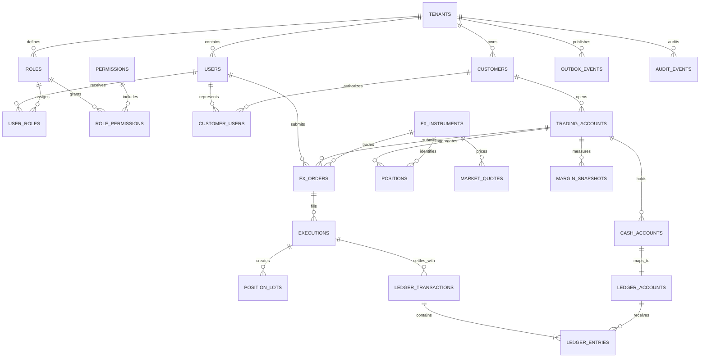
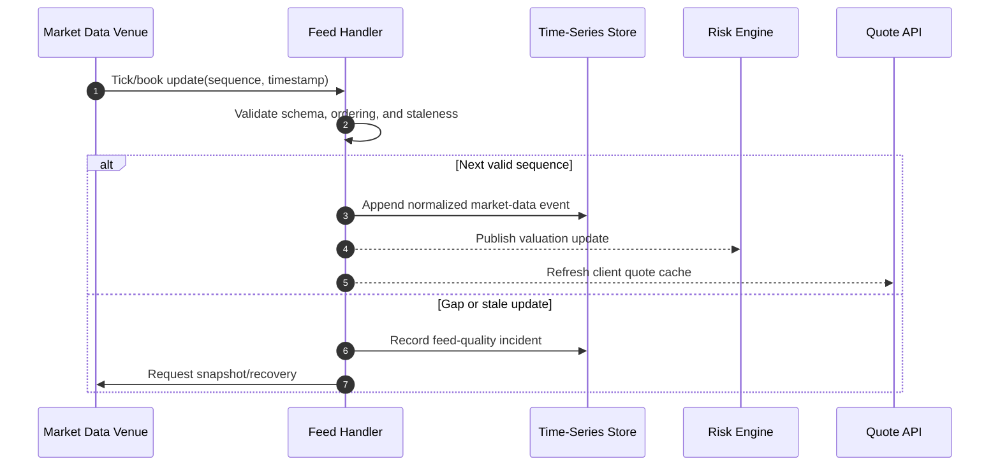

# Forex Trading Database Design

This design assumes `ForexApp` is a retail foreign-exchange trading platform rather than a simple currency converter. PostgreSQL stores customers, trading accounts, orders, executions, positions, cash ledgers, and compliance history. A dedicated pricing feed and, at very high throughput, a sequenced execution engine can sit in front of the database while PostgreSQL remains the durable system of record.

## Scope and principles

- Supports spot FX instruments, market/limit/stop orders, partial fills, margin, realized/unrealized P&L, deposits, withdrawals, and immutable execution history.
- Orders are mutable state machines; executions and cash-ledger postings are append-only facts.
- Prices use `numeric(20,10)`, quantities `numeric(20,8)`, and money `numeric(20,8)` with instrument/currency scale validation. Never use floating point.
- Market timestamps store both provider event time and ingestion time in UTC.
- The matching/execution sequence is authoritative; timestamps alone never define trade order.
- Credentials, KYC documents, and payment secrets remain in dedicated systems and are referenced by opaque IDs.

## Critical invariants

1. `(venue_id, execution_id)` and `(trading_account_id, client_order_id)` are unique.
2. An order's total filled quantity cannot exceed its requested quantity.
3. Executions are immutable; cancellations and corrections use linked bust/correct events.
4. Position quantity and cost are deterministic projections of executions in sequence order.
5. Cash movements balance per currency in the double-entry ledger.
6. Available margin cannot become negative when accepting an order unless the account is in an authorized liquidation flow.
7. Order state transitions are monotonic and guarded by version/sequence.
8. Idempotent retries return the original order or funding result.

## Identity and authorization tables

Authentication identities are separate from regulated customer and trading-account records.

| Table | Key columns | Purpose and constraints |
|---|---|---|
| `users` | `user_id`, `tenant_id`, `identity_subject`, `email_hash`, `status`, login timestamps | External identity-provider subject without stored passwords or tokens. |
| `roles` | `role_id`, `tenant_id`, `role_code`, `name`, `description`, `is_system` | Trader, dealer, risk, compliance, support, audit, or administrator role. |
| `permissions` | `permission_id`, `permission_code`, `description` | Global action catalog. |
| `user_roles` | `user_role_id`, `tenant_id`, user/role IDs, optional scope, assignment/expiry fields | Auditable role assignment, optionally scoped to a trading account or desk. |
| `role_permissions` | `tenant_id`, `role_id`, `permission_id`, `granted_at` | Role-to-permission grants. |
| `customer_users` | customer/user IDs, relationship type, validity/status fields | Links identities to individual or institutional customers; trading-account access is then constrained by roles/scopes. |

The access path is `users → customer_users → customers → trading_accounts`; authorization flows through `user_roles → roles → role_permissions`, and every client order records `submitted_by_user_id`.

## Entity relationship model



## Reference and account tables

| Table | Key columns | Purpose and constraints |
|---|---|---|
| `tenants` | `tenant_id`, `code`, `base_currency`, `timezone`, `status` | Broker/legal entity boundary. |
| `customers` | `customer_id`, `tenant_id`, `customer_number`, `status`, `kyc_status`, `risk_class`, encrypted PII reference | Trading customer. PII should be isolated/encrypted. |
| `trading_accounts` | `trading_account_id`, `tenant_id`, `customer_id`, `account_number_token`, `base_currency`, `mode`, `leverage_limit`, `margin_call_level`, `stop_out_level`, `status`, `version` | `mode` distinguishes live/demo; unique token/hash lookup. |
| `cash_accounts` | `cash_account_id`, `tenant_id`, `trading_account_id`, `currency`, `status` | One balance container per trading account/currency. |
| `venues` | `venue_id`, `code`, `name`, `timezone`, `status` | Liquidity provider, ECN, or internal venue. |
| `fx_instruments` | `instrument_id`, `symbol`, `base_currency`, `quote_currency`, `price_scale`, `quantity_scale`, `min_quantity`, `quantity_step`, `trading_status` | Unique currency pair such as `EUR/USD`; base and quote must differ. |
| `trading_sessions` | `session_id`, `instrument_id`, `day_of_week`, open/close times, holiday calendar reference | Valid trading windows; calendar changes are versioned. |

## Orders and executions

| Table | Key columns | Purpose and constraints |
|---|---|---|
| `fx_orders` | `order_id`, `tenant_id`, `trading_account_id`, `instrument_id`, `client_order_id`, `side`, `order_type`, `time_in_force`, `quantity`, `limit_price`, `stop_price`, `filled_quantity`, `average_fill_price`, `status`, `accepted_sequence`, `version`, timestamps | Order state. Unique `(trading_account_id, client_order_id)`. Conditional checks require prices for limit/stop types. |
| `order_events` | `order_event_id bigint`, `order_id`, `sequence_no`, `event_type`, old/new status, quantities, `reason_code`, `occurred_at`, `payload` | Append-only lifecycle history. Unique `(order_id, sequence_no)`. |
| `executions` | `execution_pk bigint`, `tenant_id`, `venue_id`, `venue_execution_id`, `order_id`, `execution_sequence`, `side`, `quantity`, `price`, `commission`, `commission_currency`, `executed_at`, `received_at`, `status`, `corrects_execution_pk NULL` | Immutable fill/bust/correction fact. Unique venue/external execution and internal sequence. |
| `position_lots` | `lot_id`, `tenant_id`, `trading_account_id`, `instrument_id`, `opening_execution_pk`, `opened_quantity`, `remaining_quantity`, `open_price`, `opened_at`, `closed_at` | FIFO/specified-lot basis for auditable realized P&L. |
| `positions` | `trading_account_id`, `instrument_id`, `net_quantity`, `average_open_price`, `realized_pnl`, `last_execution_sequence`, `version`, `updated_at` | Rebuildable, strongly consistent projection. Unique account/instrument. |

Order statuses are `PENDING`, `ACCEPTED`, `PARTIALLY_FILLED`, `FILLED`, `CANCEL_PENDING`, `CANCELLED`, `REJECTED`, and `EXPIRED`. Enforce allowed transitions in one command handler; do not let clients set status directly.

## Market data and risk

| Table | Key columns | Purpose and constraints |
|---|---|---|
| `market_quotes` | `instrument_id`, `provider_id`, `provider_sequence`, `bid`, `ask`, `event_at`, `received_at` | Append-only ticks; check `bid > 0`, `ask >= bid`. Partition by time and instrument/provider. |
| `market_candles` | `instrument_id`, `interval`, `bucket_at`, OHLC bid/ask values, `volume`, `source_version` | Derived historical bars, unique instrument/interval/bucket. |
| `margin_snapshots` | `snapshot_id bigint`, `trading_account_id`, `calculated_at`, `valuation_sequence`, `equity`, `used_margin`, `free_margin`, `margin_level`, `pricing_cutoff` | Auditable risk decision input/output; snapshots are not the financial source of truth. |
| `risk_reservations` | `reservation_id`, `order_id`, `trading_account_id`, `reserved_margin`, `currency`, `status`, `expires_at`, `version` | Prevents concurrent accepted orders from consuming the same margin. |

For large tick volumes, use a purpose-built time-series store or PostgreSQL time partitioning/compression. Keep the current best bid/ask in a small `latest_quote` projection with compare-and-set on provider sequence; never update it with an older quote.

## Cash ledger and settlement

| Table | Key columns | Purpose and constraints |
|---|---|---|
| `ledger_accounts` | `ledger_account_id`, `tenant_id`, `cash_account_id NULL`, `code`, `class`, `normal_side`, `currency`, `status` | Customer cash and internal settlement, fee, P&L, suspense, and bank accounts. |
| `ledger_transactions` | `ledger_transaction_id`, `tenant_id`, `type`, `business_date`, `posted_at`, `idempotency_key`, `reversal_of`, `reference`, `metadata` | Immutable transaction header. |
| `ledger_entries` | `entry_id bigint`, transaction/account IDs, `tenant_id`, `side`, `amount`, `currency`, `sequence_no` | Positive immutable debit/credit lines balanced per currency. |
| `cash_balances` | `ledger_account_id`, `debit_total`, `credit_total`, `posted_balance`, `available_balance`, `as_of_entry_id`, `version` | Rebuildable balance projection; available deducts withdrawal/margin reservations. |
| `funding_requests` | `funding_request_id`, account, `type`, `amount`, `currency`, `status`, provider/idempotency/ledger references, `version` | Deposit or withdrawal workflow; provider callbacks are deduplicated. |

An FX trade exchanges two currencies and therefore posts balanced legs through venue/FX clearing accounts in each currency. Fees and realized P&L use explicit ledger accounts. Never claim that unlike currencies arithmetically balance against each other.

## Complete PostgreSQL schema, constraints, and indexes

The following dependency-ordered DDL creates the complete relational model documented above, including trading, risk, market-data, cash-ledger, audit, and event tables.

```sql
CREATE EXTENSION IF NOT EXISTS pgcrypto;

CREATE TABLE tenants (
    tenant_id     uuid PRIMARY KEY DEFAULT gen_random_uuid(),
    code          text NOT NULL UNIQUE,
    base_currency char(3) NOT NULL,
    timezone      text NOT NULL,
    status        text NOT NULL CHECK (status IN ('ACTIVE','SUSPENDED','CLOSED'))
);

CREATE TABLE users (
    user_id uuid PRIMARY KEY DEFAULT gen_random_uuid(),
    tenant_id uuid NOT NULL REFERENCES tenants(tenant_id),
    identity_subject text NOT NULL, email_hash bytea NULL,
    status text NOT NULL CHECK (status IN ('INVITED','ACTIVE','LOCKED','DISABLED')),
    last_login_at timestamptz NULL,
    created_at timestamptz NOT NULL DEFAULT clock_timestamp(),
    updated_at timestamptz NOT NULL DEFAULT clock_timestamp(),
    UNIQUE (tenant_id, user_id), UNIQUE (tenant_id, identity_subject)
);

CREATE TABLE roles (
    role_id uuid PRIMARY KEY DEFAULT gen_random_uuid(),
    tenant_id uuid NOT NULL REFERENCES tenants(tenant_id),
    role_code text NOT NULL, name text NOT NULL, description text NULL,
    is_system boolean NOT NULL DEFAULT false,
    created_at timestamptz NOT NULL DEFAULT clock_timestamp(),
    UNIQUE (tenant_id, role_id), UNIQUE (tenant_id, role_code)
);

CREATE TABLE permissions (
    permission_id uuid PRIMARY KEY DEFAULT gen_random_uuid(),
    permission_code text NOT NULL UNIQUE, description text NOT NULL
);

CREATE TABLE role_permissions (
    tenant_id uuid NOT NULL, role_id uuid NOT NULL,
    permission_id uuid NOT NULL REFERENCES permissions(permission_id),
    granted_at timestamptz NOT NULL DEFAULT clock_timestamp(),
    PRIMARY KEY (role_id, permission_id),
    FOREIGN KEY (tenant_id, role_id) REFERENCES roles(tenant_id, role_id)
);

CREATE TABLE user_roles (
    user_role_id uuid PRIMARY KEY DEFAULT gen_random_uuid(),
    tenant_id uuid NOT NULL, user_id uuid NOT NULL, role_id uuid NOT NULL,
    scope_type text NULL, scope_id uuid NULL,
    assigned_by_user_id uuid NULL,
    assigned_at timestamptz NOT NULL DEFAULT clock_timestamp(),
    expires_at timestamptz NULL,
    FOREIGN KEY (tenant_id, user_id) REFERENCES users(tenant_id, user_id),
    FOREIGN KEY (tenant_id, role_id) REFERENCES roles(tenant_id, role_id),
    FOREIGN KEY (tenant_id, assigned_by_user_id) REFERENCES users(tenant_id, user_id),
    CHECK ((scope_type IS NULL) = (scope_id IS NULL)),
    CHECK (expires_at IS NULL OR expires_at > assigned_at)
);

CREATE TABLE customers (
    customer_id     uuid PRIMARY KEY DEFAULT gen_random_uuid(),
    tenant_id       uuid NOT NULL REFERENCES tenants(tenant_id),
    customer_number text NOT NULL,
    status          text NOT NULL CHECK (status IN ('PENDING','ACTIVE','RESTRICTED','CLOSED')),
    kyc_status      text NOT NULL CHECK (kyc_status IN ('PENDING','VERIFIED','REJECTED','EXPIRED')),
    risk_class      text NULL,
    pii_reference   text NOT NULL,
    UNIQUE (tenant_id, customer_id),
    UNIQUE (tenant_id, customer_number)
);

CREATE TABLE trading_accounts (
    trading_account_id uuid PRIMARY KEY DEFAULT gen_random_uuid(),
    tenant_id          uuid NOT NULL REFERENCES tenants(tenant_id),
    customer_id        uuid NOT NULL REFERENCES customers(customer_id),
    account_number_token text NOT NULL,
    base_currency      char(3) NOT NULL,
    mode               text NOT NULL CHECK (mode IN ('LIVE','DEMO')),
    leverage_limit     numeric(10,4) NOT NULL CHECK (leverage_limit >= 1),
    margin_call_level  numeric(10,4) NOT NULL CHECK (margin_call_level > 0),
    stop_out_level     numeric(10,4) NOT NULL CHECK (stop_out_level > 0),
    status             text NOT NULL CHECK (status IN ('PENDING','ACTIVE','RESTRICTED','CLOSED')),
    version            bigint NOT NULL DEFAULT 0,
    UNIQUE (tenant_id, trading_account_id),
    UNIQUE (tenant_id, account_number_token),
    CHECK (stop_out_level <= margin_call_level)
);

CREATE TABLE customer_users (
    tenant_id uuid NOT NULL, customer_id uuid NOT NULL, user_id uuid NOT NULL,
    relationship_type text NOT NULL CHECK
        (relationship_type IN ('SELF','OWNER','TRADER','AUTHORIZED_REPRESENTATIVE')),
    status text NOT NULL CHECK (status IN ('ACTIVE','SUSPENDED','REVOKED')),
    valid_from timestamptz NOT NULL DEFAULT clock_timestamp(), valid_to timestamptz NULL,
    PRIMARY KEY (customer_id, user_id, valid_from),
    FOREIGN KEY (tenant_id, customer_id) REFERENCES customers(tenant_id, customer_id),
    FOREIGN KEY (tenant_id, user_id) REFERENCES users(tenant_id, user_id),
    CHECK (valid_to IS NULL OR valid_to > valid_from)
);

CREATE TABLE cash_accounts (
    cash_account_id    uuid PRIMARY KEY DEFAULT gen_random_uuid(),
    tenant_id          uuid NOT NULL REFERENCES tenants(tenant_id),
    trading_account_id uuid NOT NULL REFERENCES trading_accounts(trading_account_id),
    currency           char(3) NOT NULL,
    status             text NOT NULL CHECK (status IN ('ACTIVE','FROZEN','CLOSED')),
    UNIQUE (tenant_id, cash_account_id),
    UNIQUE (trading_account_id, currency)
);

CREATE TABLE venues (
    venue_id uuid PRIMARY KEY DEFAULT gen_random_uuid(),
    code     text NOT NULL UNIQUE,
    name     text NOT NULL,
    timezone text NOT NULL,
    status   text NOT NULL CHECK (status IN ('ACTIVE','HALTED','CLOSED'))
);

CREATE TABLE fx_instruments (
    instrument_id uuid PRIMARY KEY DEFAULT gen_random_uuid(),
    symbol        text NOT NULL UNIQUE,
    base_currency char(3) NOT NULL,
    quote_currency char(3) NOT NULL,
    price_scale   smallint NOT NULL CHECK (price_scale BETWEEN 0 AND 10),
    quantity_scale smallint NOT NULL CHECK (quantity_scale BETWEEN 0 AND 8),
    min_quantity  numeric(20,8) NOT NULL CHECK (min_quantity > 0),
    quantity_step numeric(20,8) NOT NULL CHECK (quantity_step > 0),
    trading_status text NOT NULL CHECK (trading_status IN ('ACTIVE','HALTED','RETIRED')),
    CHECK (base_currency <> quote_currency)
);

CREATE TABLE trading_sessions (
    session_id    uuid PRIMARY KEY DEFAULT gen_random_uuid(),
    instrument_id uuid NOT NULL REFERENCES fx_instruments(instrument_id),
    day_of_week   smallint NOT NULL CHECK (day_of_week BETWEEN 0 AND 6),
    open_time     time NOT NULL,
    close_time    time NOT NULL,
    valid_from    date NOT NULL,
    valid_to      date NULL,
    holiday_calendar_ref text NULL,
    CHECK (valid_to IS NULL OR valid_to >= valid_from),
    UNIQUE (instrument_id, day_of_week, valid_from)
);

CREATE TABLE fx_orders (
    order_id             uuid PRIMARY KEY DEFAULT gen_random_uuid(),
    tenant_id            uuid NOT NULL REFERENCES tenants(tenant_id),
    submitted_by_user_id uuid NULL,
    trading_account_id   uuid NOT NULL REFERENCES trading_accounts(trading_account_id),
    instrument_id        uuid NOT NULL REFERENCES fx_instruments(instrument_id),
    client_order_id      text NOT NULL,
    side                 text NOT NULL CHECK (side IN ('BUY','SELL')),
    order_type           text NOT NULL CHECK (order_type IN ('MARKET','LIMIT','STOP','STOP_LIMIT')),
    time_in_force        text NOT NULL CHECK (time_in_force IN ('GTC','IOC','FOK','DAY')),
    quantity             numeric(20,8) NOT NULL CHECK (quantity > 0),
    limit_price          numeric(20,10) NULL CHECK (limit_price > 0),
    stop_price           numeric(20,10) NULL CHECK (stop_price > 0),
    filled_quantity      numeric(20,8) NOT NULL DEFAULT 0 CHECK (filled_quantity >= 0),
    average_fill_price   numeric(20,10) NULL CHECK (average_fill_price > 0),
    status               text NOT NULL CHECK (status IN
        ('PENDING','ACCEPTED','PARTIALLY_FILLED','FILLED','CANCEL_PENDING',
         'CANCELLED','REJECTED','EXPIRED')),
    accepted_sequence    bigint NULL,
    version              bigint NOT NULL DEFAULT 0,
    created_at           timestamptz NOT NULL DEFAULT clock_timestamp(),
    updated_at           timestamptz NOT NULL DEFAULT clock_timestamp(),
    FOREIGN KEY (tenant_id, submitted_by_user_id) REFERENCES users(tenant_id, user_id),
    CHECK (filled_quantity <= quantity),
    CHECK (order_type NOT IN ('LIMIT','STOP_LIMIT') OR limit_price IS NOT NULL),
    CHECK (order_type NOT IN ('STOP','STOP_LIMIT') OR stop_price IS NOT NULL),
    UNIQUE (tenant_id, order_id),
    UNIQUE (trading_account_id, client_order_id)
);

CREATE TABLE order_events (
    order_event_id bigint GENERATED ALWAYS AS IDENTITY PRIMARY KEY,
    tenant_id      uuid NOT NULL,
    order_id       uuid NOT NULL,
    sequence_no    bigint NOT NULL CHECK (sequence_no > 0),
    event_type     text NOT NULL,
    from_status    text NULL,
    to_status      text NOT NULL,
    reason_code    text NULL,
    occurred_at    timestamptz NOT NULL,
    payload        jsonb NOT NULL DEFAULT '{}'::jsonb,
    FOREIGN KEY (tenant_id, order_id) REFERENCES fx_orders(tenant_id, order_id),
    UNIQUE (order_id, sequence_no)
);

CREATE TABLE executions (
    execution_pk       bigint GENERATED ALWAYS AS IDENTITY PRIMARY KEY,
    tenant_id          uuid NOT NULL,
    venue_id           uuid NOT NULL REFERENCES venues(venue_id),
    venue_execution_id text NOT NULL,
    order_id           uuid NOT NULL,
    execution_sequence bigint NOT NULL CHECK (execution_sequence > 0),
    side               text NOT NULL CHECK (side IN ('BUY','SELL')),
    quantity           numeric(20,8) NOT NULL CHECK (quantity > 0),
    price              numeric(20,10) NOT NULL CHECK (price > 0),
    commission         numeric(20,8) NOT NULL DEFAULT 0 CHECK (commission >= 0),
    commission_currency char(3) NOT NULL,
    executed_at        timestamptz NOT NULL,
    received_at        timestamptz NOT NULL DEFAULT clock_timestamp(),
    status             text NOT NULL CHECK (status IN ('ACTIVE','BUSTED','CORRECTED')),
    corrects_execution_pk bigint NULL REFERENCES executions(execution_pk),
    FOREIGN KEY (tenant_id, order_id) REFERENCES fx_orders(tenant_id, order_id),
    CHECK (corrects_execution_pk IS NULL OR status = 'CORRECTED'),
    UNIQUE (venue_id, venue_execution_id),
    UNIQUE (order_id, execution_sequence)
);

CREATE TABLE position_lots (
    lot_id               uuid PRIMARY KEY DEFAULT gen_random_uuid(),
    tenant_id            uuid NOT NULL REFERENCES tenants(tenant_id),
    trading_account_id   uuid NOT NULL REFERENCES trading_accounts(trading_account_id),
    instrument_id        uuid NOT NULL REFERENCES fx_instruments(instrument_id),
    opening_execution_pk bigint NOT NULL UNIQUE REFERENCES executions(execution_pk),
    opened_quantity      numeric(20,8) NOT NULL CHECK (opened_quantity > 0),
    remaining_quantity   numeric(20,8) NOT NULL CHECK (remaining_quantity >= 0),
    open_price           numeric(20,10) NOT NULL CHECK (open_price > 0),
    opened_at            timestamptz NOT NULL,
    closed_at            timestamptz NULL,
    CHECK (remaining_quantity <= opened_quantity),
    CHECK ((remaining_quantity = 0) = (closed_at IS NOT NULL))
);

CREATE TABLE positions (
    tenant_id              uuid NOT NULL REFERENCES tenants(tenant_id),
    trading_account_id     uuid NOT NULL REFERENCES trading_accounts(trading_account_id),
    instrument_id          uuid NOT NULL REFERENCES fx_instruments(instrument_id),
    net_quantity           numeric(20,8) NOT NULL DEFAULT 0,
    average_open_price     numeric(20,10) NULL CHECK (average_open_price > 0),
    realized_pnl           numeric(20,8) NOT NULL DEFAULT 0,
    last_execution_sequence bigint NOT NULL DEFAULT 0 CHECK (last_execution_sequence >= 0),
    version                bigint NOT NULL DEFAULT 0,
    updated_at             timestamptz NOT NULL DEFAULT clock_timestamp(),
    PRIMARY KEY (trading_account_id, instrument_id)
);

CREATE TABLE market_quotes (
    instrument_id    uuid NOT NULL REFERENCES fx_instruments(instrument_id),
    provider_id      uuid NOT NULL,
    provider_sequence bigint NOT NULL CHECK (provider_sequence > 0),
    bid              numeric(20,10) NOT NULL CHECK (bid > 0),
    ask              numeric(20,10) NOT NULL CHECK (ask > 0),
    event_at         timestamptz NOT NULL,
    received_at      timestamptz NOT NULL DEFAULT clock_timestamp(),
    CHECK (ask >= bid),
    PRIMARY KEY (instrument_id, provider_id, provider_sequence, event_at)
) PARTITION BY RANGE (event_at);

CREATE TABLE market_quotes_default PARTITION OF market_quotes DEFAULT;

CREATE TABLE market_candles (
    instrument_id uuid NOT NULL REFERENCES fx_instruments(instrument_id),
    interval_code text NOT NULL,
    bucket_at     timestamptz NOT NULL,
    open_bid      numeric(20,10) NOT NULL CHECK (open_bid > 0),
    high_bid      numeric(20,10) NOT NULL CHECK (high_bid > 0),
    low_bid       numeric(20,10) NOT NULL CHECK (low_bid > 0),
    close_bid     numeric(20,10) NOT NULL CHECK (close_bid > 0),
    open_ask      numeric(20,10) NOT NULL CHECK (open_ask > 0),
    high_ask      numeric(20,10) NOT NULL CHECK (high_ask > 0),
    low_ask       numeric(20,10) NOT NULL CHECK (low_ask > 0),
    close_ask     numeric(20,10) NOT NULL CHECK (close_ask > 0),
    volume        numeric(20,8) NOT NULL DEFAULT 0 CHECK (volume >= 0),
    source_version text NOT NULL,
    PRIMARY KEY (instrument_id, interval_code, bucket_at),
    CHECK (high_bid >= GREATEST(open_bid, close_bid, low_bid)),
    CHECK (low_bid <= LEAST(open_bid, close_bid, high_bid)),
    CHECK (high_ask >= GREATEST(open_ask, close_ask, low_ask)),
    CHECK (low_ask <= LEAST(open_ask, close_ask, high_ask))
);

CREATE TABLE risk_reservations (
    reservation_id    uuid PRIMARY KEY DEFAULT gen_random_uuid(),
    tenant_id         uuid NOT NULL REFERENCES tenants(tenant_id),
    order_id          uuid NOT NULL UNIQUE REFERENCES fx_orders(order_id),
    trading_account_id uuid NOT NULL REFERENCES trading_accounts(trading_account_id),
    reserved_margin   numeric(20,8) NOT NULL CHECK (reserved_margin > 0),
    currency          char(3) NOT NULL,
    status            text NOT NULL CHECK (status IN ('ACTIVE','RELEASED','EXPIRED','CONSUMED')),
    expires_at        timestamptz NOT NULL,
    version           bigint NOT NULL DEFAULT 0
);

CREATE TABLE margin_snapshots (
    snapshot_id       bigint GENERATED ALWAYS AS IDENTITY PRIMARY KEY,
    trading_account_id uuid NOT NULL REFERENCES trading_accounts(trading_account_id),
    calculated_at     timestamptz NOT NULL,
    valuation_sequence bigint NOT NULL CHECK (valuation_sequence > 0),
    equity            numeric(20,8) NOT NULL,
    used_margin       numeric(20,8) NOT NULL CHECK (used_margin >= 0),
    free_margin       numeric(20,8) NOT NULL,
    margin_level      numeric(20,8) NULL,
    pricing_cutoff    timestamptz NOT NULL,
    UNIQUE (trading_account_id, valuation_sequence)
);

CREATE TABLE ledger_accounts (
    ledger_account_id uuid PRIMARY KEY DEFAULT gen_random_uuid(),
    tenant_id         uuid NOT NULL REFERENCES tenants(tenant_id),
    cash_account_id   uuid NULL UNIQUE REFERENCES cash_accounts(cash_account_id),
    code              text NOT NULL,
    account_class     text NOT NULL CHECK
        (account_class IN ('ASSET','LIABILITY','EQUITY','REVENUE','EXPENSE')),
    normal_side       text NOT NULL CHECK (normal_side IN ('DEBIT','CREDIT')),
    currency          char(3) NOT NULL,
    status            text NOT NULL CHECK (status IN ('ACTIVE','FROZEN','CLOSED')),
    UNIQUE (tenant_id, ledger_account_id),
    UNIQUE (tenant_id, code)
);

CREATE TABLE ledger_transactions (
    ledger_transaction_id uuid PRIMARY KEY DEFAULT gen_random_uuid(),
    tenant_id              uuid NOT NULL REFERENCES tenants(tenant_id),
    transaction_type       text NOT NULL,
    business_date          date NOT NULL,
    posted_at              timestamptz NOT NULL DEFAULT clock_timestamp(),
    idempotency_key        text NOT NULL,
    reversal_of            uuid NULL UNIQUE REFERENCES ledger_transactions(ledger_transaction_id),
    reference              text NULL,
    metadata               jsonb NOT NULL DEFAULT '{}'::jsonb,
    UNIQUE (tenant_id, ledger_transaction_id),
    UNIQUE (tenant_id, idempotency_key)
);

CREATE TABLE ledger_entries (
    entry_id              bigint GENERATED ALWAYS AS IDENTITY PRIMARY KEY,
    tenant_id             uuid NOT NULL,
    ledger_transaction_id uuid NOT NULL,
    ledger_account_id     uuid NOT NULL,
    side                  text NOT NULL CHECK (side IN ('DEBIT','CREDIT')),
    amount                numeric(20,8) NOT NULL CHECK (amount > 0),
    currency              char(3) NOT NULL,
    sequence_no           smallint NOT NULL CHECK (sequence_no > 0),
    FOREIGN KEY (tenant_id, ledger_transaction_id)
        REFERENCES ledger_transactions(tenant_id, ledger_transaction_id),
    FOREIGN KEY (tenant_id, ledger_account_id)
        REFERENCES ledger_accounts(tenant_id, ledger_account_id),
    UNIQUE (ledger_transaction_id, sequence_no)
);

CREATE TABLE cash_balances (
    ledger_account_id uuid PRIMARY KEY REFERENCES ledger_accounts(ledger_account_id),
    debit_total       numeric(20,8) NOT NULL DEFAULT 0 CHECK (debit_total >= 0),
    credit_total      numeric(20,8) NOT NULL DEFAULT 0 CHECK (credit_total >= 0),
    posted_balance    numeric(20,8) NOT NULL DEFAULT 0,
    available_balance numeric(20,8) NOT NULL DEFAULT 0,
    as_of_entry_id    bigint NULL REFERENCES ledger_entries(entry_id),
    version           bigint NOT NULL DEFAULT 0
);

CREATE TABLE funding_requests (
    funding_request_id uuid PRIMARY KEY DEFAULT gen_random_uuid(),
    tenant_id          uuid NOT NULL REFERENCES tenants(tenant_id),
    cash_account_id    uuid NOT NULL REFERENCES cash_accounts(cash_account_id),
    request_type       text NOT NULL CHECK (request_type IN ('DEPOSIT','WITHDRAWAL')),
    amount             numeric(20,8) NOT NULL CHECK (amount > 0),
    currency           char(3) NOT NULL,
    status             text NOT NULL CHECK (status IN ('CREATED','PENDING','POSTED','FAILED','REVERSED')),
    provider_reference text NULL,
    idempotency_key    text NOT NULL,
    ledger_transaction_id uuid NULL REFERENCES ledger_transactions(ledger_transaction_id),
    version            bigint NOT NULL DEFAULT 0,
    created_at         timestamptz NOT NULL DEFAULT clock_timestamp(),
    UNIQUE (tenant_id, idempotency_key),
    UNIQUE (tenant_id, provider_reference)
);

CREATE TABLE outbox_events (
    event_id       bigint GENERATED ALWAYS AS IDENTITY PRIMARY KEY,
    tenant_id      uuid NOT NULL REFERENCES tenants(tenant_id),
    aggregate_type text NOT NULL,
    aggregate_id   uuid NOT NULL,
    event_type     text NOT NULL,
    payload        jsonb NOT NULL,
    occurred_at    timestamptz NOT NULL DEFAULT clock_timestamp(),
    published_at   timestamptz NULL,
    attempt_count  integer NOT NULL DEFAULT 0 CHECK (attempt_count >= 0)
);

CREATE TABLE audit_events (
    audit_event_id bigint GENERATED ALWAYS AS IDENTITY PRIMARY KEY,
    tenant_id      uuid NOT NULL REFERENCES tenants(tenant_id),
    actor_id       text NULL,
    action         text NOT NULL,
    resource_type  text NOT NULL,
    resource_id    text NOT NULL,
    request_id     text NULL,
    occurred_at    timestamptz NOT NULL DEFAULT clock_timestamp(),
    details        jsonb NOT NULL DEFAULT '{}'::jsonb
);

CREATE UNIQUE INDEX ux_user_roles_global
    ON user_roles (user_id, role_id) WHERE scope_type IS NULL;
CREATE UNIQUE INDEX ux_user_roles_scoped
    ON user_roles (user_id, role_id, scope_type, scope_id) WHERE scope_type IS NOT NULL;
CREATE INDEX ix_user_roles_active
    ON user_roles (tenant_id, user_id, expires_at);
CREATE INDEX ix_users_email_hash
    ON users (tenant_id, email_hash) WHERE email_hash IS NOT NULL;
CREATE UNIQUE INDEX ux_customer_users_active
    ON customer_users (customer_id, user_id) WHERE status = 'ACTIVE' AND valid_to IS NULL;
CREATE INDEX ix_customer_users_user ON customer_users (tenant_id, user_id, status);

CREATE INDEX ix_order_account_history
    ON fx_orders (tenant_id, trading_account_id, created_at DESC);
CREATE INDEX ix_order_open
    ON fx_orders (tenant_id, instrument_id, created_at)
    WHERE status IN ('PENDING','ACCEPTED','PARTIALLY_FILLED','CANCEL_PENDING');
CREATE INDEX ix_execution_order_sequence
    ON executions (tenant_id, order_id, execution_sequence);
CREATE INDEX ix_execution_account_time
    ON executions (tenant_id, executed_at DESC);
CREATE INDEX ix_quote_instrument_time
    ON market_quotes (instrument_id, event_at DESC);
CREATE INDEX ix_risk_reservation_expiry
    ON risk_reservations (expires_at) WHERE status = 'ACTIVE';
CREATE INDEX ix_outbox_unpublished
    ON outbox_events (event_id) WHERE published_at IS NULL;
CREATE INDEX ix_position_lot_open
    ON position_lots (tenant_id, trading_account_id, instrument_id, opened_at)
    WHERE remaining_quantity > 0;
CREATE INDEX ix_ledger_entry_history
    ON ledger_entries (tenant_id, ledger_account_id, entry_id DESC);
CREATE INDEX ix_funding_account_history
    ON funding_requests (tenant_id, cash_account_id, created_at DESC);
CREATE INDEX ix_audit_resource_time
    ON audit_events (tenant_id, resource_type, resource_id, occurred_at DESC);
```

Order transition validity, total fills across execution rows, position projection updates, margin availability, and per-currency ledger balancing require a sequenced command procedure or deferred triggers because they aggregate multiple rows. Normal application roles must not update executions, order events, or posted ledger rows directly; busts/corrections append linked facts.

## Main use-case sequence diagrams

Read the diagrams from top to bottom. The sequence follows the business lifecycle, with alternative and failure paths branching from the relevant step.

**Lifecycle:** Build market state → accept order → cancel/replace branch → execute → control risk → settle and reconcile

### 1. Ingest market data



### 2. Submit and accept an order

```mermaid
sequenceDiagram
    autonumber
    actor Trader
    participant API as Trading API
    participant Market as Market Data
    participant Risk as Risk Engine
    participant DB as PostgreSQL
    participant Engine as Matching/Execution Engine

    Trader->>API: Submit order(client order ID, terms)
    API->>DB: Claim client order ID and request hash
    API->>Market: Read current quote and valuation sequence
    Market-->>API: Price snapshot
    API->>Risk: Validate limits and required margin
    Risk-->>API: Approved with reservation amount
    API->>DB: Lock risk row; reserve margin
    API->>DB: Insert ACCEPTED order, event, audit, and outbox
    API-->>Trader: Order accepted
    DB-->>Engine: Publish accepted order from outbox
```

#### Flow details

1. Claim `(trading_account_id, client_order_id)` with the canonical request hash.
2. Validate the account, instrument, session, scales, limits, and quote freshness.
3. Lock the trading-account risk row, recompute margin from a recorded price/valuation sequence, and create the reservation.
4. Insert the order, `ACCEPTED` event, engine sequence, and outbox event in the same commit.

### 3. Cancel or replace an open order

```mermaid
sequenceDiagram
    autonumber
    actor Trader
    participant API as Trading API
    participant DB as PostgreSQL
    participant Engine as Execution Engine

    Trader->>API: Cancel order(client request ID)
    API->>DB: Claim request and load current order state
    API->>Engine: Cancel using stable command ID
    alt Remaining quantity cancelled
        Engine-->>API: Cancel acknowledgement and engine sequence
        API->>DB: Lock order; append CANCELLED event
        API->>DB: Release remaining margin; write audit/outbox atomically
        API-->>Trader: Cancelled quantity and final state
    else Fill won the race
        Engine-->>API: Already filled/partially filled state
        API->>DB: Apply authoritative executions before cancel result
        API-->>Trader: Current filled and remaining quantity
    end
```

### 4. Apply an execution

```mermaid
sequenceDiagram
    autonumber
    participant Venue as Execution Venue
    participant Consumer as Execution Consumer
    participant DB as PostgreSQL
    participant Bus as Event Bus
    actor Trader

    Venue->>Consumer: Execution(venue ID, sequence, fill)
    Consumer->>DB: Deduplicate venue execution ID
    alt Next expected sequence
        Consumer->>DB: Lock order, position, and cash rows
        Consumer->>DB: Insert execution; update fill and position
        Consumer->>DB: Release margin; post fees/settlement
        Consumer->>DB: Append events/audit/outbox; COMMIT
        DB-->>Bus: Publish execution and order-state events
        Bus-->>Trader: Fill notification
    else Sequence gap
        Consumer->>DB: Persist gap; defer execution and alert
    else Duplicate
        DB-->>Consumer: Previously applied result
    end
```

#### Flow details

1. Deduplicate the venue execution and process it in authoritative sequence order.
2. Lock the order and affected position/cash rows in deterministic order.
3. Insert the immutable execution, advance filled quantity/status, update lots and position, release proportional margin, and post fees/settlement.
4. Record order events, audit data, and outbox events atomically.
5. After an uncertain commit, retry the same venue execution ID; uniqueness makes the operation safe.

An out-of-sequence execution is retained in a gap table or queue and alerts after a bounded delay; it must not silently produce an incorrect position.

### 5. Handle a margin breach and liquidation

```mermaid
sequenceDiagram
    autonumber
    participant Market as Market Data
    participant Risk as Risk Engine
    participant DB as PostgreSQL
    participant Liquidator as Liquidation Worker
    participant Engine as Execution Engine
    actor Trader

    Market-->>Risk: New valuation price/sequence
    Risk->>DB: Revalue positions and margin projection
    alt Maintenance margin breached
        Risk->>DB: Freeze new risk; create margin call and outbox
        DB-->>Trader: Margin-call notification
        DB-->>Liquidator: Publish liquidation command after policy deadline
        Liquidator->>Engine: Submit reduce-only orders
        Engine-->>Liquidator: Execution reports
        Liquidator->>DB: Apply fills and recompute margin atomically
    end
```

### 6. Settle trades and reconcile cash

```mermaid
sequenceDiagram
    autonumber
    participant Scheduler
    participant DB as PostgreSQL
    participant Custodian
    participant Recon as Reconciliation Worker
    participant Ops as Operations

    Scheduler->>DB: Select due unsettled obligations
    Scheduler->>Custodian: Send net settlement instruction with batch ID
    Custodian-->>Scheduler: Accepted and settlement reference
    Scheduler->>DB: Mark batch SUBMITTED; append audit/outbox
    Custodian-->>Recon: Settlement confirmation/file
    Recon->>DB: Match external lines to internal obligations
    alt Fully matched
        Recon->>DB: Post cash movements; mark SETTLED atomically
    else Break detected
        Recon->>DB: Record reconciliation break
        Recon-->>Ops: Alert with unmatched references
    end
```


## Non-functional Requirements

The targets below are initial objectives; instrument, venue, and regulatory obligations may require stricter values.

### Exception Handling

- Reject invalid orders with stable protocol/business codes and correlation IDs without leaking risk models or counterparty data.
- Retry ambiguous submissions and executions only with the same client/venue identifiers; quarantine sequence gaps instead of applying them out of order.
- Escalate reconciliation breaks, stale prices, negative-margin anomalies, and exhausted settlement retries to operations with trading safeguards.

- Serialize commands per account or partition where possible; otherwise use row locks or optimistic versions with bounded retries.
- Reconcile orders to executions, positions to ordered executions/lots, and cash projections to ledger entries as three independent controls.

### Availability

- Target 99.99% monthly availability during configured trading sessions for order entry, execution ingestion, and risk controls.
- Use multi-zone failover and replicated event recovery; target RPO near zero for accepted orders/executions and RTO ≤ 15 minutes.
- Fail closed for stale market data or unavailable risk controls while keeping cancellation and risk-reduction operations available where safe.

- Use synchronous regional HA, point-in-time recovery, encrypted off-domain backups, and regular restore/failover tests.
- Send execution and ledger writes to the primary; historical charts and reporting may use replicas or time-series storage.

### Scalability

- Partition orders, executions, market data, and audit history by venue/instrument and time while preserving account-level ordering.
- Scale feed handlers, read APIs, valuation workers, and settlement workers independently; isolate hot instruments and accounts.
- Use bounded queues, gap detection, snapshots, and backpressure to survive market-data and execution bursts.

- Partition quotes by time and optionally instrument hash; partition executions, order events, ledger entries, and audits by month.
- Index open orders by tenant/account/status/time, executions by account/instrument/sequence, and positions by account; add partial indexes for active orders, reservations, gaps, and outbox rows.

### Performance

- Target p99 ≤ 20 ms for internal order validation/persistence and p99 ≤ 10 ms for execution application, excluding venue transit, when deployed near the venue.
- Publish accepted orders and fills from the outbox within 100 ms at normal load.
- Measure end-to-end percentiles by instrument and session; prevent analytics and reconciliation queries from contending with trading writes.

- Use keyset pagination for execution history and keep operational queries away from raw tick partitions.

### Security

- Require strong MFA and scoped entitlements for traders, risk staff, operations, and administrators; enforce account, instrument, and notional limits.
- Use mutual TLS or signed authenticated sessions for venue connectivity, managed secret/key rotation, and network segmentation.
- Protect order interfaces against replay, abuse, unauthorized algorithms, and privilege escalation; require dual control for limit overrides.

- Separate execution, posting, and reporting roles and enforce tenant row-level security.

### Data Protection

- Encrypt customer, account, order, execution, and settlement data in transit and at rest with controlled key rotation.
- Enforce jurisdictional residency, market-record retention, legal hold, and purpose-limited access.
- Mask client identities in analytics and nonproduction datasets while preserving deterministic references required for reconciliation.

- Apply jurisdiction-specific suitability, leverage, best-execution, market-abuse, AML, and record-retention controls outside direct client influence.

### Logging

- Emit low-allocation structured logs with trace, client-order, venue-order, execution, instrument, sequence, latency, and stable result code.
- Never log credentials, session keys, full client identity, or proprietary risk parameters; sample only noncritical high-volume diagnostics.
- Synchronize clocks to an approved source and monitor feed gaps, latency outliers, rejected orders, queue depth, and settlement failures.

### Audit Logging

- Immutably record order lifecycle events, executions, cancels/replaces, risk decisions, limit changes, manual interventions, and data exports.
- Preserve actor/algorithm identity, timestamps, source sequence, request hashes, before/after state, reason, and outcome.
- Store regulatory audit copies in tamper-evident, access-controlled storage with verified completeness and mandated retention.

- Retain quote/model/rule versions, actor, request ID, device/session risk reference, and reason codes for material trading decisions.

## Validation checklist

- Concurrent orders cannot reserve the same margin twice.
- Partial fills cannot overfill and valid state transitions cannot regress.
- Duplicate/out-of-order venue messages do not corrupt orders or positions.
- Position and realized P&L rebuild exactly from sequenced executions/lots.
- Cash postings balance independently for every currency.
- Stale quotes cannot overwrite current quotes or authorize new risk.
- Execution bust/correction produces linked, auditable compensating effects.
- Restore and replay reproduce orders, positions, cash, and event publication consistently.
