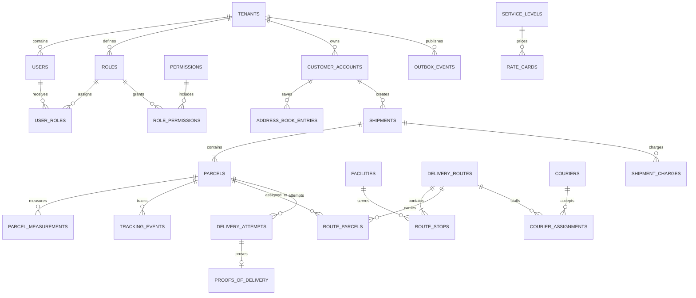

# Parcel Delivery Database Design

This design models a multi-tenant parcel and last-mile delivery network using PostgreSQL with PostGIS. It supports quotes, shipments containing multiple parcels, labels, hub/route planning, courier assignment, custody scans, delivery attempts, proof of delivery, charges, and customer tracking. PostgreSQL is the durable source of truth; scanners and mobile clients synchronize through idempotent event APIs.

## Scope and principles

- A shipment is the commercial order; a parcel is an individually labeled and tracked physical unit.
- Accepted shipments snapshot sender, recipient, service, price, dimensions, declared value, and delivery instructions.
- Physical history is append-only. Corrections add events with reason/actor and do not rewrite custody evidence.
- Coordinates use PostGIS `geography(Point,4326)`; money uses `numeric(19,4)`; weight and dimensions use fixed SI decimal units.
- Scanner/mobile clients may work offline, so every event includes device ID, source event ID, source sequence, event time, and receive time.
- Payment secrets, identity documents, signatures, and photos are stored in dedicated vault/object storage with opaque references.

## Critical invariants

1. A tracking number and label barcode are globally unique within the issuing tenant/carrier namespace.
2. A parcel belongs to exactly one shipment and cannot change tenant.
3. A parcel has at most one current custody holder and one active last-mile assignment.
4. Shipment/parcel state projections are derived from valid ordered events and cannot regress because of a late scan.
5. Accepted weight, dimension, address, service, and pricing snapshots are immutable; remeasurement creates an adjustment.
6. A manifest cannot depart with the same parcel assigned to another overlapping manifest leg.
7. Duplicate device events, API requests, and provider callbacks produce one result.
8. Aggregate changes and outbox records commit atomically.

## Identity and authorization tables

Authentication identities are separate from customer accounts, couriers, and operational facilities.

| Table | Key columns | Purpose and constraints |
|---|---|---|
| `users` | `user_id`, `tenant_id`, `identity_subject`, `email_hash`, `status`, login timestamps | External identity-provider subject without stored credentials. |
| `roles` | `role_id`, `tenant_id`, `role_code`, `name`, `description`, `is_system` | Customer operator, courier, hub operator, support, audit, or administrator role. |
| `permissions` | `permission_id`, `permission_code`, `description` | Global action catalog. |
| `user_roles` | `user_role_id`, `tenant_id`, user/role IDs, optional scope, assignment/expiry fields | Auditable role assignment, optionally scoped to an account, route, or facility. |
| `role_permissions` | `tenant_id`, `role_id`, `permission_id`, `granted_at` | Role-to-permission grants. |

## Entity relationship model



## Reference and customer tables

Every tenant-owned table includes `tenant_id`, and tenant-owned relationships use composite foreign keys containing it.

| Table | Key columns | Purpose and constraints |
|---|---|---|
| `tenants` | `tenant_id`, `carrier_code`, name, base currency, timezone, `status` | Carrier/legal entity boundary. |
| `customer_accounts` | `customer_account_id`, `tenant_id`, account number, type, billing/credit terms, encrypted contact reference, `status`, `version` | Sender, merchant, or business customer. |
| `address_book_entries` | `address_id`, `customer_account_id`, encrypted normalized address/contact, `location`, validation result/version, `status` | Reusable address; shipment retains snapshots. |
| `service_levels` | `service_level_id`, `tenant_id`, code/name, max weight/dimensions, delivery commitment, signature/insurance rules, `status` | Same-day, next-day, standard, cold-chain, etc. |
| `rate_cards` | `rate_card_id`, `tenant_id`, customer/zone/service references, currency, base/weight/distance/surcharge rules, effective window, `version`, `status` | Immutable/versioned price rule set. |
| `zones` | `zone_id`, `tenant_id`, code, `boundary geography`, postal-code rules, `status` | Pickup/delivery pricing and operations region. |
| `facilities` | `facility_id`, `tenant_id`, code/name, type, encrypted address, `location`, timezone, `status` | Hub, depot, locker, or partner location. |
| `couriers` | `courier_id`, `tenant_id`, identity reference, vehicle/capacity attributes, eligibility status, `version` | Last-mile operator. |

## Shipment and parcel tables

| Table | Key columns | Purpose and constraints |
|---|---|---|
| `shipments` | `shipment_id`, `tenant_id`, `shipment_number`, `customer_account_id`, `service_level_id`, sender/recipient address and contact snapshots, pickup/delivery windows, currency, quoted/final totals, declared value, `status`, `idempotency_key`, `version`, timestamps | Commercial aggregate. Unique tenant shipment number and idempotency key. |
| `parcels` | `parcel_id`, `tenant_id`, `shipment_id`, `tracking_number`, `barcode`, piece number, package type, declared/measured weight and dimensions, contents category, hazardous/temperature flags, `status`, current facility/custodian, `version` | Physical handling unit. Unique tenant tracking/barcode; checks positive measurements. |
| `parcel_measurements` | `measurement_id`, `parcel_id`, source/device, weight/dimensions, dimensional weight, image/evidence reference, `measured_at`, `received_at` | Append-only reweigh/re-dimension evidence. |
| `labels` | `label_id`, `parcel_id`, label version, format, storage/checksum reference, `status`, `created_at`, `voided_at` | Generated label metadata; only one active version per parcel. |
| `pickup_requests` | `pickup_id`, `shipment_id`, window, address snapshot, assigned courier/route, `status`, attempt count, `version` | Pickup workflow, especially for merchant batches. |
| `shipment_charges` | `charge_id`, `shipment_id`, type, signed amount, currency, tax, pricing/rule version, source measurement ID, `status` | Quote, surcharge, remeasurement, insurance, tax, refund, or correction line. |

Final charge is the sum of active immutable charge lines. Do not overwrite a quote when an actual measurement changes price; create a linked adjustment with the evidence and rule version.

## Network, routing, and custody tables

| Table | Key columns | Purpose and constraints |
|---|---|---|
| `delivery_routes` | `route_id`, `tenant_id`, route date, depot, vehicle, service area, plan version, `status`, capacity totals, planned/actual timestamps, `version` | Pickup, line-haul, or last-mile route. |
| `route_stops` | `stop_id`, `route_id`, `sequence_no`, type, facility/address snapshot, location, planned window, actual timestamps, `status` | Ordered route plan. Unique route/sequence. |
| `route_parcels` | `route_id`, `parcel_id`, load/unload stop IDs, assignment status, loaded/unloaded timestamps | Parcel-to-leg assignment. Partial uniqueness prevents overlapping active carriage. |
| `manifests` | `manifest_id`, `tenant_id`, facility/route/vehicle references, manifest number, seal number, `status`, closed/departed timestamps, `version` | Controlled load list and handoff. |
| `manifest_parcels` | `manifest_id`, `parcel_id`, loaded state, scan event ID, exception reason | Exact manifest contents. Unique manifest/parcel. |
| `custody_events` | `custody_event_id bigint`, `parcel_id`, from/to party/facility, event type, source identifiers, location, `occurred_at`, `received_at`, evidence reference | Append-only chain of custody. |
| `courier_assignments` | `assignment_id`, `route_id`, `courier_id`, role, `status`, offered/accepted/completed timestamps | Route staffing. Unique active courier/route/role. |

Route optimization is computed outside the database. Persist its input/version and complete stop plan so operations remain auditable and can continue if the optimizer is unavailable.

## Tracking and delivery tables

| Table | Key columns | Purpose and constraints |
|---|---|---|
| `tracking_events` | `event_id bigint`, `tenant_id`, `parcel_id`, `event_type`, operational/public status, facility/courier, optional location, device/source event/sequence, `occurred_at`, `received_at`, reason, metadata | Immutable scan/event fact. Unique `(tenant_id, device_id, source_event_id)`. |
| `parcel_states` | `parcel_id`, current operational/public status, current location/facility/custodian, last applied sequence, last event time, `version` | Rebuildable current projection. |
| `delivery_attempts` | `attempt_id`, `parcel_id`, attempt number, courier/route/stop, result, reason, occurred time, location, next-action/window | Unique parcel/attempt; result drives a validated transition. |
| `proofs_of_delivery` | `proof_id`, `attempt_id`, recipient token/name ciphertext, signature/photo references and checksums, OTP verification, geo/time evidence, retention class | Sensitive proof metadata; object content stays encrypted outside PostgreSQL. |
| `exception_cases` | `case_id`, shipment/parcel IDs, type, severity, status, owner, SLA deadline, resolution, `version` | Damage, loss, address, customs, or service-failure workflow. |

Late scans remain in `tracking_events` but update `parcel_states` only when the domain transition and source ordering rules permit. Public tracking status is intentionally coarser than internal status to avoid exposing sensitive facility/courier data.

## Complete PostgreSQL schema, constraints, and indexes

The following dependency-ordered DDL creates the complete relational model documented above. PostGIS supports facilities, zones, stops, and scan locations.

```sql
CREATE EXTENSION IF NOT EXISTS pgcrypto;
CREATE EXTENSION IF NOT EXISTS postgis;

CREATE TABLE tenants (
    tenant_id uuid PRIMARY KEY DEFAULT gen_random_uuid(),
    carrier_code text NOT NULL UNIQUE, name text NOT NULL,
    base_currency char(3) NOT NULL, timezone text NOT NULL,
    status text NOT NULL CHECK (status IN ('ACTIVE','SUSPENDED','CLOSED'))
);

CREATE TABLE users (
    user_id uuid PRIMARY KEY DEFAULT gen_random_uuid(),
    tenant_id uuid NOT NULL REFERENCES tenants(tenant_id),
    identity_subject text NOT NULL, email_hash bytea NULL,
    status text NOT NULL CHECK (status IN ('INVITED','ACTIVE','LOCKED','DISABLED')),
    last_login_at timestamptz NULL,
    created_at timestamptz NOT NULL DEFAULT clock_timestamp(),
    updated_at timestamptz NOT NULL DEFAULT clock_timestamp(),
    UNIQUE (tenant_id, user_id), UNIQUE (tenant_id, identity_subject)
);

CREATE TABLE roles (
    role_id uuid PRIMARY KEY DEFAULT gen_random_uuid(),
    tenant_id uuid NOT NULL REFERENCES tenants(tenant_id),
    role_code text NOT NULL, name text NOT NULL, description text NULL,
    is_system boolean NOT NULL DEFAULT false,
    created_at timestamptz NOT NULL DEFAULT clock_timestamp(),
    UNIQUE (tenant_id, role_id), UNIQUE (tenant_id, role_code)
);

CREATE TABLE permissions (
    permission_id uuid PRIMARY KEY DEFAULT gen_random_uuid(),
    permission_code text NOT NULL UNIQUE, description text NOT NULL
);

CREATE TABLE role_permissions (
    tenant_id uuid NOT NULL, role_id uuid NOT NULL,
    permission_id uuid NOT NULL REFERENCES permissions(permission_id),
    granted_at timestamptz NOT NULL DEFAULT clock_timestamp(),
    PRIMARY KEY (role_id, permission_id),
    FOREIGN KEY (tenant_id, role_id) REFERENCES roles(tenant_id, role_id)
);

CREATE TABLE user_roles (
    user_role_id uuid PRIMARY KEY DEFAULT gen_random_uuid(),
    tenant_id uuid NOT NULL, user_id uuid NOT NULL, role_id uuid NOT NULL,
    scope_type text NULL, scope_id uuid NULL,
    assigned_by_user_id uuid NULL,
    assigned_at timestamptz NOT NULL DEFAULT clock_timestamp(),
    expires_at timestamptz NULL,
    FOREIGN KEY (tenant_id, user_id) REFERENCES users(tenant_id, user_id),
    FOREIGN KEY (tenant_id, role_id) REFERENCES roles(tenant_id, role_id),
    FOREIGN KEY (tenant_id, assigned_by_user_id) REFERENCES users(tenant_id, user_id),
    CHECK ((scope_type IS NULL) = (scope_id IS NULL)),
    CHECK (expires_at IS NULL OR expires_at > assigned_at)
);

CREATE TABLE customer_accounts (
    customer_account_id uuid PRIMARY KEY DEFAULT gen_random_uuid(),
    tenant_id uuid NOT NULL REFERENCES tenants(tenant_id),
    account_number text NOT NULL, account_type text NOT NULL,
    billing_terms jsonb NOT NULL DEFAULT '{}'::jsonb,
    credit_limit numeric(19,4) NOT NULL DEFAULT 0 CHECK (credit_limit >= 0),
    contact_reference text NOT NULL,
    status text NOT NULL CHECK (status IN ('ACTIVE','ON_HOLD','CLOSED')),
    version bigint NOT NULL DEFAULT 0,
    UNIQUE (tenant_id, customer_account_id), UNIQUE (tenant_id, account_number)
);

CREATE TABLE address_book_entries (
    address_id uuid PRIMARY KEY DEFAULT gen_random_uuid(),
    customer_account_id uuid NOT NULL REFERENCES customer_accounts(customer_account_id),
    address_ciphertext bytea NOT NULL, contact_ciphertext bytea NULL,
    location geography(Point,4326) NOT NULL,
    validation_result jsonb NOT NULL DEFAULT '{}'::jsonb,
    validation_version text NULL,
    status text NOT NULL CHECK (status IN ('ACTIVE','INVALID','ARCHIVED'))
);

CREATE TABLE service_levels (
    service_level_id uuid PRIMARY KEY DEFAULT gen_random_uuid(),
    tenant_id uuid NOT NULL REFERENCES tenants(tenant_id),
    code text NOT NULL, name text NOT NULL,
    max_weight_kg numeric(12,3) NOT NULL CHECK (max_weight_kg > 0),
    max_length_cm numeric(12,2) NOT NULL CHECK (max_length_cm > 0),
    delivery_commitment jsonb NOT NULL,
    signature_required boolean NOT NULL DEFAULT false,
    insurance_rule jsonb NOT NULL DEFAULT '{}'::jsonb,
    status text NOT NULL CHECK (status IN ('ACTIVE','PAUSED','RETIRED')),
    UNIQUE (tenant_id, service_level_id), UNIQUE (tenant_id, code)
);

CREATE TABLE zones (
    zone_id uuid PRIMARY KEY DEFAULT gen_random_uuid(),
    tenant_id uuid NOT NULL REFERENCES tenants(tenant_id),
    code text NOT NULL, boundary geography(MultiPolygon,4326) NULL,
    postal_rules jsonb NOT NULL DEFAULT '{}'::jsonb,
    status text NOT NULL CHECK (status IN ('ACTIVE','RETIRED')),
    UNIQUE (tenant_id, zone_id), UNIQUE (tenant_id, code)
);

CREATE TABLE rate_cards (
    rate_card_id uuid PRIMARY KEY DEFAULT gen_random_uuid(),
    tenant_id uuid NOT NULL REFERENCES tenants(tenant_id),
    customer_account_id uuid NULL REFERENCES customer_accounts(customer_account_id),
    origin_zone_id uuid NOT NULL REFERENCES zones(zone_id),
    destination_zone_id uuid NOT NULL REFERENCES zones(zone_id),
    service_level_id uuid NOT NULL REFERENCES service_levels(service_level_id),
    currency char(3) NOT NULL, rule_definition jsonb NOT NULL,
    valid_from timestamptz NOT NULL, valid_to timestamptz NULL,
    version integer NOT NULL CHECK (version > 0),
    status text NOT NULL CHECK (status IN ('DRAFT','ACTIVE','RETIRED')),
    CHECK (valid_to IS NULL OR valid_to > valid_from)
);

CREATE TABLE facilities (
    facility_id uuid PRIMARY KEY DEFAULT gen_random_uuid(),
    tenant_id uuid NOT NULL REFERENCES tenants(tenant_id),
    code text NOT NULL, name text NOT NULL,
    facility_type text NOT NULL CHECK (facility_type IN ('HUB','DEPOT','LOCKER','PARTNER')),
    address_ciphertext bytea NOT NULL, location geography(Point,4326) NOT NULL,
    timezone text NOT NULL,
    status text NOT NULL CHECK (status IN ('ACTIVE','CLOSED')),
    UNIQUE (tenant_id, facility_id), UNIQUE (tenant_id, code)
);

CREATE TABLE couriers (
    courier_id uuid PRIMARY KEY DEFAULT gen_random_uuid(),
    tenant_id uuid NOT NULL REFERENCES tenants(tenant_id),
    identity_reference text NOT NULL, vehicle_type text NOT NULL,
    weight_capacity_kg numeric(12,3) NOT NULL CHECK (weight_capacity_kg > 0),
    volume_capacity_m3 numeric(12,4) NOT NULL CHECK (volume_capacity_m3 >= 0),
    status text NOT NULL CHECK (status IN ('PENDING','ACTIVE','PAUSED','SUSPENDED','CLOSED')),
    version bigint NOT NULL DEFAULT 0,
    UNIQUE (tenant_id, courier_id)
);

CREATE TABLE delivery_routes (
    route_id uuid PRIMARY KEY DEFAULT gen_random_uuid(),
    tenant_id uuid NOT NULL REFERENCES tenants(tenant_id), route_date date NOT NULL,
    depot_id uuid NOT NULL REFERENCES facilities(facility_id),
    vehicle_reference text NULL, service_area jsonb NULL,
    plan_version text NOT NULL,
    status text NOT NULL CHECK (status IN ('PLANNED','READY','IN_PROGRESS','COMPLETED','CANCELLED')),
    weight_capacity_kg numeric(12,3) NOT NULL CHECK (weight_capacity_kg >= 0),
    volume_capacity_m3 numeric(12,4) NOT NULL CHECK (volume_capacity_m3 >= 0),
    planned_start timestamptz NULL, actual_start timestamptz NULL, actual_end timestamptz NULL,
    version bigint NOT NULL DEFAULT 0,
    UNIQUE (tenant_id, route_id)
);

CREATE TABLE route_stops (
    stop_id uuid PRIMARY KEY DEFAULT gen_random_uuid(),
    route_id uuid NOT NULL REFERENCES delivery_routes(route_id),
    sequence_no integer NOT NULL CHECK (sequence_no > 0),
    stop_type text NOT NULL CHECK (stop_type IN ('PICKUP','DELIVERY','FACILITY','BREAK')),
    facility_id uuid NULL REFERENCES facilities(facility_id),
    address_snapshot jsonb NULL, location geography(Point,4326) NOT NULL,
    planned_window tstzrange NULL,
    status text NOT NULL CHECK (status IN ('PLANNED','ARRIVED','COMPLETED','SKIPPED')),
    arrived_at timestamptz NULL, departed_at timestamptz NULL,
    UNIQUE (route_id, sequence_no)
);

CREATE TABLE shipments (
    shipment_id        uuid PRIMARY KEY DEFAULT gen_random_uuid(),
    tenant_id          uuid NOT NULL REFERENCES tenants(tenant_id),
    shipment_number    text NOT NULL,
    customer_account_id uuid NOT NULL REFERENCES customer_accounts(customer_account_id),
    service_level_id   uuid NOT NULL REFERENCES service_levels(service_level_id),
    sender_snapshot    jsonb NOT NULL,
    recipient_snapshot jsonb NOT NULL,
    pickup_window      tstzrange NULL,
    delivery_window    tstzrange NULL,
    currency           char(3) NOT NULL,
    quoted_total       numeric(19,4) NOT NULL DEFAULT 0 CHECK (quoted_total >= 0),
    final_total        numeric(19,4) NULL CHECK (final_total >= 0),
    declared_value     numeric(19,4) NOT NULL DEFAULT 0 CHECK (declared_value >= 0),
    status             text NOT NULL CHECK (status IN
        ('CREATED','LABEL_READY','PICKUP_SCHEDULED','IN_TRANSIT','OUT_FOR_DELIVERY',
         'DELIVERED','DELIVERY_FAILED','RETURNING','RETURNED','CANCELLED')),
    idempotency_key    text NOT NULL,
    version            bigint NOT NULL DEFAULT 0,
    created_at         timestamptz NOT NULL DEFAULT clock_timestamp(),
    updated_at         timestamptz NOT NULL DEFAULT clock_timestamp(),
    CHECK (pickup_window IS NULL OR NOT isempty(pickup_window)),
    CHECK (delivery_window IS NULL OR NOT isempty(delivery_window)),
    UNIQUE (tenant_id, shipment_id),
    UNIQUE (tenant_id, shipment_number),
    UNIQUE (tenant_id, idempotency_key)
);

CREATE TABLE parcels (
    parcel_id          uuid PRIMARY KEY DEFAULT gen_random_uuid(),
    tenant_id          uuid NOT NULL,
    shipment_id        uuid NOT NULL,
    tracking_number    text NOT NULL,
    barcode            text NOT NULL,
    piece_number       integer NOT NULL CHECK (piece_number > 0),
    package_type       text NOT NULL,
    declared_weight_kg numeric(12,3) NOT NULL CHECK (declared_weight_kg > 0),
    length_cm          numeric(12,2) NOT NULL CHECK (length_cm > 0),
    width_cm           numeric(12,2) NOT NULL CHECK (width_cm > 0),
    height_cm          numeric(12,2) NOT NULL CHECK (height_cm > 0),
    hazardous          boolean NOT NULL DEFAULT false,
    status             text NOT NULL CHECK (status IN
        ('CREATED','AT_FACILITY','IN_TRANSIT','OUT_FOR_DELIVERY','DELIVERED',
         'DELIVERY_FAILED','RETURNING','RETURNED','LOST','DAMAGED','CANCELLED')),
    current_facility_id uuid NULL REFERENCES facilities(facility_id),
    version            bigint NOT NULL DEFAULT 0,
    created_at         timestamptz NOT NULL DEFAULT clock_timestamp(),
    FOREIGN KEY (tenant_id, shipment_id) REFERENCES shipments(tenant_id, shipment_id),
    UNIQUE (tenant_id, parcel_id),
    UNIQUE (tenant_id, tracking_number),
    UNIQUE (tenant_id, barcode),
    UNIQUE (shipment_id, piece_number)
);

CREATE TABLE parcel_measurements (
    measurement_id uuid PRIMARY KEY DEFAULT gen_random_uuid(),
    parcel_id uuid NOT NULL REFERENCES parcels(parcel_id),
    source text NOT NULL, device_id uuid NULL,
    weight_kg numeric(12,3) NOT NULL CHECK (weight_kg > 0),
    length_cm numeric(12,2) NOT NULL CHECK (length_cm > 0),
    width_cm numeric(12,2) NOT NULL CHECK (width_cm > 0),
    height_cm numeric(12,2) NOT NULL CHECK (height_cm > 0),
    dimensional_weight_kg numeric(12,3) NOT NULL CHECK (dimensional_weight_kg > 0),
    evidence_reference text NULL,
    measured_at timestamptz NOT NULL, received_at timestamptz NOT NULL DEFAULT clock_timestamp()
);

CREATE TABLE labels (
    label_id uuid PRIMARY KEY DEFAULT gen_random_uuid(),
    parcel_id uuid NOT NULL REFERENCES parcels(parcel_id),
    version_no integer NOT NULL CHECK (version_no > 0), format text NOT NULL,
    object_reference text NOT NULL, checksum text NOT NULL,
    status text NOT NULL CHECK (status IN ('ACTIVE','VOIDED')),
    created_at timestamptz NOT NULL DEFAULT clock_timestamp(), voided_at timestamptz NULL,
    UNIQUE (parcel_id, version_no)
);

CREATE TABLE pickup_requests (
    pickup_id uuid PRIMARY KEY DEFAULT gen_random_uuid(),
    shipment_id uuid NOT NULL REFERENCES shipments(shipment_id),
    pickup_window tstzrange NOT NULL, address_snapshot jsonb NOT NULL,
    courier_id uuid NULL REFERENCES couriers(courier_id),
    route_id uuid NULL REFERENCES delivery_routes(route_id),
    status text NOT NULL CHECK (status IN ('REQUESTED','SCHEDULED','PICKED_UP','FAILED','CANCELLED')),
    attempt_count integer NOT NULL DEFAULT 0 CHECK (attempt_count >= 0),
    version bigint NOT NULL DEFAULT 0,
    CHECK (NOT isempty(pickup_window))
);

CREATE TABLE shipment_charges (
    charge_id uuid PRIMARY KEY DEFAULT gen_random_uuid(),
    shipment_id uuid NOT NULL REFERENCES shipments(shipment_id),
    charge_type text NOT NULL, amount numeric(19,4) NOT NULL,
    currency char(3) NOT NULL, tax_amount numeric(19,4) NOT NULL DEFAULT 0,
    rule_version text NOT NULL,
    source_measurement_id uuid NULL REFERENCES parcel_measurements(measurement_id),
    status text NOT NULL CHECK (status IN ('ESTIMATED','ACTIVE','VOIDED','REFUNDED')),
    created_at timestamptz NOT NULL DEFAULT clock_timestamp()
);

CREATE TABLE tracking_events (
    event_id        bigint GENERATED ALWAYS AS IDENTITY PRIMARY KEY,
    tenant_id       uuid NOT NULL,
    parcel_id       uuid NOT NULL,
    event_type      text NOT NULL,
    operational_status text NOT NULL,
    public_status   text NOT NULL,
    facility_id     uuid NULL REFERENCES facilities(facility_id),
    courier_id      uuid NULL REFERENCES couriers(courier_id),
    location        geography(Point,4326) NULL,
    device_id       uuid NULL,
    source_event_id text NOT NULL,
    source_sequence bigint NULL CHECK (source_sequence > 0),
    occurred_at     timestamptz NOT NULL,
    received_at     timestamptz NOT NULL DEFAULT clock_timestamp(),
    reason_code     text NULL,
    metadata        jsonb NOT NULL DEFAULT '{}'::jsonb,
    FOREIGN KEY (tenant_id, parcel_id) REFERENCES parcels(tenant_id, parcel_id),
    UNIQUE (tenant_id, device_id, source_event_id)
);

CREATE TABLE parcel_states (
    parcel_id          uuid PRIMARY KEY REFERENCES parcels(parcel_id),
    tenant_id          uuid NOT NULL REFERENCES tenants(tenant_id),
    operational_status text NOT NULL,
    public_status      text NOT NULL,
    facility_id        uuid NULL REFERENCES facilities(facility_id),
    custodian_type     text NULL,
    custodian_id       uuid NULL,
    last_event_id      bigint NULL REFERENCES tracking_events(event_id),
    last_source_sequence bigint NULL,
    last_event_at      timestamptz NULL,
    version            bigint NOT NULL DEFAULT 0
);

CREATE TABLE route_parcels (
    route_id      uuid NOT NULL REFERENCES delivery_routes(route_id),
    parcel_id     uuid NOT NULL REFERENCES parcels(parcel_id),
    load_stop_id  uuid NULL REFERENCES route_stops(stop_id),
    unload_stop_id uuid NULL REFERENCES route_stops(stop_id),
    status        text NOT NULL CHECK
        (status IN ('PLANNED','LOADED','UNLOADED','CANCELLED','COMPLETED')),
    loaded_at     timestamptz NULL,
    unloaded_at   timestamptz NULL,
    PRIMARY KEY (route_id, parcel_id),
    CHECK (unloaded_at IS NULL OR loaded_at IS NOT NULL),
    CHECK (unloaded_at IS NULL OR unloaded_at >= loaded_at)
);

CREATE TABLE manifests (
    manifest_id uuid PRIMARY KEY DEFAULT gen_random_uuid(),
    tenant_id uuid NOT NULL REFERENCES tenants(tenant_id),
    facility_id uuid NOT NULL REFERENCES facilities(facility_id),
    route_id uuid NULL REFERENCES delivery_routes(route_id),
    manifest_number text NOT NULL, seal_number text NULL,
    status text NOT NULL CHECK (status IN ('OPEN','CLOSED','DEPARTED','RECEIVED','CANCELLED')),
    closed_at timestamptz NULL, departed_at timestamptz NULL,
    version bigint NOT NULL DEFAULT 0,
    UNIQUE (tenant_id, manifest_id), UNIQUE (tenant_id, manifest_number)
);

CREATE TABLE manifest_parcels (
    manifest_id uuid NOT NULL REFERENCES manifests(manifest_id),
    parcel_id uuid NOT NULL REFERENCES parcels(parcel_id),
    loaded_status text NOT NULL CHECK (loaded_status IN ('PLANNED','LOADED','MISSING','UNLOADED')),
    scan_event_id bigint NULL,
    exception_reason text NULL,
    PRIMARY KEY (manifest_id, parcel_id)
);

CREATE TABLE custody_events (
    custody_event_id bigint GENERATED ALWAYS AS IDENTITY PRIMARY KEY,
    parcel_id uuid NOT NULL REFERENCES parcels(parcel_id),
    from_party_type text NULL, from_party_id uuid NULL,
    to_party_type text NOT NULL, to_party_id uuid NOT NULL,
    event_type text NOT NULL, source_event_id text NOT NULL,
    location geography(Point,4326) NULL,
    occurred_at timestamptz NOT NULL, received_at timestamptz NOT NULL DEFAULT clock_timestamp(),
    evidence_reference text NULL,
    UNIQUE (parcel_id, source_event_id)
);

CREATE TABLE courier_assignments (
    assignment_id uuid PRIMARY KEY DEFAULT gen_random_uuid(),
    route_id uuid NOT NULL REFERENCES delivery_routes(route_id),
    courier_id uuid NOT NULL REFERENCES couriers(courier_id),
    role text NOT NULL,
    status text NOT NULL CHECK (status IN ('OFFERED','ACCEPTED','REJECTED','COMPLETED','RELEASED')),
    offered_at timestamptz NOT NULL, accepted_at timestamptz NULL, completed_at timestamptz NULL,
    UNIQUE (route_id, courier_id, role)
);

CREATE TABLE delivery_attempts (
    attempt_id    uuid PRIMARY KEY DEFAULT gen_random_uuid(),
    parcel_id     uuid NOT NULL REFERENCES parcels(parcel_id),
    attempt_no    integer NOT NULL CHECK (attempt_no > 0),
    courier_id    uuid NOT NULL REFERENCES couriers(courier_id),
    route_id      uuid NULL REFERENCES delivery_routes(route_id),
    result        text NOT NULL CHECK
        (result IN ('DELIVERED','RECIPIENT_UNAVAILABLE','REFUSED','BAD_ADDRESS','UNSAFE','OTHER')),
    reason_code   text NULL,
    occurred_at   timestamptz NOT NULL,
    location      geography(Point,4326) NULL,
    UNIQUE (parcel_id, attempt_no)
);

CREATE TABLE proofs_of_delivery (
    proof_id       uuid PRIMARY KEY DEFAULT gen_random_uuid(),
    attempt_id     uuid NOT NULL UNIQUE REFERENCES delivery_attempts(attempt_id),
    recipient_ciphertext bytea NULL,
    signature_ref  text NULL,
    photo_ref      text NULL,
    object_checksum text NULL,
    otp_verified   boolean NOT NULL DEFAULT false,
    captured_at    timestamptz NOT NULL,
    CHECK (signature_ref IS NOT NULL OR photo_ref IS NOT NULL OR otp_verified)
);

ALTER TABLE manifest_parcels
    ADD CONSTRAINT fk_manifest_scan_event FOREIGN KEY (scan_event_id) REFERENCES tracking_events(event_id);

CREATE TABLE exception_cases (
    case_id uuid PRIMARY KEY DEFAULT gen_random_uuid(),
    shipment_id uuid NULL REFERENCES shipments(shipment_id),
    parcel_id uuid NULL REFERENCES parcels(parcel_id),
    case_type text NOT NULL, severity text NOT NULL,
    status text NOT NULL CHECK (status IN ('OPEN','INVESTIGATING','RESOLVED','CLOSED')),
    owner_id text NULL, sla_deadline timestamptz NULL, resolution text NULL,
    version bigint NOT NULL DEFAULT 0,
    CHECK (shipment_id IS NOT NULL OR parcel_id IS NOT NULL)
);

CREATE TABLE outbox_events (
    event_id bigint GENERATED ALWAYS AS IDENTITY PRIMARY KEY,
    tenant_id uuid NOT NULL REFERENCES tenants(tenant_id),
    aggregate_type text NOT NULL, aggregate_id uuid NOT NULL, event_type text NOT NULL,
    payload jsonb NOT NULL, occurred_at timestamptz NOT NULL DEFAULT clock_timestamp(),
    published_at timestamptz NULL,
    attempt_count integer NOT NULL DEFAULT 0 CHECK (attempt_count >= 0)
);

CREATE TABLE audit_events (
    audit_event_id bigint GENERATED ALWAYS AS IDENTITY PRIMARY KEY,
    tenant_id uuid NOT NULL REFERENCES tenants(tenant_id), actor_id text NULL,
    action text NOT NULL, resource_type text NOT NULL, resource_id text NOT NULL,
    occurred_at timestamptz NOT NULL DEFAULT clock_timestamp(),
    details jsonb NOT NULL DEFAULT '{}'::jsonb
);

CREATE UNIQUE INDEX ux_user_roles_global
    ON user_roles (user_id, role_id) WHERE scope_type IS NULL;
CREATE UNIQUE INDEX ux_user_roles_scoped
    ON user_roles (user_id, role_id, scope_type, scope_id) WHERE scope_type IS NOT NULL;
CREATE INDEX ix_user_roles_active
    ON user_roles (tenant_id, user_id, expires_at);
CREATE INDEX ix_users_email_hash
    ON users (tenant_id, email_hash) WHERE email_hash IS NOT NULL;

CREATE INDEX ix_shipment_customer_history
    ON shipments (tenant_id, customer_account_id, created_at DESC);
CREATE INDEX ix_shipment_operational_queue
    ON shipments (tenant_id, status, created_at)
    WHERE status NOT IN ('DELIVERED','RETURNED','CANCELLED');
CREATE INDEX ix_parcel_tracking_lookup ON parcels (tenant_id, tracking_number);
CREATE INDEX ix_tracking_parcel_history
    ON tracking_events (tenant_id, parcel_id, occurred_at DESC, event_id DESC);
CREATE INDEX ix_tracking_received ON tracking_events (received_at DESC);
CREATE INDEX ix_tracking_location ON tracking_events USING gist (location);
CREATE UNIQUE INDEX ux_parcel_active_route
    ON route_parcels (parcel_id) WHERE status IN ('PLANNED','LOADED');
CREATE INDEX ix_delivery_attempt_parcel
    ON delivery_attempts (parcel_id, attempt_no DESC);
CREATE INDEX ix_outbox_unpublished
    ON outbox_events (event_id) WHERE published_at IS NULL;
CREATE INDEX ix_zone_boundary ON zones USING gist (boundary);
CREATE INDEX ix_facility_location ON facilities USING gist (location);
CREATE INDEX ix_route_stop_order ON route_stops (route_id, sequence_no);
CREATE UNIQUE INDEX ux_label_active ON labels (parcel_id) WHERE status = 'ACTIVE';
CREATE INDEX ix_manifest_open ON manifests (tenant_id, facility_id)
    WHERE status = 'OPEN';
CREATE INDEX ix_exception_sla ON exception_cases (sla_deadline)
    WHERE status IN ('OPEN','INVESTIGATING');
CREATE INDEX ix_audit_resource_time
    ON audit_events (tenant_id, resource_type, resource_id, occurred_at DESC);
```

Valid parcel transitions, single current custodian, manifest/route overlap, aggregate shipment totals, and acceptance of late source events require a transactional event-ingestion procedure or deferred triggers. Tracking, custody, measurement, attempt, and proof records are append-only; normal application roles must not update or delete them.

## Core flows

### Create shipment

1. Claim the idempotency key and validate customer, service, address, parcel limits, restricted goods, and pickup window.
2. Calculate price from a recorded zone/rate-card version.
3. Insert shipment, address/service/price snapshots, parcels, tracking numbers, initial events, charges, and outbox records in one transaction.
4. Generate label artifacts asynchronously; store checksum/version metadata and emit `LABEL_READY`.

### Scan and transfer custody

1. Deduplicate `(device_id, source_event_id)` and retain both device and receive timestamps.
2. Validate parcel, facility/route/manifest context and expected transition. Flag but retain suspicious events for investigation.
3. Append tracking/custody events, update the parcel projection with optimistic versioning, and publish through the outbox atomically.

### Deliver parcel

Lock the parcel/assignment, confirm courier custody and geofence/policy, insert the attempt and proof reference, transition the parcel, update route/stop progress, and emit the public event in one transaction. Redelivery or return-to-sender is a new planned flow, never history mutation.

## Consistency, indexing, and scale

- Use optimistic versions for parcel/route state and locks for manifest close, custody handoff, and delivery completion.
- GiST index zones, facilities, and stop locations. B-tree index tracking number/barcode hash, customer shipment history, route stops, and open exception SLAs.
- Partition tracking/custody events, scans, audits, and outbox history by month; optionally hash-subpartition by tenant or parcel ID.
- Add partial indexes for active routes, undelivered parcels, open exceptions, pending labels, expiring pickups, and unpublished outbox rows.
- Use event/parcel IDs for keyset pagination. Search/read replicas can serve public history after acceptable lag; delivery commands use the primary.
- Workers claim batches with `FOR UPDATE SKIP LOCKED`; all event consumers and device synchronization paths are idempotent.

## Security and operations

- Encrypt names, addresses, phones, declared contents, proof, and precise locations; tokenize public tracking access and rate-limit enumeration.
- Restrict couriers to assigned work and minimum recipient data. Log all proof/address access and use short-lived object URLs.
- Apply tenant row-level security, least-privilege operational roles, immutable audit events, encrypted backups, and retention-specific media deletion.
- Run regional PostgreSQL HA with point-in-time recovery and off-domain backups. Test restore, device replay, projection rebuild, and outbox recovery.

## Validation checklist

- Tracking/barcode allocation remains unique under concurrency and retry.
- Duplicate/offline/late scans do not regress the parcel projection.
- A parcel cannot be actively carried on conflicting routes/manifests.
- Custody always has a single current holder and complete handoff trail.
- Delivery proof is linked to one valid attempt and protected by retention/access rules.
- Remeasurements and failed delivery produce auditable adjustments/events.
- Rebuilt parcel states and charges match event and charge history after restore.
