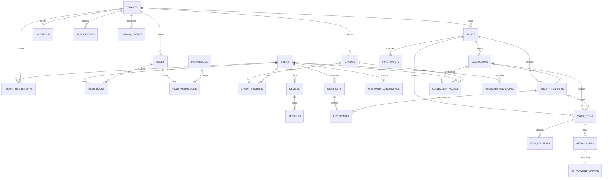
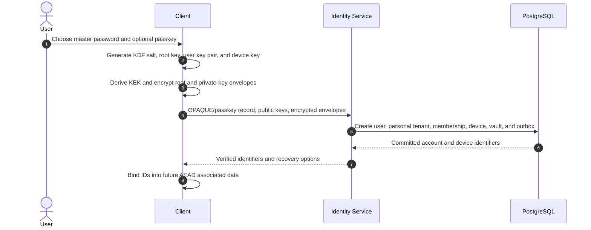
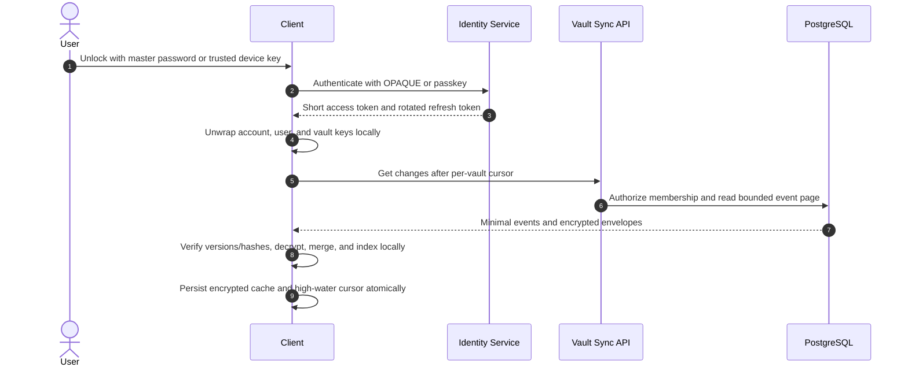
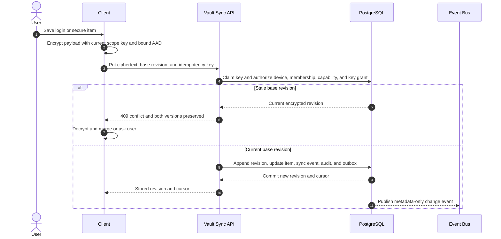
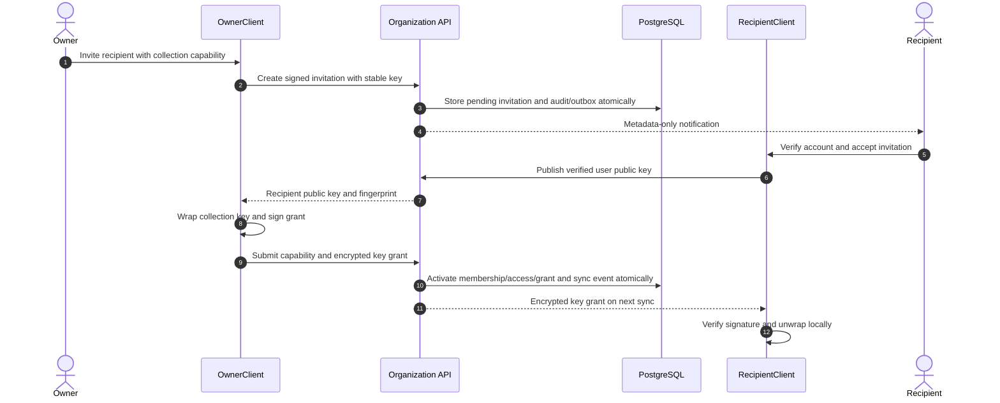
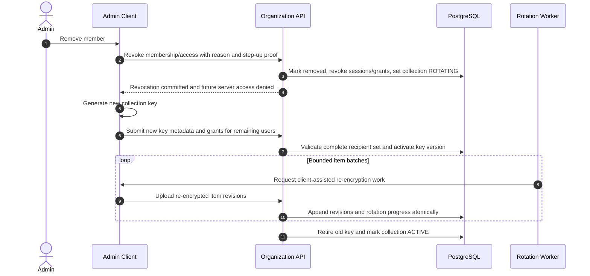
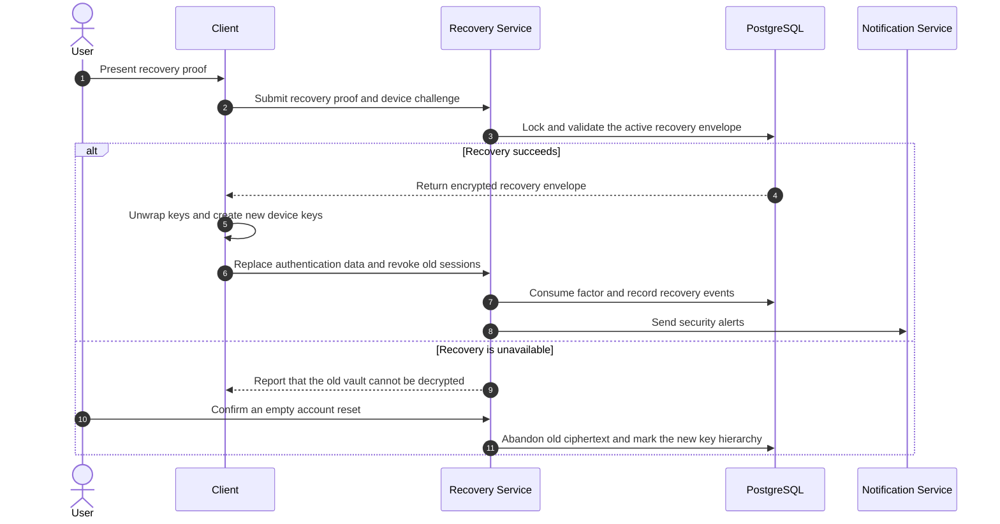

# Password Manager System Design

This document defines a production-oriented, multi-tenant, zero-knowledge password manager, covering client cryptography, domain and data models, synchronization and sharing workflows, technology choices, and non-functional requirements. React clients encrypt and decrypt vault data locally, .NET services coordinate identities, devices, ciphertext synchronization, sharing, and audit behavior, and Azure provides managed compute, storage, messaging, identity integration, security, and observability. PostgreSQL remains the transactional source of truth for encrypted key envelopes, vault ciphertext, and metadata; Blob Storage holds encrypted attachments, while caches and event streams are replayable derived systems.

## Scope and principles

- Supports personal, family, and organization tenants; logins, secure notes, payment cards, identities, TOTP seeds, passkeys, encrypted attachments, collections, sharing, recovery options, and device management.
- The master password never leaves the client. The service stores OPAQUE/passkey registration data, client-encrypted key envelopes, and ciphertext rather than plaintext vault contents.
- Each personal account receives a personal tenant; the same global user identity can join additional family or organization tenants through tenant memberships.
- Clients derive a key-encryption key with Argon2id, unwrap random account/vault keys locally, search locally, and keep only an encrypted offline cache.
- PostgreSQL stores metadata needed for authorization and synchronization. Item titles, URLs, usernames, passwords, notes, TOTP seeds, attachment names, and custom fields remain inside encrypted payloads.
- UUIDs are used for public identifiers, UTC for instants, a monotonic sequence for synchronization, and object storage for encrypted attachment bytes.
- Cryptographic algorithms, KDF parameters, associated-data formats, payload schemas, and key versions are explicit and migratable.
- A forgotten master password cannot be recovered unless the user has enabled a recovery code, trusted-device, or organization-recovery mechanism.

## Critical invariants

1. A master password, plaintext account root key, vault key, collection key, item, or attachment never reaches the server.
2. Authentication secrets and vault-encryption keys use independent, domain-separated derivations and envelopes.
3. Every encrypted item references exactly one active key scope belonging to the same tenant and vault; a collection item uses that collection's key scope.
4. Every AEAD nonce is unique for its key, and associated data binds tenant, vault, item, revision, content type, and key version.
5. Item revisions, sync events, security audit events, and accepted key grants are append-only.
6. A write with a stale base revision cannot overwrite the current item; both versions remain available for client-side conflict resolution.
7. A user can read or mutate ciphertext only while an active tenant membership, collection capability, trusted session, and applicable key grant permit it.
8. Revocation immediately blocks future server access and starts key rotation; it cannot retract plaintext or keys already copied by a previously authorized member.
9. Duplicate API calls, device approvals, invitations, and worker events have one business outcome.
10. Domain changes, sync events, audit records, and outbox events commit in the same database transaction.

## Identity and authorization tables

Authentication identities are global because one person can own a personal tenant and join several family or organization tenants. Tenant membership and scoped roles determine authorization; cryptographic key grants determine which ciphertext that identity can decrypt.

| Table | Key columns | Purpose and constraints |
|---|---|---|
| `users` | `user_id`, keyed email hash, encrypted email, status, OPAQUE record/version, KDF salt/parameters, encrypted account-root envelope | Global login identity. Contains no master password, derived vault key, or plaintext private key. |
| `tenants` | `tenant_id`, type, code, encrypted display name, status, policy | Personal, family, or organization security boundary. |
| `tenant_memberships` | tenant/user IDs, membership type, status, inviter, accepted/removed timestamps | Connects identities to tenants; unique active membership per tenant/user. |
| `roles` | `role_id`, `tenant_id`, role code, name, description, system flag | Tenant-scoped owner, administrator, member, auditor, or recovery-administrator role. |
| `permissions` | `permission_id`, permission code, description | Global action catalog such as `vault.read`, `member.invite`, or `audit.read`. |
| `role_permissions` | tenant/role/permission IDs, grant timestamp | Normalized role-to-permission mapping. |
| `user_roles` | tenant/user/role IDs, optional resource scope, grantor, assignment/expiry timestamps | Auditable global or vault/collection-scoped role assignment. |
| `groups` | `group_id`, `tenant_id`, encrypted name, status | Organization group used to manage collection authorization. |
| `group_members` | tenant/group/user IDs, validity/status fields | Group membership; key envelopes are still issued to individual user public keys. |

The authorization path is `users -> tenant_memberships -> user_roles -> roles -> role_permissions -> permissions`, optionally narrowed by `groups` and collection capabilities. The decryption path is independent: an authorized user also needs a valid `key_grant` addressed to one of the user's current public keys.

## Entity relationship model



## Account, device, and cryptographic tables

| Table | Key columns | Purpose and constraints |
|---|---|---|
| `devices` | device/user IDs, public signing key, fingerprint, trust/status, approved/revoked/last-seen timestamps | Device identity. A revoked device cannot create sessions or approve another device. |
| `device_approval_challenges` | challenge ID, user/new-device IDs, hashed secret, expiry, approval state | Single-use, short-lived QR/short-code approval workflow. |
| `webauthn_credentials` | credential/user IDs, public key, sign counter, transports, backup flags, timestamps | Passkey authentication metadata; unique credential ID. |
| `mfa_factors` | factor/user IDs, type, KMS-encrypted server secret or public metadata, status, verification/use timestamps | Server authentication factor. Vault TOTP seeds are not stored here; they remain in item ciphertext. |
| `sessions` | session/user/device IDs, hashed refresh-token ID, token family, scope, issue/expiry/revocation and risk fields | Rotating device-bound session. Raw refresh tokens are never stored. |
| `user_keys` | user key ID/version, public encryption/signing keys, client-encrypted private-key envelope, nonce, algorithm, fingerprint, status | Versioned sharing identity. The server can distribute public keys but cannot decrypt the private bundle. |
| `recovery_envelopes` | user ID, type, encrypted root-key envelope, code hash/public-key version, status, created/used/revoked timestamps | Explicit recovery method: high-entropy code, trusted device, or organization recovery. |
| `encryption_keys` | tenant/vault IDs, optional collection ID, scope type, key version, algorithm, fingerprint, status | Metadata for a random client-generated vault or collection key; no plaintext key is stored. |
| `key_grants` | encryption-key/user-key IDs, encrypted key envelope, nonce, grantor signature, state, timestamps | Makes one encryption-key version decryptable by one user-key version. Accepted grants are immutable. |

The client derives a 256-bit key-encryption key with Argon2id and a per-user random salt, then unwraps a random account root key. The root key encrypts the user's private-key bundle. Vault and collection keys are independently random and are wrapped to member public keys with a reviewed HPKE or sealed-box construction. Item and attachment encryption uses a reviewed AEAD such as XChaCha20-Poly1305 or AES-256-GCM. Authentication uses passkeys where possible and a standardized augmented PAKE such as OPAQUE for master-password authentication.

Passkey authentication and vault unlock are separate. A passkey can unlock vault keys only when the client has explicitly enrolled a device-bound wrapped root key or a reviewed passkey-PRF construction; otherwise the master password, a trusted device, or a recovery factor is still required.

## Vault, collection, and item tables

| Table | Key columns | Purpose and constraints |
|---|---|---|
| `vaults` | vault/tenant IDs, vault type, encrypted metadata, current revision, status, timestamps | Personal or shared encrypted container. All server-visible display metadata is ciphertext. |
| `collections` | collection/vault/tenant IDs, encrypted metadata, current key version, status | Sharing boundary within a vault. Organization items normally belong to a collection. |
| `collection_access` | collection ID, exactly one user or group subject, capability, grantor, validity/status fields | Read, write, or manage authorization. Does not itself reveal a key. |
| `vault_items` | item/vault IDs, optional collection, encryption-key ID, current revision, item type, algorithm, nonce, encrypted payload, ciphertext hash, timestamps | Current opaque item envelope. Item type may be visible for routing; products wanting stronger metadata privacy can encrypt it too. |
| `item_revisions` | item/revision IDs, key version, algorithm, nonce, encrypted payload, hash, device, timestamp | Immutable history used for restore and conflict resolution. |
| `attachments` | attachment/item/vault IDs, encryption-key ID, wrapped attachment-key envelope, encrypted metadata, ciphertext byte count, chunk count, status | Attachment manifest. Filename, media type, and plaintext size are encrypted or bucketed. |
| `attachment_chunks` | attachment/chunk number, object key, nonce, ciphertext size/hash, state | Ordered encrypted object-storage chunks. Unique chunk number and object key. |
| `item_tombstones` | vault/item IDs, deletion revision, deleting device, deleted/purge timestamps | Bounded deletion marker for offline clients; after expiry an old client must perform a full resync. |

Each item envelope records its schema version, AEAD algorithm, nonce, key identifier/version, ciphertext, and associated-data version. The client reconstructs associated data from canonical identifiers such as `tenant_id || vault_id || item_id || revision || item_type || key_version`. Any mismatch or ciphertext modification must fail authenticated decryption.

## Sharing, synchronization, and operational tables

| Table | Key columns | Purpose and constraints |
|---|---|---|
| `invitations` | invitation/tenant IDs, email lookup hash, inviter, role, signed token hash, status, expiry/acceptance timestamps | Metadata-only invitation. Wrapped keys are issued only after the recipient identity/public key is verified. |
| `sync_events` | monotonic sequence, tenant/vault/entity IDs, entity type, operation, revision, timestamp | Minimal append-only change feed. Clients fetch encrypted entities and deduplicate by sequence/entity revision. |
| `idempotency_records` | user ID, operation, idempotency key, canonical request hash, stored response, expiry | Replays the original outcome and rejects reuse with a different request hash. |
| `security_events` | user/device/session IDs, event type, risk level, source network metadata, result, timestamp | Security detection feed for sign-in, recovery, device, export, and abuse signals. |
| `outbox_events` | tenant/aggregate IDs, event type, minimal payload, occurrence/publication timestamps, attempt count | Transactional outbox for reliable notification, audit export, and worker delivery. |
| `audit_events` | tenant, actor/device, action, resource, request ID, reason/result, previous hash, event hash, timestamp | Append-only, hash-linked administrative and security audit history without vault plaintext. |

The server provides a monotonic per-vault cursor rather than wall-clock ordering. A client submits a base revision and idempotency key; the transaction compares revisions, appends history, updates the encrypted item, emits a sync event, writes an audit event where required, and adds an outbox event. A stale base revision returns `409 CONFLICT` and preserves both encrypted versions for a client-side merge.

## Complete PostgreSQL schema, constraints, and indexes

The following dependency-ordered DDL creates the complete relational model documented above. It stores only ciphertext and cryptographic metadata for vault contents. Production deployments should add tenant row-level security policies and use migration-managed enum/reference values where independent deployment requires them.

```sql
CREATE EXTENSION IF NOT EXISTS pgcrypto;

CREATE TABLE users (
    user_id uuid PRIMARY KEY DEFAULT gen_random_uuid(),
    email_lookup_hash bytea NOT NULL UNIQUE,
    email_ciphertext bytea NOT NULL,
    status text NOT NULL CHECK (status IN ('PENDING','ACTIVE','LOCKED','DISABLED','RESET')),
    opaque_record bytea NULL,
    opaque_suite_version integer NULL CHECK (opaque_suite_version > 0),
    kdf_algorithm text NOT NULL DEFAULT 'ARGON2ID',
    kdf_salt bytea NOT NULL,
    kdf_parameters jsonb NOT NULL,
    encrypted_root_key bytea NOT NULL,
    root_key_nonce bytea NOT NULL,
    root_key_algorithm text NOT NULL,
    root_key_envelope_version integer NOT NULL CHECK (root_key_envelope_version > 0),
    failed_login_count integer NOT NULL DEFAULT 0 CHECK (failed_login_count >= 0),
    locked_until timestamptz NULL, last_login_at timestamptz NULL,
    created_at timestamptz NOT NULL DEFAULT clock_timestamp(),
    updated_at timestamptz NOT NULL DEFAULT clock_timestamp(),
    CHECK (jsonb_typeof(kdf_parameters) = 'object')
);

CREATE TABLE tenants (
    tenant_id uuid PRIMARY KEY DEFAULT gen_random_uuid(),
    tenant_type text NOT NULL CHECK (tenant_type IN ('PERSONAL','FAMILY','ORGANIZATION')),
    code text NOT NULL UNIQUE,
    display_name_ciphertext bytea NOT NULL,
    policy jsonb NOT NULL DEFAULT '{}'::jsonb,
    status text NOT NULL CHECK (status IN ('ACTIVE','SUSPENDED','CLOSED')),
    created_at timestamptz NOT NULL DEFAULT clock_timestamp(),
    updated_at timestamptz NOT NULL DEFAULT clock_timestamp(),
    CHECK (jsonb_typeof(policy) = 'object')
);

CREATE TABLE tenant_memberships (
    tenant_id uuid NOT NULL REFERENCES tenants(tenant_id),
    user_id uuid NOT NULL REFERENCES users(user_id),
    membership_type text NOT NULL CHECK (membership_type IN ('OWNER','ADMIN','MEMBER','AUDITOR','RECOVERY_ADMIN')),
    status text NOT NULL CHECK (status IN ('INVITED','ACTIVE','SUSPENDED','REMOVED')),
    invited_by_user_id uuid NULL REFERENCES users(user_id),
    invited_at timestamptz NULL, accepted_at timestamptz NULL, removed_at timestamptz NULL,
    created_at timestamptz NOT NULL DEFAULT clock_timestamp(),
    PRIMARY KEY (tenant_id, user_id),
    CHECK (status <> 'ACTIVE' OR accepted_at IS NOT NULL),
    CHECK (status <> 'REMOVED' OR removed_at IS NOT NULL)
);

CREATE TABLE roles (
    role_id uuid PRIMARY KEY DEFAULT gen_random_uuid(),
    tenant_id uuid NOT NULL REFERENCES tenants(tenant_id),
    role_code text NOT NULL, name text NOT NULL, description text NULL,
    is_system boolean NOT NULL DEFAULT false,
    created_at timestamptz NOT NULL DEFAULT clock_timestamp(),
    UNIQUE (tenant_id, role_id), UNIQUE (tenant_id, role_code)
);

CREATE TABLE permissions (
    permission_id uuid PRIMARY KEY DEFAULT gen_random_uuid(),
    permission_code text NOT NULL UNIQUE, description text NOT NULL
);

CREATE TABLE role_permissions (
    tenant_id uuid NOT NULL, role_id uuid NOT NULL,
    permission_id uuid NOT NULL REFERENCES permissions(permission_id),
    granted_at timestamptz NOT NULL DEFAULT clock_timestamp(),
    PRIMARY KEY (role_id, permission_id),
    FOREIGN KEY (tenant_id, role_id) REFERENCES roles(tenant_id, role_id)
);

CREATE TABLE user_roles (
    user_role_id uuid PRIMARY KEY DEFAULT gen_random_uuid(),
    tenant_id uuid NOT NULL, user_id uuid NOT NULL, role_id uuid NOT NULL,
    scope_type text NULL CHECK (scope_type IN ('VAULT','COLLECTION')), scope_id uuid NULL,
    assigned_by_user_id uuid NULL REFERENCES users(user_id),
    assigned_at timestamptz NOT NULL DEFAULT clock_timestamp(), expires_at timestamptz NULL,
    FOREIGN KEY (tenant_id, user_id) REFERENCES tenant_memberships(tenant_id, user_id),
    FOREIGN KEY (tenant_id, role_id) REFERENCES roles(tenant_id, role_id),
    CHECK ((scope_type IS NULL) = (scope_id IS NULL)),
    CHECK (expires_at IS NULL OR expires_at > assigned_at)
);

CREATE TABLE groups (
    group_id uuid PRIMARY KEY DEFAULT gen_random_uuid(),
    tenant_id uuid NOT NULL REFERENCES tenants(tenant_id),
    name_ciphertext bytea NOT NULL, metadata_nonce bytea NOT NULL,
    metadata_algorithm text NOT NULL,
    status text NOT NULL CHECK (status IN ('ACTIVE','ARCHIVED')),
    created_at timestamptz NOT NULL DEFAULT clock_timestamp(),
    UNIQUE (tenant_id, group_id)
);

CREATE TABLE group_members (
    tenant_id uuid NOT NULL, group_id uuid NOT NULL, user_id uuid NOT NULL,
    status text NOT NULL CHECK (status IN ('ACTIVE','REMOVED')),
    added_by_user_id uuid NOT NULL,
    added_at timestamptz NOT NULL DEFAULT clock_timestamp(), removed_at timestamptz NULL,
    PRIMARY KEY (group_id, user_id),
    FOREIGN KEY (tenant_id, group_id) REFERENCES groups(tenant_id, group_id),
    FOREIGN KEY (tenant_id, user_id) REFERENCES tenant_memberships(tenant_id, user_id),
    FOREIGN KEY (tenant_id, added_by_user_id)
        REFERENCES tenant_memberships(tenant_id, user_id),
    CHECK (status <> 'REMOVED' OR removed_at IS NOT NULL)
);

CREATE TABLE devices (
    device_id uuid PRIMARY KEY DEFAULT gen_random_uuid(),
    user_id uuid NOT NULL REFERENCES users(user_id),
    device_name_ciphertext bytea NOT NULL, platform text NOT NULL,
    public_signing_key bytea NOT NULL, key_fingerprint bytea NOT NULL,
    trust_level text NOT NULL CHECK (trust_level IN ('UNTRUSTED','TRUSTED','HARDWARE_BACKED')),
    status text NOT NULL CHECK (status IN ('PENDING','ACTIVE','REVOKED')),
    approved_by_device_id uuid NULL REFERENCES devices(device_id),
    approved_at timestamptz NULL, revoked_at timestamptz NULL, last_seen_at timestamptz NULL,
    created_at timestamptz NOT NULL DEFAULT clock_timestamp(),
    UNIQUE (user_id, device_id), UNIQUE (user_id, key_fingerprint),
    CHECK (status <> 'ACTIVE' OR approved_at IS NOT NULL),
    CHECK (status <> 'REVOKED' OR revoked_at IS NOT NULL)
);

CREATE TABLE device_approval_challenges (
    challenge_id uuid PRIMARY KEY DEFAULT gen_random_uuid(),
    user_id uuid NOT NULL REFERENCES users(user_id),
    new_device_id uuid NOT NULL REFERENCES devices(device_id),
    secret_hash bytea NOT NULL UNIQUE,
    state text NOT NULL CHECK (state IN ('PENDING','APPROVED','EXPIRED','CANCELLED')),
    approved_by_device_id uuid NULL REFERENCES devices(device_id),
    created_at timestamptz NOT NULL DEFAULT clock_timestamp(), expires_at timestamptz NOT NULL,
    consumed_at timestamptz NULL,
    CHECK (expires_at > created_at), CHECK (state <> 'APPROVED' OR consumed_at IS NOT NULL)
);

CREATE TABLE webauthn_credentials (
    credential_id bytea PRIMARY KEY, user_id uuid NOT NULL REFERENCES users(user_id),
    public_key bytea NOT NULL, sign_count bigint NOT NULL DEFAULT 0 CHECK (sign_count >= 0),
    transports text[] NOT NULL DEFAULT '{}', backup_eligible boolean NOT NULL DEFAULT false,
    backup_state boolean NOT NULL DEFAULT false, aaguid uuid NULL,
    created_at timestamptz NOT NULL DEFAULT clock_timestamp(),
    last_used_at timestamptz NULL, revoked_at timestamptz NULL
);

CREATE TABLE mfa_factors (
    factor_id uuid PRIMARY KEY DEFAULT gen_random_uuid(), user_id uuid NOT NULL REFERENCES users(user_id),
    factor_type text NOT NULL CHECK (factor_type IN ('TOTP','SECURITY_KEY','RECOVERY_CODES')),
    secret_ciphertext bytea NULL, public_metadata jsonb NOT NULL DEFAULT '{}'::jsonb,
    status text NOT NULL CHECK (status IN ('PENDING','ACTIVE','REVOKED')),
    verified_at timestamptz NULL, last_used_at timestamptz NULL,
    created_at timestamptz NOT NULL DEFAULT clock_timestamp(), revoked_at timestamptz NULL,
    CHECK (jsonb_typeof(public_metadata) = 'object'),
    CHECK (status <> 'ACTIVE' OR verified_at IS NOT NULL)
);

CREATE TABLE sessions (
    session_id uuid PRIMARY KEY DEFAULT gen_random_uuid(),
    user_id uuid NOT NULL REFERENCES users(user_id), device_id uuid NOT NULL REFERENCES devices(device_id),
    refresh_token_hash bytea NOT NULL UNIQUE, token_family_id uuid NOT NULL, scopes text[] NOT NULL,
    source_ip_hash bytea NULL, user_agent_hash bytea NULL,
    risk_level text NOT NULL CHECK (risk_level IN ('LOW','MEDIUM','HIGH')),
    issued_at timestamptz NOT NULL DEFAULT clock_timestamp(), expires_at timestamptz NOT NULL,
    last_used_at timestamptz NULL, revoked_at timestamptz NULL, revoke_reason text NULL,
    CHECK (expires_at > issued_at)
);

CREATE TABLE user_keys (
    user_key_id uuid PRIMARY KEY DEFAULT gen_random_uuid(), user_id uuid NOT NULL REFERENCES users(user_id),
    key_version integer NOT NULL CHECK (key_version > 0),
    public_encryption_key bytea NOT NULL, public_signing_key bytea NOT NULL,
    encrypted_private_key_bundle bytea NOT NULL, private_key_nonce bytea NOT NULL,
    envelope_algorithm text NOT NULL, key_fingerprint bytea NOT NULL,
    status text NOT NULL CHECK (status IN ('ACTIVE','RETIRED','REVOKED')),
    created_at timestamptz NOT NULL DEFAULT clock_timestamp(), retired_at timestamptz NULL,
    UNIQUE (user_id, key_version), UNIQUE (key_fingerprint)
);

CREATE TABLE recovery_envelopes (
    recovery_envelope_id uuid PRIMARY KEY DEFAULT gen_random_uuid(),
    user_id uuid NOT NULL REFERENCES users(user_id),
    recovery_type text NOT NULL CHECK (recovery_type IN ('RECOVERY_CODE','TRUSTED_DEVICE','ORGANIZATION')),
    encrypted_root_key bytea NOT NULL, envelope_nonce bytea NOT NULL, envelope_algorithm text NOT NULL,
    recovery_code_hash bytea NULL, recovery_public_key_version integer NULL,
    status text NOT NULL CHECK (status IN ('ACTIVE','USED','REVOKED')),
    created_at timestamptz NOT NULL DEFAULT clock_timestamp(), used_at timestamptz NULL, revoked_at timestamptz NULL,
    CHECK ((recovery_type = 'RECOVERY_CODE') = (recovery_code_hash IS NOT NULL)),
    CHECK (status <> 'USED' OR used_at IS NOT NULL), UNIQUE (recovery_code_hash)
);

CREATE TABLE vaults (
    vault_id uuid PRIMARY KEY DEFAULT gen_random_uuid(), tenant_id uuid NOT NULL REFERENCES tenants(tenant_id),
    vault_type text NOT NULL CHECK (vault_type IN ('PERSONAL','SHARED')),
    metadata_ciphertext bytea NOT NULL, metadata_nonce bytea NOT NULL, metadata_algorithm text NOT NULL,
    current_revision bigint NOT NULL DEFAULT 0 CHECK (current_revision >= 0),
    status text NOT NULL CHECK (status IN ('ACTIVE','FROZEN','DELETED')),
    created_by_user_id uuid NOT NULL,
    created_at timestamptz NOT NULL DEFAULT clock_timestamp(),
    updated_at timestamptz NOT NULL DEFAULT clock_timestamp(), deleted_at timestamptz NULL,
    FOREIGN KEY (tenant_id, created_by_user_id) REFERENCES tenant_memberships(tenant_id, user_id),
    UNIQUE (tenant_id, vault_id), CHECK (updated_at >= created_at),
    CHECK (status <> 'DELETED' OR deleted_at IS NOT NULL)
);

CREATE TABLE collections (
    collection_id uuid PRIMARY KEY DEFAULT gen_random_uuid(), tenant_id uuid NOT NULL,
    vault_id uuid NOT NULL, metadata_ciphertext bytea NOT NULL, metadata_nonce bytea NOT NULL,
    metadata_algorithm text NOT NULL, current_key_version integer NOT NULL DEFAULT 1 CHECK (current_key_version > 0),
    status text NOT NULL CHECK (status IN ('ACTIVE','ROTATING','ARCHIVED')),
    created_at timestamptz NOT NULL DEFAULT clock_timestamp(), updated_at timestamptz NOT NULL DEFAULT clock_timestamp(),
    UNIQUE (tenant_id, collection_id), UNIQUE (vault_id, collection_id),
    FOREIGN KEY (tenant_id, vault_id) REFERENCES vaults(tenant_id, vault_id)
);

CREATE TABLE collection_access (
    collection_access_id uuid PRIMARY KEY DEFAULT gen_random_uuid(), tenant_id uuid NOT NULL,
    collection_id uuid NOT NULL, user_id uuid NULL, group_id uuid NULL,
    capability text NOT NULL CHECK (capability IN ('READ','WRITE','MANAGE')),
    status text NOT NULL CHECK (status IN ('ACTIVE','REVOKED')),
    granted_by_user_id uuid NOT NULL,
    granted_at timestamptz NOT NULL DEFAULT clock_timestamp(), revoked_at timestamptz NULL, expires_at timestamptz NULL,
    FOREIGN KEY (tenant_id, collection_id) REFERENCES collections(tenant_id, collection_id),
    FOREIGN KEY (tenant_id, user_id) REFERENCES tenant_memberships(tenant_id, user_id),
    FOREIGN KEY (tenant_id, group_id) REFERENCES groups(tenant_id, group_id),
    FOREIGN KEY (tenant_id, granted_by_user_id)
        REFERENCES tenant_memberships(tenant_id, user_id),
    CHECK ((user_id IS NOT NULL)::integer + (group_id IS NOT NULL)::integer = 1),
    CHECK (expires_at IS NULL OR expires_at > granted_at),
    CHECK (status <> 'REVOKED' OR revoked_at IS NOT NULL)
);

CREATE TABLE encryption_keys (
    encryption_key_id uuid PRIMARY KEY DEFAULT gen_random_uuid(), tenant_id uuid NOT NULL,
    vault_id uuid NOT NULL, collection_id uuid NULL,
    scope_type text NOT NULL CHECK (scope_type IN ('VAULT','COLLECTION')),
    key_version integer NOT NULL CHECK (key_version > 0), algorithm text NOT NULL,
    key_fingerprint bytea NOT NULL,
    status text NOT NULL CHECK (status IN ('ACTIVE','ROTATING','RETIRED','REVOKED')),
    created_at timestamptz NOT NULL DEFAULT clock_timestamp(), retired_at timestamptz NULL,
    FOREIGN KEY (tenant_id, vault_id) REFERENCES vaults(tenant_id, vault_id),
    FOREIGN KEY (vault_id, collection_id) REFERENCES collections(vault_id, collection_id),
    CHECK ((scope_type = 'COLLECTION') = (collection_id IS NOT NULL)),
    UNIQUE (vault_id, collection_id, key_version), UNIQUE (vault_id, key_fingerprint),
    UNIQUE (encryption_key_id, tenant_id, vault_id)
);

CREATE UNIQUE INDEX ux_vault_key_version ON encryption_keys (vault_id, key_version)
    WHERE scope_type = 'VAULT';

CREATE TABLE key_grants (
    key_grant_id uuid PRIMARY KEY DEFAULT gen_random_uuid(),
    encryption_key_id uuid NOT NULL REFERENCES encryption_keys(encryption_key_id),
    grantee_user_key_id uuid NOT NULL REFERENCES user_keys(user_key_id),
    wrapped_key bytea NOT NULL, envelope_nonce bytea NOT NULL, envelope_algorithm text NOT NULL,
    grantor_user_id uuid NOT NULL REFERENCES users(user_id), grantor_signature bytea NOT NULL,
    status text NOT NULL CHECK (status IN ('PENDING','ACCEPTED','REVOKED')),
    created_at timestamptz NOT NULL DEFAULT clock_timestamp(), accepted_at timestamptz NULL, revoked_at timestamptz NULL,
    UNIQUE (encryption_key_id, grantee_user_key_id),
    CHECK (status <> 'ACCEPTED' OR accepted_at IS NOT NULL),
    CHECK (status <> 'REVOKED' OR revoked_at IS NOT NULL)
);

CREATE TABLE vault_items (
    item_id uuid PRIMARY KEY DEFAULT gen_random_uuid(), tenant_id uuid NOT NULL, vault_id uuid NOT NULL,
    collection_id uuid NULL, encryption_key_id uuid NOT NULL,
    current_revision bigint NOT NULL CHECK (current_revision > 0),
    item_type text NOT NULL CHECK (item_type IN ('LOGIN','SECURE_NOTE','CARD','IDENTITY','TOTP','PASSKEY','OTHER')),
    schema_version integer NOT NULL CHECK (schema_version > 0), aad_version integer NOT NULL CHECK (aad_version > 0),
    algorithm text NOT NULL, nonce bytea NOT NULL, encrypted_payload bytea NOT NULL, ciphertext_hash bytea NOT NULL,
    created_by_device_id uuid NOT NULL REFERENCES devices(device_id),
    updated_by_device_id uuid NOT NULL REFERENCES devices(device_id),
    created_at timestamptz NOT NULL DEFAULT clock_timestamp(),
    updated_at timestamptz NOT NULL DEFAULT clock_timestamp(), deleted_at timestamptz NULL,
    FOREIGN KEY (encryption_key_id, tenant_id, vault_id)
        REFERENCES encryption_keys(encryption_key_id, tenant_id, vault_id),
    FOREIGN KEY (vault_id, collection_id) REFERENCES collections(vault_id, collection_id),
    UNIQUE (vault_id, item_id), UNIQUE (item_id, tenant_id, vault_id),
    UNIQUE (item_id, current_revision),
    CHECK (updated_at >= created_at)
);

CREATE TABLE item_revisions (
    item_id uuid NOT NULL REFERENCES vault_items(item_id), revision bigint NOT NULL CHECK (revision > 0),
    encryption_key_id uuid NOT NULL REFERENCES encryption_keys(encryption_key_id),
    schema_version integer NOT NULL CHECK (schema_version > 0), aad_version integer NOT NULL CHECK (aad_version > 0),
    algorithm text NOT NULL, nonce bytea NOT NULL, encrypted_payload bytea NOT NULL, ciphertext_hash bytea NOT NULL,
    changed_by_device_id uuid NOT NULL REFERENCES devices(device_id),
    created_at timestamptz NOT NULL DEFAULT clock_timestamp(), PRIMARY KEY (item_id, revision)
);

CREATE TABLE item_tombstones (
    item_id uuid PRIMARY KEY, tenant_id uuid NOT NULL, vault_id uuid NOT NULL,
    deletion_revision bigint NOT NULL CHECK (deletion_revision > 0),
    deleted_by_device_id uuid NOT NULL REFERENCES devices(device_id),
    deleted_at timestamptz NOT NULL DEFAULT clock_timestamp(), purge_after timestamptz NOT NULL,
    FOREIGN KEY (item_id, tenant_id, vault_id)
        REFERENCES vault_items(item_id, tenant_id, vault_id),
    CHECK (purge_after > deleted_at)
);

CREATE TABLE attachments (
    attachment_id uuid PRIMARY KEY DEFAULT gen_random_uuid(), tenant_id uuid NOT NULL,
    vault_id uuid NOT NULL, item_id uuid NOT NULL,
    encryption_key_id uuid NOT NULL, wrapped_attachment_key bytea NOT NULL,
    attachment_key_nonce bytea NOT NULL, key_envelope_algorithm text NOT NULL,
    metadata_ciphertext bytea NOT NULL, metadata_nonce bytea NOT NULL,
    ciphertext_bytes bigint NOT NULL CHECK (ciphertext_bytes >= 0),
    chunk_count integer NOT NULL CHECK (chunk_count > 0),
    status text NOT NULL CHECK (status IN ('UPLOADING','READY','FAILED','DELETED')),
    created_at timestamptz NOT NULL DEFAULT clock_timestamp(), completed_at timestamptz NULL, deleted_at timestamptz NULL,
    FOREIGN KEY (encryption_key_id, tenant_id, vault_id)
        REFERENCES encryption_keys(encryption_key_id, tenant_id, vault_id),
    FOREIGN KEY (item_id, tenant_id, vault_id)
        REFERENCES vault_items(item_id, tenant_id, vault_id),
    CHECK (status <> 'READY' OR completed_at IS NOT NULL),
    CHECK (status <> 'DELETED' OR deleted_at IS NOT NULL)
);

CREATE TABLE attachment_chunks (
    attachment_id uuid NOT NULL REFERENCES attachments(attachment_id),
    chunk_no integer NOT NULL CHECK (chunk_no >= 0), object_key text NOT NULL UNIQUE,
    nonce bytea NOT NULL, ciphertext_bytes integer NOT NULL CHECK (ciphertext_bytes > 0),
    ciphertext_hash bytea NOT NULL,
    status text NOT NULL CHECK (status IN ('PENDING','UPLOADED','VERIFIED','DELETED')),
    uploaded_at timestamptz NULL, PRIMARY KEY (attachment_id, chunk_no)
);

CREATE TABLE invitations (
    invitation_id uuid PRIMARY KEY DEFAULT gen_random_uuid(), tenant_id uuid NOT NULL REFERENCES tenants(tenant_id),
    email_lookup_hash bytea NOT NULL, invited_user_id uuid NULL REFERENCES users(user_id),
    invited_by_user_id uuid NOT NULL,
    membership_type text NOT NULL CHECK (membership_type IN ('ADMIN','MEMBER','AUDITOR','RECOVERY_ADMIN')),
    token_hash bytea NOT NULL UNIQUE, inviter_signature bytea NOT NULL,
    status text NOT NULL CHECK (status IN ('PENDING','ACCEPTED','EXPIRED','REVOKED')),
    created_at timestamptz NOT NULL DEFAULT clock_timestamp(), expires_at timestamptz NOT NULL,
    accepted_at timestamptz NULL, revoked_at timestamptz NULL,
    FOREIGN KEY (tenant_id, invited_by_user_id)
        REFERENCES tenant_memberships(tenant_id, user_id),
    CHECK (expires_at > created_at), CHECK (status <> 'ACCEPTED' OR accepted_at IS NOT NULL)
);

CREATE TABLE sync_events (
    sequence_id bigint GENERATED ALWAYS AS IDENTITY PRIMARY KEY,
    tenant_id uuid NOT NULL REFERENCES tenants(tenant_id), vault_id uuid NOT NULL,
    entity_type text NOT NULL CHECK (entity_type IN ('ITEM','ATTACHMENT','COLLECTION','KEY','MEMBERSHIP')),
    entity_id uuid NOT NULL,
    operation text NOT NULL CHECK (operation IN ('UPSERT','DELETE','ROTATE','REVOKE')),
    revision bigint NOT NULL CHECK (revision > 0),
    occurred_at timestamptz NOT NULL DEFAULT clock_timestamp(),
    FOREIGN KEY (tenant_id, vault_id) REFERENCES vaults(tenant_id, vault_id),
    UNIQUE (vault_id, entity_type, entity_id, revision, operation)
);

CREATE TABLE idempotency_records (
    user_id uuid NOT NULL REFERENCES users(user_id), idempotency_key text NOT NULL,
    operation text NOT NULL, request_hash bytea NOT NULL,
    response_code integer NULL CHECK (response_code BETWEEN 100 AND 599), response_body jsonb NULL,
    resource_type text NULL, resource_id uuid NULL,
    created_at timestamptz NOT NULL DEFAULT clock_timestamp(), expires_at timestamptz NOT NULL,
    PRIMARY KEY (user_id, idempotency_key), CHECK (expires_at > created_at)
);

CREATE TABLE security_events (
    security_event_id bigint GENERATED ALWAYS AS IDENTITY PRIMARY KEY,
    user_id uuid NULL REFERENCES users(user_id), device_id uuid NULL REFERENCES devices(device_id),
    session_id uuid NULL REFERENCES sessions(session_id), event_type text NOT NULL,
    risk_level text NOT NULL CHECK (risk_level IN ('LOW','MEDIUM','HIGH','CRITICAL')),
    source_ip_hash bytea NULL, network_country char(2) NULL,
    result text NOT NULL CHECK (result IN ('SUCCEEDED','FAILED','BLOCKED')),
    request_id text NULL, occurred_at timestamptz NOT NULL DEFAULT clock_timestamp(),
    details jsonb NOT NULL DEFAULT '{}'::jsonb, CHECK (jsonb_typeof(details) = 'object')
);

CREATE TABLE outbox_events (
    event_id bigint GENERATED ALWAYS AS IDENTITY PRIMARY KEY,
    tenant_id uuid NOT NULL REFERENCES tenants(tenant_id),
    aggregate_type text NOT NULL, aggregate_id uuid NOT NULL, event_type text NOT NULL,
    payload jsonb NOT NULL, occurred_at timestamptz NOT NULL DEFAULT clock_timestamp(),
    published_at timestamptz NULL, attempt_count integer NOT NULL DEFAULT 0 CHECK (attempt_count >= 0),
    CHECK (jsonb_typeof(payload) = 'object')
);

CREATE TABLE audit_events (
    audit_event_id bigint GENERATED ALWAYS AS IDENTITY PRIMARY KEY,
    tenant_id uuid NOT NULL REFERENCES tenants(tenant_id),
    actor_user_id uuid NULL REFERENCES users(user_id), actor_device_id uuid NULL REFERENCES devices(device_id),
    action text NOT NULL, resource_type text NOT NULL, resource_id text NOT NULL,
    request_id text NULL, reason_code text NULL,
    result text NOT NULL CHECK (result IN ('SUCCEEDED','FAILED','DENIED')),
    previous_hash bytea NULL, event_hash bytea NOT NULL,
    occurred_at timestamptz NOT NULL DEFAULT clock_timestamp(),
    details jsonb NOT NULL DEFAULT '{}'::jsonb, CHECK (jsonb_typeof(details) = 'object')
);

CREATE UNIQUE INDEX ux_user_roles_global
    ON user_roles (tenant_id, user_id, role_id) WHERE scope_type IS NULL;
CREATE UNIQUE INDEX ux_user_roles_scoped
    ON user_roles (tenant_id, user_id, role_id, scope_type, scope_id) WHERE scope_type IS NOT NULL;
CREATE INDEX ix_memberships_user_active
    ON tenant_memberships (user_id, tenant_id) WHERE status = 'ACTIVE';
CREATE INDEX ix_group_members_user_active
    ON group_members (tenant_id, user_id) WHERE status = 'ACTIVE';
CREATE INDEX ix_sessions_user_active
    ON sessions (user_id, expires_at) WHERE revoked_at IS NULL;
CREATE INDEX ix_device_challenge_expiry
    ON device_approval_challenges (expires_at) WHERE state = 'PENDING';
CREATE INDEX ix_key_grants_grantee_active
    ON key_grants (grantee_user_key_id, encryption_key_id) WHERE status = 'ACCEPTED';
CREATE UNIQUE INDEX ux_collection_access_user_active
    ON collection_access (collection_id, user_id) WHERE user_id IS NOT NULL AND status = 'ACTIVE';
CREATE UNIQUE INDEX ux_collection_access_group_active
    ON collection_access (collection_id, group_id) WHERE group_id IS NOT NULL AND status = 'ACTIVE';
CREATE INDEX ix_items_vault_updated
    ON vault_items (vault_id, updated_at DESC, item_id);
CREATE INDEX ix_items_collection_active
    ON vault_items (collection_id, updated_at DESC) WHERE deleted_at IS NULL;
CREATE INDEX ix_item_revision_retention ON item_revisions (created_at);
CREATE INDEX ix_tombstone_purge ON item_tombstones (purge_after);
CREATE INDEX ix_attachment_incomplete ON attachments (created_at) WHERE status = 'UPLOADING';
CREATE INDEX ix_invitation_pending
    ON invitations (tenant_id, email_lookup_hash, expires_at) WHERE status = 'PENDING';
CREATE INDEX ix_sync_vault_cursor ON sync_events (vault_id, sequence_id);
CREATE INDEX ix_security_user_time ON security_events (user_id, occurred_at DESC);
CREATE INDEX ix_outbox_unpublished ON outbox_events (event_id) WHERE published_at IS NULL;
CREATE INDEX ix_audit_tenant_time ON audit_events (tenant_id, occurred_at DESC, audit_event_id);
CREATE INDEX ix_audit_resource_time
    ON audit_events (tenant_id, resource_type, resource_id, occurred_at DESC);
```

Cross-row rules require deferred constraint triggers or a privileged transaction procedure. These rules verify that an item's encryption key belongs to its exact collection or vault scope, only one active key version exists per scope, the current item envelope also exists in immutable revision history, group/user access belongs to the same tenant, attachment chunks equal the declared count and size before `READY`, and vault revisions advance with sync events. Triggers deny `UPDATE` and `DELETE` on accepted key grants, item revisions, sync events, and audit events. Key rotation retires old keys only after every remaining authorized member has a valid new grant and all targeted items have migrated.

## Main use-case sequence diagrams

Read the diagrams from top to bottom. Each command uses a stable idempotency key, and every vault mutation writes its sync/outbox records in the same transaction.

**Lifecycle:** Register and enroll device -> unlock and sync -> create/update items -> share -> revoke/rotate -> recover

### 1. Register an account and first device



The email-verification flow proves control of an address but does not unlock the vault. A recovery code, if enabled, is random and shown once for offline storage.

### 2. Unlock and synchronize a vault



An inactive client older than tombstone retention performs a full resync. Read-your-writes synchronization uses the primary or a session-consistent replica.

### 3. Create or update a vault item



The server compares opaque ciphertext and revisions but never performs plaintext field merging or search.

### 4. Invite a member and share a collection



The owner client must verify the recipient fingerprint through an authenticated channel for high-risk sharing. Notifications contain no vault names or item contents.

### 5. Revoke a member and rotate keys



Small collections rotate eagerly. Large rotations are resumable and visibly incomplete until all targeted items have migrated. Revocation cannot erase plaintext already copied by the removed member.

### 6. Recover access or reset an unrecoverable account



Support personnel cannot bypass the cryptographic recovery model. Changing a known master password only re-wraps the random root key; it does not re-encrypt every vault item.

## Technology Suggestion

### Frontend and client cryptography

- **React with TypeScript:** Provides a shared, strongly typed UI foundation for the web vault, account settings, sharing, and security administration.
- **Web Crypto API with a reviewed cryptographic library:** Performs key derivation, encryption, decryption, and signing in the client so plaintext vault data and user-derived master keys never reach the backend. Cryptographic formats must be versioned and independently security-reviewed.
- **Azure Static Web Apps with Azure Front Door:** Hosts immutable frontend assets and adds TLS, WAF protection, global routing, and security-header enforcement. Use a strict Content Security Policy to reduce script-injection risk.

### Backend and runtime

- **.NET with ASP.NET Core:** Supplies strongly typed APIs, mature security middleware, rate limiting, and dependable background processing for synchronization, sharing, device management, and notification workflows.
- **Azure Container Apps:** Runs the API and workers with managed scaling, private networking, revision-based deployments, and less operational overhead than a full Kubernetes platform. Separate the synchronization API from email, cleanup, and audit workers as load grows.

### Data and storage

- **Azure Database for PostgreSQL Flexible Server:** Preserves the documented relationships, optimistic concurrency, constraints, and synchronization indexes while adding high availability, encrypted backups, and point-in-time restore. Store only ciphertext and cryptographic metadata for vault content.
- **Azure Blob Storage:** Holds encrypted attachments and immutable export artifacts using opaque object names, short-lived access, versioning, and malware scanning. Attachment keys remain wrapped by client-controlled vault keys.
- **Azure Managed Redis:** Supports short-lived rate limits, session metadata, and synchronization hints; it must not contain plaintext secrets or become the source of truth.

### Messaging and realtime synchronization

- **Azure Service Bus:** Delivers durable email, security alert, cleanup, key-rotation, and audit work with retries and dead-letter handling.
- **Azure Web PubSub:** Notifies active clients that encrypted vault state changed. Clients then retrieve authorized ciphertext through the API instead of placing vault content in realtime messages.

### Identity, keys, and observability

- **Microsoft Entra External ID:** Supports account authentication, MFA, and federation. The vault master password and vault encryption keys remain separate from the identity provider so server-side account access cannot decrypt vault contents.
- **Managed identities with Azure Key Vault or Managed HSM:** Protects server-owned signing, wrapping, and transport keys without storing credentials in code. Do not place user-derived vault master keys in Key Vault.
- **Azure Monitor, Application Insights, Defender for Cloud, and Microsoft Sentinel:** Detects authentication abuse, unusual device activity, sync failures, and infrastructure threats. Telemetry must exclude URLs, item names, ciphertext payloads, derived keys, and recovery material.

### Delivery and deployment guidance

- **GitHub Actions or Azure DevOps with Bicep:** Automates dependency scanning, secret scanning, SAST, cryptographic compatibility tests, signed artifacts, and repeatable infrastructure.
- Treat cryptographic format changes as migrations that must remain backward compatible until every supported client can rotate data safely.
- Use private endpoints, availability-zone deployment, tested restore procedures, and an independent penetration test before production release.

## Recommended repository folder structure

Keep each application in a repository with these folders and GitHub Actions workflows:

```text
.
|-- .github/
|   `-- workflows/
|       |-- backend-ci.yml
|       |-- e2e.yml
|       |-- frontend-ci.yml
|       |-- infra.yml
|       `-- release.yml
|-- backend/
|   |-- ProjectName.Api/
|   |   |-- DependencyInjection.cs
|   |   |-- Dockerfile
|   |   `-- Program.cs
|   |-- ProjectName.Application/
|   |-- ProjectName.AspireAppHost/
|   |   `-- Program.cs
|   |-- ProjectName.Background/
|   |   |-- DependencyInjection.cs
|   |   |-- Dockerfile
|   |   `-- Program.cs
|   |-- ProjectName.Domain/
|   |-- ProjectName.Infrastructure/
|   |   |-- Caching/
|   |   |-- Indexing/
|   |   |-- Logging/
|   |   |-- Messaging/
|   |   |-- Monitoring/
|   |   `-- Notification/
|   |-- ProjectName.Persistence/
|   |   |-- Repositories/
|   |   `-- ProjectNameDbContext.cs
|   `-- ProjectName.slnx
|-- e2e/
|   |-- package.json
|   |-- package-lock.json
|   `-- tsconfig.json
|-- frontend/
|   |-- src/
|   |   |-- components/
|   |   `-- pages/
|   |-- package.json
|   |-- package-lock.json
|   `-- tsconfig.json
`-- infra/
    |-- modules/
    |-- main.bicep
    |-- parameters.dev.json
    |-- parameters.test.json
    `-- README.md
```

- `.github/workflows/`: GitHub Actions workflow definitions. Use `backend-ci.yml` to build and test the backend, `e2e.yml` to run end-to-end tests from `e2e/`, `frontend-ci.yml` to lint, build, and test the frontend, `infra.yml` to deploy `infra/main.bicep` with the target environment's parameter file, and `release.yml` to publish versioned artifacts and deploy releases after the required checks pass.
- `backend/`: Replace `ProjectName` with the application's project name. Keep HTTP endpoints, middleware, and application startup in `ProjectName.Api/`, use cases and application interfaces in `ProjectName.Application/`, Aspire orchestration of runnable backend projects and their resource dependencies in `ProjectName.AspireAppHost/`, background workers and scheduled jobs in `ProjectName.Background/`, domain entities and business rules in `ProjectName.Domain/`, external service integrations in `ProjectName.Infrastructure/`, and database access and migrations in `ProjectName.Persistence/`. Group the projects in `ProjectName.slnx`.
- `e2e/`: End-to-end tests for complete user journeys across the frontend, backend, and supporting services, with test fixtures and runner configuration.
- `frontend/`: User-facing applications, client-side state and API clients, and frontend unit and component tests. Keep reusable UI components in `src/components/` and route-level page views in `src/pages/`.
- `infra/`: Infrastructure as code with reusable Bicep modules in `modules/`, the deployment entry point in `main.bicep`, development and test configuration in `parameters.dev.json` and `parameters.test.json`, and provisioning instructions in `README.md`.

## Non-functional Requirements

The targets below are initial objectives for normal regional operation and must be validated on representative client devices, including KDF latency and offline synchronization.

### Exception Handling

- Return ASP.NET Core `ProblemDetails` without cryptographic detail and propagate opaque correlation IDs through Application Insights and Service Bus. React clients handle ciphertext revision conflicts explicitly; .NET workers use bounded retries and dead-letter queues without retrying invalid envelopes.

- Return stable client-safe error codes and correlation IDs; distinguish validation, authentication, authorization, conflict, retryable dependency, quota, and terminal cryptographic-envelope failures.
- Preserve conflicting encrypted revisions rather than silently overwriting them; clients decrypt and merge or ask the user.
- Retry notifications, attachment finalization, rotation jobs, and outbox delivery with bounded backoff, stable command IDs, and dead-letter handling.

- Use optimistic item revisions for normal writes and row locks for invitation acceptance, recovery-factor use, membership revocation, and key-version activation.
- Workers claim small batches with `FOR UPDATE SKIP LOCKED`; exhausted or inconsistent rotations go to a security operations queue.

### Availability

- Distribute Container Apps revisions across availability zones behind Azure Front Door and use zone-redundant PostgreSQL, Blob Storage redundancy, Service Bus Premium, and redundant Web PubSub units. The React client preserves encrypted offline access and resynchronizes after recovery.

- Target 99.99% monthly availability for authentication and encrypted synchronization and 99.9% for attachment upload, notification, and breach-monitoring features.
- Preserve read access through the encrypted offline cache when the service is unavailable; queue local mutations with base revisions for later conflict resolution.
- Deploy across failure domains with tested failover; target RPO <= 5 minutes and RTO <= 30 minutes for a regional transactional-data disaster.

- Use synchronous in-region PostgreSQL HA, point-in-time recovery, encrypted off-account backups, and quarterly restore/failover exercises.
- Route security-sensitive and read-your-writes requests to the primary; lag-tolerant audit exports and analytics use replicas.

### Scalability

- Configure independent Container Apps scaling rules for HTTP concurrency, Service Bus backlog, and synchronization workers. Upload encrypted attachments directly to Blob Storage with narrowly scoped short-lived authorization so API replicas do not proxy large files.

- Horizontally scale stateless identity, sync, sharing, and attachment APIs; isolate notification, audit-export, breach-monitoring, and rotation workers.
- Partition sync, item-revision, session, security-event, audit, and outbox history by time and high-volume tenant when measurements justify it.
- Apply per-tenant storage, bandwidth, request, concurrent-sync, and worker quotas so a large tenant cannot starve others.

- Index changes by vault/sequence, items by vault/update time, active grants by user key, sessions by user/expiry, and audits by tenant/time.
- Keep attachment ciphertext in object storage and use short-lived, size-limited pre-signed requests rather than routing bytes through PostgreSQL.

### Performance

- Use asynchronous ASP.NET Core APIs, Npgsql pooling, compact versioned ciphertext envelopes, and Web PubSub change notifications to avoid polling. React performs Web Crypto work in Web Workers so key derivation and decryption do not block the interface.

- Target p95 <= 200 ms for bounded incremental sync and encrypted item writes, excluding client cryptography and attachment transfer; target p95 <= 100 ms for an in-region no-change poll.
- Tune Argon2id per client class against a measured unlock latency and memory budget; store versioned parameters and raise them over time.
- Use opaque keyset cursors and bounded batch sizes; never use deep `OFFSET` pagination for sync, revision, or audit history.

- Acknowledge uploaded chunks only after object durability and finalize manifests asynchronously without holding a database transaction across object-store calls.

### Security

- Enforce a strict Front Door content security policy and WAF rules, Microsoft Entra External ID controls, Container Apps managed identities, private endpoints, and Key Vault or Managed HSM for server-owned keys. User-derived vault keys exist only in the client and never in Azure identity, logs, or server key stores.

- Prefer passkeys and OPAQUE, require step-up authentication for recovery, exports, device enrollment, member removal, key rotation, and organization-administrator changes.
- Enforce least-privilege tenant/vault/collection authorization, signed key grants, TLS, HSTS, refresh-token rotation/reuse detection, rate limits, and anti-enumeration responses.
- Protect device credentials with OS keystores; auto-lock clients; isolate browser-extension content scripts; match autofill origins exactly and warn on lookalike domains or insecure frames.

- Use reviewed cryptographic libraries, signed releases, dependency pinning, SBOM/provenance, secret scanning, SAST/SCA, parser fuzzing, and independent cryptographic/penetration review.
- Keep server signing, audit-integrity, MFA, and notification secrets in KMS/HSM-backed storage; ordinary plaintext user vault keys never enter KMS or application memory.

### Data Protection

- Store ciphertext and cryptographic metadata in PostgreSQL and encrypted attachments in private Blob Storage with versioning and retention rules. Use separate Key Vault keys for server data protection, customer-managed keys where required, and client-side envelope keys for vault content.

- Encrypt item fields, collection/vault names, attachment names/metadata, user contact data, databases, backups, local caches, and object storage with versioned keys.
- Minimize server-visible metadata and retain IP/device, deleted ciphertext, revisions, security events, and attachment uploads only for documented security/legal windows.
- Support deletion by purging eligible ciphertext and wrapped keys after retention while preserving anonymized compliance/audit evidence where required.

- Document unavoidable metadata exposure such as membership relationships, ciphertext sizes, access times, and device/network information; use size buckets or padding where practical.
- A server cannot scan plaintext attachments, so use quotas, safe download isolation, abuse controls, and optional client-side scanning.

### Logging

- Instrument React, ASP.NET Core, Container Apps, PostgreSQL calls, and Service Bus consumers with OpenTelemetry, then apply allow-list redaction before exporting to Application Insights and Log Analytics. Alert through Azure Monitor without collecting ciphertext bodies or cryptographic parameters that aid attack.

- Emit structured logs with request ID, pseudonymous user/device/vault IDs, operation, revision, outcome, latency, dependency, and stable error code.
- Never log master passwords, recovery codes, derived or plaintext keys, MFA secrets, access/refresh tokens, authentication transcripts, decrypted fields, item ciphertext bodies, or full attachment manifests.
- Alert on credential stuffing, unusual device enrollment, mass export, sharing spikes, rotation failure, sync/outbox backlog, backup failure, and error-budget burn.

### Audit Logging

- Commit audit metadata with PostgreSQL state changes, export hash-chained copies to immutable Blob Storage, and send security detections to Microsoft Sentinel. Sign audit checkpoints using a Managed HSM key that is strictly separate from all vault encryption material.

- Record sign-in outcomes, device approvals/revocations, recovery, export, invitations, role/policy changes, membership removal, key rotation, administrative access, and destructive actions.
- Include actor, device, authority, reason, request ID, resource, result, prior event hash, and event hash without vault plaintext.
- Periodically sign/anchor tenant audit-chain checkpoints with a KMS/HSM key and export records to write-once storage with restricted access and tested verification.

- Immutably record support access and make recovery/organization-key capabilities visible to affected users.

## Validation checklist

- The master password and plaintext root, private, vault, collection, item, and attachment keys never appear in server requests, databases, logs, analytics, crash reports, or support tools.
- A stolen database and application configuration are insufficient to decrypt vault contents without guessing a strong master password or compromising an enabled recovery factor/client.
- Authentication and encryption derivations use independent salts/contexts, versioned reviewed parameters, and interoperable client test vectors.
- Altering ciphertext, tenant/vault/item identifiers, revisions, algorithms, nonces, associated-data versions, or key versions causes decryption to fail.
- An item cannot reference a key from another tenant, vault, or collection; cross-tenant foreign keys and authorization tests reject every such path.
- Duplicate commands and retries produce one outcome; concurrent stale edits return a conflict and preserve both encrypted revisions.
- Revoked members cannot fetch new ciphertext or key grants, and key-rotation progress is visible, resumable, and complete before the old key retires.
- Offline clients process tombstones correctly or perform a safe full resync after the retention window.
- Attachment chunks cannot be substituted, reordered, truncated, or finalized with an incorrect count, size, hash, nonce, or associated attachment ID.
- Support and platform administrators cannot decrypt a vault or retain old data after password reset without an explicitly enabled recovery method.
- Recovery, export, new-device enrollment, member removal, and organization administration require step-up authorization and create notifications/audit events.
- Restored backups converge with idempotent outbox replay, audit chains verify, signed releases validate, and crypto compatibility tests pass on every supported client.
