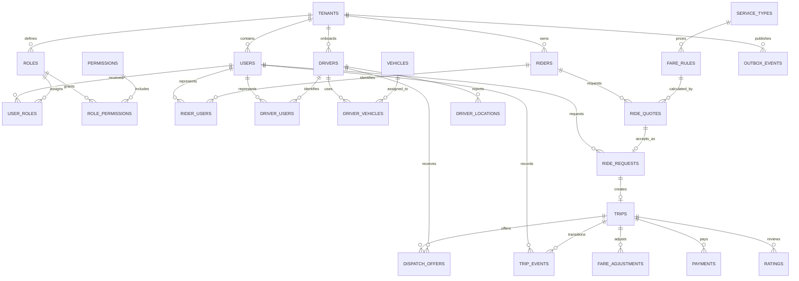
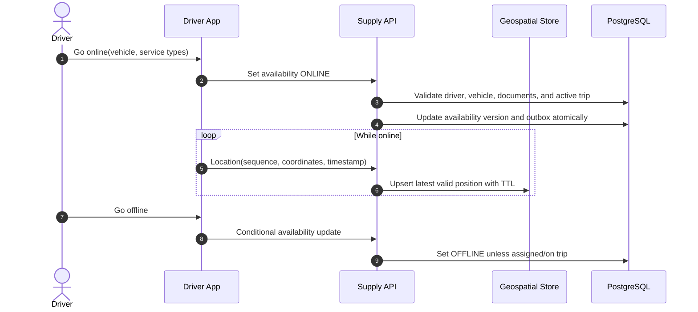

# Ride Booking Database Design

This design models a multi-tenant ride-hailing platform using PostgreSQL with PostGIS. PostgreSQL stores riders, drivers, vehicles, quotes, ride requests, trips, dispatch outcomes, fares, and payments. Low-latency driver discovery and location streaming may use geo caches and event infrastructure, but all accepted assignments and trip transitions are committed to PostgreSQL.

## Scope and principles

- Supports on-demand/scheduled rides, multiple service levels, quote expiry, driver offers, pickup/trip tracking, cancellation, fare adjustment, payment/refund, and ratings.
- A trip stores immutable pickup/dropoff, quote, pricing-rule, and service snapshots.
- Dispatch, trip, and payment are separate state machines coordinated with idempotent commands.
- Coordinates use PostGIS `geography(Point,4326)`; money uses `numeric(19,4)` and explicit currency.
- High-frequency raw driver locations have short retention and are separated from durable business history.

## Critical invariants

1. A ride request has at most one active trip, and a trip has at most one active accepted driver assignment.
2. A driver/vehicle cannot serve conflicting active trips unless an explicitly modeled pooled-ride capacity permits it.
3. Quote price, expiry, locations, service type, and pricing-rule version are immutable once accepted.
4. Trip transitions are valid, monotonic, sequenced, and append-only in history.
5. Only one driver can atomically accept a dispatch round/offer.
6. Captures and refunds cannot exceed authorized and captured amounts.
7. Duplicate API calls, driver events, and provider callbacks yield one outcome.
8. State changes and outbox/audit records commit atomically.

## Identity and authorization tables

Authentication identities are separate from rider and driver profiles, allowing one user to hold both roles safely.

| Table | Key columns | Purpose and constraints |
|---|---|---|
| `users` | `user_id`, `tenant_id`, `identity_subject`, `email_hash`, `status`, login timestamps | External identity-provider subject without stored credentials. |
| `roles` | `role_id`, `tenant_id`, `role_code`, `name`, `description`, `is_system` | Rider, driver, dispatch, support, safety, finance, or administrator role. |
| `permissions` | `permission_id`, `permission_code`, `description` | Global action catalog. |
| `user_roles` | `user_role_id`, `tenant_id`, user/role IDs, optional scope, assignment/expiry fields | Auditable global or fleet/service-area-scoped role assignment. |
| `role_permissions` | `tenant_id`, `role_id`, `permission_id`, `granted_at` | Role-to-permission grants. |
| `rider_users` | rider/user IDs, validity/status fields | Connects login identities to rider profiles. |
| `driver_users` | driver/user IDs, validity/status fields | Connects login identities to driver profiles; the same user may also be a rider. |

The access path is `users → rider_users/driver_users → domain profile`; authorization flows through roles and permissions. Ride requests and human trip events retain `requested_by_user_id` or `actor_user_id`.

## Entity relationship model



## Identity, supply, and pricing tables

All tenant-owned relationships use tenant-inclusive composite foreign keys to prevent cross-tenant references.

| Table | Key columns | Purpose and constraints |
|---|---|---|
| `tenants` | `tenant_id`, `code`, `default_currency`, `timezone`, `status` | Marketplace/legal entity. |
| `riders` | `rider_id`, `tenant_id`, customer number, encrypted PII reference, `status`, rating aggregates, `created_at` | Passenger profile. |
| `drivers` | `driver_id`, `tenant_id`, encrypted identity/contact reference, onboarding/background statuses, rating aggregates, `status`, `version` | Driver eligibility aggregate. |
| `vehicles` | `vehicle_id`, `tenant_id`, tokenized plate/VIN hashes, make/model/year/color, seats, inspection/insurance expiries, `status` | Vehicle and compliance attributes. |
| `driver_vehicles` | `driver_id`, `vehicle_id`, `valid_from`, `valid_to`, `is_primary` | Historical authorized assignment. |
| `driver_availabilities` | `driver_id`, `vehicle_id`, `status`, `service_area_id`, `current_location`, `location_at`, `active_trip_id NULL`, `version` | Current supply projection. |
| `service_types` | `service_type_id`, `tenant_id`, code/name, minimum capacity, constraints, `status` | Economy, premium, XL, accessible, and similar products. |
| `fare_rules` | `fare_rule_id`, `tenant_id`, `service_type_id`, region, currency, base/per-distance/per-time/minimum/cancellation values, surge policy version, effective window, `status` | Immutable/versioned pricing configuration. |
| `service_areas` | `service_area_id`, `tenant_id`, name, `boundary geography`, timezone, `status` | Geographic availability and rule boundary. |

## Quote, request, and trip tables

| Table | Key columns | Purpose and constraints |
|---|---|---|
| `ride_quotes` | `quote_id`, `tenant_id`, `rider_id`, `service_type_id`, pickup/dropoff snapshots, distance/duration estimates, currency, estimated/min/max fare, surge multiplier, `fare_rule_id`, routing/pricing versions, `expires_at`, `created_at` | Immutable quote. Check positive values and expiry after creation. |
| `ride_requests` | `request_id`, `tenant_id`, `rider_id`, `quote_id`, `status`, requested/scheduled times, `idempotency_key`, cancellation fields, `version` | Rider intent. Unique tenant/idempotency key and one request per accepted quote. |
| `trips` | `trip_id`, `tenant_id`, `request_id`, `trip_number`, rider/driver/vehicle IDs, service/location/quote snapshots, `status`, estimated and actual timestamps/distances/durations, `version` | Durable trip aggregate. Driver/vehicle are nullable until assignment. |
| `trip_events` | `event_id bigint`, `trip_id`, `sequence_no`, `from_status`, `to_status`, actor, reason, optional location, `occurred_at`, `received_at`, metadata | Append-only state history; unique trip/sequence and source event ID. |
| `trip_waypoints` | `waypoint_id`, `trip_id`, `sequence_no`, type, address snapshot, location, `status`, arrival/departure timestamps | Ordered stops for multi-stop or pooled rides. |
| `cancellations` | `cancellation_id`, `trip_id`, actor type/id, reason code, charge amount, currency, policy version, `created_at` | Immutable cancellation decision and policy evidence. |

Typical trip states are `SEARCHING`, `DRIVER_ASSIGNED`, `DRIVER_EN_ROUTE`, `DRIVER_ARRIVED`, `IN_PROGRESS`, `COMPLETED`, `CANCELLED`, and `NO_DRIVER`. Allowed transitions are enforced in one command handler and recorded with an expected aggregate version.

## Dispatch and location tables

| Table | Key columns | Purpose and constraints |
|---|---|---|
| `dispatch_rounds` | `round_id`, `trip_id`, `round_no`, search parameters/algorithm version, `status`, `started_at`, `expires_at` | Auditable dispatch attempt and decision inputs. |
| `dispatch_offers` | `offer_id`, `round_id`, `trip_id`, `driver_id`, `vehicle_id`, `status`, `offered_at`, `expires_at`, `responded_at`, score/rank snapshot | Unique round/driver. Partial unique indexes enforce one accepted offer per trip and one conflicting active trip per driver. |
| `driver_locations` | `driver_id`, `source_sequence`, `location`, heading/speed/accuracy, `recorded_at`, `received_at` | Short-retention append-only telemetry, partitioned by time. Reject/flag stale or implausible sequence movement. |
| `trip_location_samples` | `trip_id`, `sequence_no`, encrypted/generalized location, `recorded_at`, source | Restricted samples retained only as required for route, safety, and dispute evidence. |

At scale, drivers publish locations to a stream and a geo cache indexed by H3/S2/geohash. PostgreSQL receives sampled durable points and the current availability projection. Assignment acceptance still uses an atomic conditional transaction against authoritative driver/trip rows.

## Fare, payment, and rating tables

| Table | Key columns | Purpose and constraints |
|---|---|---|
| `trip_fares` | `trip_id`, currency, base/distance/time/surge/toll/tax/discount/tip/cancellation components, `total`, pricing inputs and rule version, `status`, `version` | Itemized immutable final-fare version; corrections create adjustments. |
| `fare_adjustments` | `adjustment_id`, `trip_id`, type, signed amount, currency, reason, actor, evidence reference, `created_at` | Append-only correction/refund evidence. |
| `payments` | `payment_id`, `trip_id`, provider/method token references, `status`, authorized/captured/refunded amounts, provider reference, `idempotency_key`, `version` | Payment aggregate. Unique provider/reference. |
| `payment_attempts` | `attempt_id`, `payment_id`, operation, provider event/idempotency keys, status/failure, timestamps | Append-oriented remote-call/callback history. |
| `driver_earnings` | `earning_id`, `trip_id`, `driver_id`, gross/commission/tax/bonus/net components, currency, rule version, settlement status | Auditable driver payable calculation; actual money movement belongs in a wallet/ledger service. |
| `ratings` | `rating_id`, `trip_id`, `rater_type`, `rater_id`, `ratee_type`, `ratee_id`, score, encrypted comment, moderation status | Unique rater role per trip; only eligible after terminal trip state. |

## Complete PostgreSQL schema, constraints, and indexes

The following dependency-ordered DDL creates the complete relational model documented above. PostGIS supplies geographic types and indexes.

```sql
CREATE EXTENSION IF NOT EXISTS pgcrypto;
CREATE EXTENSION IF NOT EXISTS postgis;

CREATE TABLE tenants (
    tenant_id uuid PRIMARY KEY DEFAULT gen_random_uuid(),
    code text NOT NULL UNIQUE, default_currency char(3) NOT NULL,
    timezone text NOT NULL,
    status text NOT NULL CHECK (status IN ('ACTIVE','SUSPENDED','CLOSED'))
);

CREATE TABLE users (
    user_id uuid PRIMARY KEY DEFAULT gen_random_uuid(),
    tenant_id uuid NOT NULL REFERENCES tenants(tenant_id),
    identity_subject text NOT NULL, email_hash bytea NULL,
    status text NOT NULL CHECK (status IN ('INVITED','ACTIVE','LOCKED','DISABLED')),
    last_login_at timestamptz NULL,
    created_at timestamptz NOT NULL DEFAULT clock_timestamp(),
    updated_at timestamptz NOT NULL DEFAULT clock_timestamp(),
    UNIQUE (tenant_id, user_id), UNIQUE (tenant_id, identity_subject)
);

CREATE TABLE roles (
    role_id uuid PRIMARY KEY DEFAULT gen_random_uuid(),
    tenant_id uuid NOT NULL REFERENCES tenants(tenant_id),
    role_code text NOT NULL, name text NOT NULL, description text NULL,
    is_system boolean NOT NULL DEFAULT false,
    created_at timestamptz NOT NULL DEFAULT clock_timestamp(),
    UNIQUE (tenant_id, role_id), UNIQUE (tenant_id, role_code)
);

CREATE TABLE permissions (
    permission_id uuid PRIMARY KEY DEFAULT gen_random_uuid(),
    permission_code text NOT NULL UNIQUE, description text NOT NULL
);

CREATE TABLE role_permissions (
    tenant_id uuid NOT NULL, role_id uuid NOT NULL,
    permission_id uuid NOT NULL REFERENCES permissions(permission_id),
    granted_at timestamptz NOT NULL DEFAULT clock_timestamp(),
    PRIMARY KEY (role_id, permission_id),
    FOREIGN KEY (tenant_id, role_id) REFERENCES roles(tenant_id, role_id)
);

CREATE TABLE user_roles (
    user_role_id uuid PRIMARY KEY DEFAULT gen_random_uuid(),
    tenant_id uuid NOT NULL, user_id uuid NOT NULL, role_id uuid NOT NULL,
    scope_type text NULL, scope_id uuid NULL,
    assigned_by_user_id uuid NULL,
    assigned_at timestamptz NOT NULL DEFAULT clock_timestamp(),
    expires_at timestamptz NULL,
    FOREIGN KEY (tenant_id, user_id) REFERENCES users(tenant_id, user_id),
    FOREIGN KEY (tenant_id, role_id) REFERENCES roles(tenant_id, role_id),
    FOREIGN KEY (tenant_id, assigned_by_user_id) REFERENCES users(tenant_id, user_id),
    CHECK ((scope_type IS NULL) = (scope_id IS NULL)),
    CHECK (expires_at IS NULL OR expires_at > assigned_at)
);

CREATE TABLE riders (
    rider_id uuid PRIMARY KEY DEFAULT gen_random_uuid(),
    tenant_id uuid NOT NULL REFERENCES tenants(tenant_id),
    customer_number text NOT NULL, pii_reference text NOT NULL,
    status text NOT NULL CHECK (status IN ('ACTIVE','RESTRICTED','CLOSED')),
    rating_sum numeric(18,4) NOT NULL DEFAULT 0 CHECK (rating_sum >= 0),
    rating_count bigint NOT NULL DEFAULT 0 CHECK (rating_count >= 0),
    created_at timestamptz NOT NULL DEFAULT clock_timestamp(),
    UNIQUE (tenant_id, rider_id), UNIQUE (tenant_id, customer_number)
);

CREATE TABLE drivers (
    driver_id uuid PRIMARY KEY DEFAULT gen_random_uuid(),
    tenant_id uuid NOT NULL REFERENCES tenants(tenant_id),
    identity_reference text NOT NULL,
    onboarding_status text NOT NULL,
    background_status text NOT NULL,
    status text NOT NULL CHECK (status IN ('PENDING','ACTIVE','PAUSED','SUSPENDED','CLOSED')),
    rating_sum numeric(18,4) NOT NULL DEFAULT 0 CHECK (rating_sum >= 0),
    rating_count bigint NOT NULL DEFAULT 0 CHECK (rating_count >= 0),
    version bigint NOT NULL DEFAULT 0,
    UNIQUE (tenant_id, driver_id)
);

CREATE TABLE vehicles (
    vehicle_id uuid PRIMARY KEY DEFAULT gen_random_uuid(),
    tenant_id uuid NOT NULL REFERENCES tenants(tenant_id),
    plate_hash bytea NOT NULL, vin_hash bytea NULL,
    make text NOT NULL, model text NOT NULL, model_year smallint NOT NULL,
    color text NOT NULL, seats smallint NOT NULL CHECK (seats > 0),
    inspection_expires_on date NULL, insurance_expires_on date NULL,
    status text NOT NULL CHECK (status IN ('PENDING','ACTIVE','SUSPENDED','RETIRED')),
    UNIQUE (tenant_id, vehicle_id), UNIQUE (tenant_id, plate_hash)
);

CREATE TABLE driver_vehicles (
    driver_id uuid NOT NULL REFERENCES drivers(driver_id),
    vehicle_id uuid NOT NULL REFERENCES vehicles(vehicle_id),
    valid_from timestamptz NOT NULL, valid_to timestamptz NULL,
    is_primary boolean NOT NULL DEFAULT false,
    PRIMARY KEY (driver_id, vehicle_id, valid_from),
    CHECK (valid_to IS NULL OR valid_to > valid_from)
);

CREATE TABLE rider_users (
    tenant_id uuid NOT NULL, rider_id uuid NOT NULL, user_id uuid NOT NULL,
    status text NOT NULL CHECK (status IN ('ACTIVE','SUSPENDED','REVOKED')),
    valid_from timestamptz NOT NULL DEFAULT clock_timestamp(), valid_to timestamptz NULL,
    PRIMARY KEY (rider_id, user_id, valid_from),
    FOREIGN KEY (tenant_id, rider_id) REFERENCES riders(tenant_id, rider_id),
    FOREIGN KEY (tenant_id, user_id) REFERENCES users(tenant_id, user_id),
    CHECK (valid_to IS NULL OR valid_to > valid_from)
);

CREATE TABLE driver_users (
    tenant_id uuid NOT NULL, driver_id uuid NOT NULL, user_id uuid NOT NULL,
    status text NOT NULL CHECK (status IN ('ACTIVE','SUSPENDED','REVOKED')),
    valid_from timestamptz NOT NULL DEFAULT clock_timestamp(), valid_to timestamptz NULL,
    PRIMARY KEY (driver_id, user_id, valid_from),
    FOREIGN KEY (tenant_id, driver_id) REFERENCES drivers(tenant_id, driver_id),
    FOREIGN KEY (tenant_id, user_id) REFERENCES users(tenant_id, user_id),
    CHECK (valid_to IS NULL OR valid_to > valid_from)
);

CREATE TABLE service_types (
    service_type_id uuid PRIMARY KEY DEFAULT gen_random_uuid(),
    tenant_id uuid NOT NULL REFERENCES tenants(tenant_id),
    code text NOT NULL, name text NOT NULL,
    minimum_capacity smallint NOT NULL CHECK (minimum_capacity > 0),
    constraints jsonb NOT NULL DEFAULT '{}'::jsonb,
    status text NOT NULL CHECK (status IN ('ACTIVE','PAUSED','RETIRED')),
    UNIQUE (tenant_id, service_type_id), UNIQUE (tenant_id, code)
);

CREATE TABLE service_areas (
    service_area_id uuid PRIMARY KEY DEFAULT gen_random_uuid(),
    tenant_id uuid NOT NULL REFERENCES tenants(tenant_id),
    name text NOT NULL, boundary geography(MultiPolygon,4326) NOT NULL,
    timezone text NOT NULL,
    status text NOT NULL CHECK (status IN ('ACTIVE','PAUSED','RETIRED'))
);

CREATE TABLE fare_rules (
    fare_rule_id uuid PRIMARY KEY DEFAULT gen_random_uuid(),
    tenant_id uuid NOT NULL REFERENCES tenants(tenant_id),
    service_type_id uuid NOT NULL REFERENCES service_types(service_type_id),
    service_area_id uuid NOT NULL REFERENCES service_areas(service_area_id),
    currency char(3) NOT NULL,
    base_fare numeric(19,4) NOT NULL CHECK (base_fare >= 0),
    per_distance numeric(19,4) NOT NULL CHECK (per_distance >= 0),
    per_time numeric(19,4) NOT NULL CHECK (per_time >= 0),
    minimum_fare numeric(19,4) NOT NULL CHECK (minimum_fare >= 0),
    cancellation_fee numeric(19,4) NOT NULL DEFAULT 0 CHECK (cancellation_fee >= 0),
    surge_policy_version text NOT NULL,
    valid_from timestamptz NOT NULL, valid_to timestamptz NULL,
    status text NOT NULL CHECK (status IN ('DRAFT','ACTIVE','RETIRED')),
    CHECK (valid_to IS NULL OR valid_to > valid_from)
);

CREATE TABLE driver_availabilities (
    driver_id uuid PRIMARY KEY REFERENCES drivers(driver_id),
    vehicle_id uuid NULL REFERENCES vehicles(vehicle_id),
    service_area_id uuid NULL REFERENCES service_areas(service_area_id),
    status text NOT NULL CHECK (status IN ('OFFLINE','AVAILABLE','BUSY','PAUSED')),
    current_location geography(Point,4326) NULL,
    location_at timestamptz NULL, active_trip_id uuid NULL,
    version bigint NOT NULL DEFAULT 0
);

CREATE TABLE ride_quotes (
    quote_id            uuid PRIMARY KEY DEFAULT gen_random_uuid(),
    tenant_id           uuid NOT NULL REFERENCES tenants(tenant_id),
    rider_id            uuid NOT NULL REFERENCES riders(rider_id),
    service_type_id     uuid NOT NULL REFERENCES service_types(service_type_id),
    fare_rule_id        uuid NOT NULL REFERENCES fare_rules(fare_rule_id),
    pickup_location     geography(Point,4326) NOT NULL,
    dropoff_location    geography(Point,4326) NOT NULL,
    address_snapshot    jsonb NOT NULL,
    estimated_distance_m integer NOT NULL CHECK (estimated_distance_m >= 0),
    estimated_duration_s integer NOT NULL CHECK (estimated_duration_s >= 0),
    currency            char(3) NOT NULL,
    minimum_fare        numeric(19,4) NOT NULL CHECK (minimum_fare >= 0),
    estimated_fare      numeric(19,4) NOT NULL CHECK (estimated_fare >= 0),
    maximum_fare        numeric(19,4) NOT NULL CHECK (maximum_fare >= 0),
    surge_multiplier    numeric(8,4) NOT NULL DEFAULT 1 CHECK (surge_multiplier >= 1),
    routing_version     text NOT NULL,
    pricing_version     text NOT NULL,
    created_at          timestamptz NOT NULL DEFAULT clock_timestamp(),
    expires_at          timestamptz NOT NULL,
    CHECK (minimum_fare <= estimated_fare AND estimated_fare <= maximum_fare),
    CHECK (expires_at > created_at),
    UNIQUE (tenant_id, quote_id)
);

CREATE TABLE ride_requests (
    request_id       uuid PRIMARY KEY DEFAULT gen_random_uuid(),
    tenant_id        uuid NOT NULL REFERENCES tenants(tenant_id),
    requested_by_user_id uuid NULL,
    rider_id         uuid NOT NULL REFERENCES riders(rider_id),
    quote_id         uuid NOT NULL UNIQUE REFERENCES ride_quotes(quote_id),
    status           text NOT NULL CHECK
        (status IN ('CREATED','SEARCHING','MATCHED','CANCELLED','NO_DRIVER','EXPIRED')),
    requested_at     timestamptz NOT NULL DEFAULT clock_timestamp(),
    scheduled_at     timestamptz NULL,
    idempotency_key  text NOT NULL,
    version          bigint NOT NULL DEFAULT 0,
    FOREIGN KEY (tenant_id, requested_by_user_id) REFERENCES users(tenant_id, user_id),
    UNIQUE (tenant_id, request_id),
    UNIQUE (tenant_id, idempotency_key)
);

CREATE TABLE trips (
    trip_id           uuid PRIMARY KEY DEFAULT gen_random_uuid(),
    tenant_id         uuid NOT NULL,
    request_id        uuid NOT NULL UNIQUE,
    trip_number       text NOT NULL,
    rider_id          uuid NOT NULL REFERENCES riders(rider_id),
    driver_id         uuid NULL REFERENCES drivers(driver_id),
    vehicle_id        uuid NULL REFERENCES vehicles(vehicle_id),
    status            text NOT NULL CHECK (status IN
        ('SEARCHING','DRIVER_ASSIGNED','DRIVER_EN_ROUTE','DRIVER_ARRIVED',
         'IN_PROGRESS','COMPLETED','CANCELLED','NO_DRIVER')),
    pickup_snapshot   jsonb NOT NULL,
    dropoff_snapshot  jsonb NOT NULL,
    quote_snapshot    jsonb NOT NULL,
    started_at        timestamptz NULL,
    completed_at      timestamptz NULL,
    version           bigint NOT NULL DEFAULT 0,
    created_at        timestamptz NOT NULL DEFAULT clock_timestamp(),
    FOREIGN KEY (tenant_id, request_id) REFERENCES ride_requests(tenant_id, request_id),
    CHECK ((driver_id IS NULL) = (vehicle_id IS NULL)),
    CHECK (status = 'SEARCHING' OR status = 'NO_DRIVER' OR driver_id IS NOT NULL),
    UNIQUE (tenant_id, trip_id),
    UNIQUE (tenant_id, trip_number)
);

ALTER TABLE driver_availabilities
    ADD CONSTRAINT fk_driver_active_trip FOREIGN KEY (active_trip_id) REFERENCES trips(trip_id);

CREATE TABLE trip_waypoints (
    waypoint_id uuid PRIMARY KEY DEFAULT gen_random_uuid(),
    trip_id uuid NOT NULL REFERENCES trips(trip_id),
    sequence_no integer NOT NULL CHECK (sequence_no > 0),
    waypoint_type text NOT NULL CHECK (waypoint_type IN ('PICKUP','STOP','DROPOFF')),
    address_snapshot jsonb NOT NULL, location geography(Point,4326) NOT NULL,
    status text NOT NULL CHECK (status IN ('PENDING','ARRIVED','DEPARTED','SKIPPED')),
    arrived_at timestamptz NULL, departed_at timestamptz NULL,
    UNIQUE (trip_id, sequence_no),
    CHECK (departed_at IS NULL OR arrived_at IS NOT NULL)
);

CREATE TABLE cancellations (
    cancellation_id uuid PRIMARY KEY DEFAULT gen_random_uuid(),
    trip_id uuid NOT NULL UNIQUE REFERENCES trips(trip_id),
    actor_type text NOT NULL, actor_id uuid NULL, reason_code text NOT NULL,
    charge_amount numeric(19,4) NOT NULL DEFAULT 0 CHECK (charge_amount >= 0),
    currency char(3) NOT NULL, policy_version text NOT NULL,
    created_at timestamptz NOT NULL DEFAULT clock_timestamp()
);

CREATE TABLE dispatch_rounds (
    round_id uuid PRIMARY KEY DEFAULT gen_random_uuid(),
    trip_id uuid NOT NULL REFERENCES trips(trip_id),
    round_no integer NOT NULL CHECK (round_no > 0),
    search_parameters jsonb NOT NULL, algorithm_version text NOT NULL,
    status text NOT NULL CHECK (status IN ('OPEN','MATCHED','EXPIRED','CANCELLED')),
    started_at timestamptz NOT NULL, expires_at timestamptz NOT NULL,
    CHECK (expires_at > started_at), UNIQUE (trip_id, round_no)
);

CREATE TABLE dispatch_offers (
    offer_id       uuid PRIMARY KEY DEFAULT gen_random_uuid(),
    tenant_id      uuid NOT NULL,
    trip_id        uuid NOT NULL,
    driver_id      uuid NOT NULL REFERENCES drivers(driver_id),
    vehicle_id     uuid NOT NULL REFERENCES vehicles(vehicle_id),
    round_no       integer NOT NULL CHECK (round_no > 0),
    status         text NOT NULL CHECK
        (status IN ('OFFERED','ACCEPTED','REJECTED','EXPIRED','RELEASED','COMPLETED')),
    rank           integer NULL CHECK (rank > 0),
    score_snapshot jsonb NOT NULL DEFAULT '{}'::jsonb,
    offered_at     timestamptz NOT NULL,
    expires_at     timestamptz NOT NULL,
    responded_at   timestamptz NULL,
    FOREIGN KEY (tenant_id, trip_id) REFERENCES trips(tenant_id, trip_id),
    CHECK (expires_at > offered_at),
    UNIQUE (trip_id, round_no, driver_id)
);

CREATE TABLE trip_events (
    event_id      bigint GENERATED ALWAYS AS IDENTITY PRIMARY KEY,
    tenant_id     uuid NOT NULL,
    trip_id       uuid NOT NULL,
    sequence_no   bigint NOT NULL CHECK (sequence_no > 0),
    source_event_id text NULL,
    from_status   text NULL,
    to_status     text NOT NULL,
    actor_type    text NOT NULL,
    actor_user_id uuid NULL,
    location      geography(Point,4326) NULL,
    occurred_at   timestamptz NOT NULL,
    received_at   timestamptz NOT NULL DEFAULT clock_timestamp(),
    FOREIGN KEY (tenant_id, trip_id) REFERENCES trips(tenant_id, trip_id),
    FOREIGN KEY (tenant_id, actor_user_id) REFERENCES users(tenant_id, user_id),
    UNIQUE (trip_id, sequence_no),
    UNIQUE (tenant_id, source_event_id)
);

CREATE TABLE driver_locations (
    driver_id uuid NOT NULL REFERENCES drivers(driver_id),
    source_sequence bigint NOT NULL CHECK (source_sequence > 0),
    location geography(Point,4326) NOT NULL,
    heading numeric(6,2) NULL CHECK (heading >= 0 AND heading < 360),
    speed_mps numeric(10,3) NULL CHECK (speed_mps >= 0),
    accuracy_m numeric(10,2) NULL CHECK (accuracy_m >= 0),
    recorded_at timestamptz NOT NULL,
    received_at timestamptz NOT NULL DEFAULT clock_timestamp(),
    PRIMARY KEY (driver_id, source_sequence)
);

CREATE TABLE trip_location_samples (
    trip_id uuid NOT NULL REFERENCES trips(trip_id),
    sequence_no bigint NOT NULL CHECK (sequence_no > 0),
    location_ciphertext bytea NOT NULL,
    recorded_at timestamptz NOT NULL, source text NOT NULL,
    PRIMARY KEY (trip_id, sequence_no)
);

CREATE TABLE trip_fares (
    trip_id uuid PRIMARY KEY REFERENCES trips(trip_id),
    currency char(3) NOT NULL,
    base_amount numeric(19,4) NOT NULL DEFAULT 0 CHECK (base_amount >= 0),
    distance_amount numeric(19,4) NOT NULL DEFAULT 0 CHECK (distance_amount >= 0),
    time_amount numeric(19,4) NOT NULL DEFAULT 0 CHECK (time_amount >= 0),
    surge_amount numeric(19,4) NOT NULL DEFAULT 0 CHECK (surge_amount >= 0),
    toll_amount numeric(19,4) NOT NULL DEFAULT 0 CHECK (toll_amount >= 0),
    tax_amount numeric(19,4) NOT NULL DEFAULT 0 CHECK (tax_amount >= 0),
    discount_amount numeric(19,4) NOT NULL DEFAULT 0 CHECK (discount_amount >= 0),
    tip_amount numeric(19,4) NOT NULL DEFAULT 0 CHECK (tip_amount >= 0),
    cancellation_amount numeric(19,4) NOT NULL DEFAULT 0 CHECK (cancellation_amount >= 0),
    total numeric(19,4) NOT NULL CHECK (total >= 0),
    pricing_inputs jsonb NOT NULL, rule_version text NOT NULL,
    status text NOT NULL CHECK (status IN ('ESTIMATED','FINAL','ADJUSTED')),
    version bigint NOT NULL DEFAULT 0,
    CHECK (total = base_amount + distance_amount + time_amount + surge_amount
           + toll_amount + tax_amount + tip_amount + cancellation_amount - discount_amount)
);

CREATE TABLE fare_adjustments (
    adjustment_id uuid PRIMARY KEY DEFAULT gen_random_uuid(),
    trip_id uuid NOT NULL REFERENCES trips(trip_id),
    adjustment_type text NOT NULL, amount numeric(19,4) NOT NULL CHECK (amount <> 0),
    currency char(3) NOT NULL, reason text NOT NULL, actor_id text NOT NULL,
    evidence_reference text NULL,
    created_at timestamptz NOT NULL DEFAULT clock_timestamp()
);

CREATE TABLE payments (
    payment_id       uuid PRIMARY KEY DEFAULT gen_random_uuid(),
    trip_id          uuid NOT NULL REFERENCES trips(trip_id),
    provider         text NOT NULL,
    provider_reference text NULL,
    currency         char(3) NOT NULL,
    status           text NOT NULL CHECK
        (status IN ('PENDING','AUTHORIZED','CAPTURED','PARTIALLY_REFUNDED','REFUNDED','VOIDED','FAILED')),
    authorized_amount numeric(19,4) NOT NULL DEFAULT 0 CHECK (authorized_amount >= 0),
    captured_amount  numeric(19,4) NOT NULL DEFAULT 0 CHECK (captured_amount >= 0),
    refunded_amount  numeric(19,4) NOT NULL DEFAULT 0 CHECK (refunded_amount >= 0),
    idempotency_key  text NOT NULL UNIQUE,
    version          bigint NOT NULL DEFAULT 0,
    CHECK (captured_amount <= authorized_amount),
    CHECK (refunded_amount <= captured_amount),
    UNIQUE (provider, provider_reference)
);

CREATE TABLE payment_attempts (
    attempt_id uuid PRIMARY KEY DEFAULT gen_random_uuid(),
    payment_id uuid NOT NULL REFERENCES payments(payment_id),
    operation text NOT NULL CHECK (operation IN ('AUTHORIZE','CAPTURE','VOID','REFUND')),
    provider_event_id text NULL,
    status text NOT NULL CHECK (status IN ('PENDING','SUCCEEDED','FAILED','UNKNOWN')),
    failure_code text NULL, started_at timestamptz NOT NULL, completed_at timestamptz NULL,
    CHECK (completed_at IS NULL OR completed_at >= started_at),
    UNIQUE (provider_event_id, operation)
);

CREATE TABLE driver_earnings (
    earning_id uuid PRIMARY KEY DEFAULT gen_random_uuid(),
    trip_id uuid NOT NULL UNIQUE REFERENCES trips(trip_id),
    driver_id uuid NOT NULL REFERENCES drivers(driver_id),
    gross_amount numeric(19,4) NOT NULL CHECK (gross_amount >= 0),
    commission_amount numeric(19,4) NOT NULL CHECK (commission_amount >= 0),
    tax_amount numeric(19,4) NOT NULL CHECK (tax_amount >= 0),
    bonus_amount numeric(19,4) NOT NULL CHECK (bonus_amount >= 0),
    net_amount numeric(19,4) NOT NULL, currency char(3) NOT NULL,
    rule_version text NOT NULL,
    settlement_status text NOT NULL CHECK (settlement_status IN ('PENDING','SETTLED','REVERSED')),
    CHECK (net_amount = gross_amount - commission_amount - tax_amount + bonus_amount)
);

CREATE TABLE ratings (
    rating_id uuid PRIMARY KEY DEFAULT gen_random_uuid(),
    trip_id uuid NOT NULL REFERENCES trips(trip_id),
    rater_type text NOT NULL CHECK (rater_type IN ('RIDER','DRIVER')),
    rater_id uuid NOT NULL, ratee_type text NOT NULL CHECK (ratee_type IN ('RIDER','DRIVER')),
    ratee_id uuid NOT NULL, score smallint NOT NULL CHECK (score BETWEEN 1 AND 5),
    comment_ciphertext bytea NULL,
    moderation_status text NOT NULL DEFAULT 'PENDING',
    UNIQUE (trip_id, rater_type)
);

CREATE TABLE outbox_events (
    event_id bigint GENERATED ALWAYS AS IDENTITY PRIMARY KEY,
    tenant_id uuid NOT NULL REFERENCES tenants(tenant_id),
    aggregate_type text NOT NULL, aggregate_id uuid NOT NULL, event_type text NOT NULL,
    payload jsonb NOT NULL, occurred_at timestamptz NOT NULL DEFAULT clock_timestamp(),
    published_at timestamptz NULL,
    attempt_count integer NOT NULL DEFAULT 0 CHECK (attempt_count >= 0)
);

CREATE TABLE audit_events (
    audit_event_id bigint GENERATED ALWAYS AS IDENTITY PRIMARY KEY,
    tenant_id uuid NOT NULL REFERENCES tenants(tenant_id), actor_id text NULL,
    action text NOT NULL, resource_type text NOT NULL, resource_id text NOT NULL,
    occurred_at timestamptz NOT NULL DEFAULT clock_timestamp(),
    details jsonb NOT NULL DEFAULT '{}'::jsonb
);

CREATE UNIQUE INDEX ux_user_roles_global
    ON user_roles (user_id, role_id) WHERE scope_type IS NULL;
CREATE UNIQUE INDEX ux_user_roles_scoped
    ON user_roles (user_id, role_id, scope_type, scope_id) WHERE scope_type IS NOT NULL;
CREATE INDEX ix_user_roles_active
    ON user_roles (tenant_id, user_id, expires_at);
CREATE INDEX ix_users_email_hash
    ON users (tenant_id, email_hash) WHERE email_hash IS NOT NULL;
CREATE UNIQUE INDEX ux_rider_users_active
    ON rider_users (rider_id, user_id) WHERE status = 'ACTIVE' AND valid_to IS NULL;
CREATE INDEX ix_rider_users_user ON rider_users (tenant_id, user_id, status);
CREATE UNIQUE INDEX ux_driver_users_active
    ON driver_users (driver_id, user_id) WHERE status = 'ACTIVE' AND valid_to IS NULL;
CREATE INDEX ix_driver_users_user ON driver_users (tenant_id, user_id, status);

CREATE UNIQUE INDEX ux_trip_active_request
    ON trips (request_id)
    WHERE status IN ('SEARCHING','DRIVER_ASSIGNED','DRIVER_EN_ROUTE','DRIVER_ARRIVED','IN_PROGRESS');
CREATE UNIQUE INDEX ux_driver_active_trip
    ON trips (driver_id)
    WHERE driver_id IS NOT NULL
      AND status IN ('DRIVER_ASSIGNED','DRIVER_EN_ROUTE','DRIVER_ARRIVED','IN_PROGRESS');
CREATE UNIQUE INDEX ux_trip_accepted_offer
    ON dispatch_offers (trip_id) WHERE status = 'ACCEPTED';
CREATE UNIQUE INDEX ux_driver_accepted_offer
    ON dispatch_offers (driver_id) WHERE status = 'ACCEPTED';
CREATE INDEX ix_offer_driver_expiry
    ON dispatch_offers (driver_id, expires_at) WHERE status = 'OFFERED';
CREATE INDEX ix_trip_rider_history
    ON trips (tenant_id, rider_id, created_at DESC);
CREATE INDEX ix_trip_driver_history
    ON trips (tenant_id, driver_id, created_at DESC) WHERE driver_id IS NOT NULL;
CREATE INDEX ix_trip_event_history ON trip_events (trip_id, sequence_no);
CREATE INDEX ix_quote_pickup ON ride_quotes USING gist (pickup_location);
CREATE INDEX ix_driver_current_location
    ON driver_availabilities USING gist (current_location);
CREATE INDEX ix_outbox_unpublished
    ON outbox_events (event_id) WHERE published_at IS NULL;
CREATE INDEX ix_service_area_boundary ON service_areas USING gist (boundary);
CREATE INDEX ix_driver_location_time ON driver_locations (driver_id, recorded_at DESC);
CREATE INDEX ix_trip_waypoint_order ON trip_waypoints (trip_id, sequence_no);
CREATE INDEX ix_payment_attempt_pending
    ON payment_attempts (started_at) WHERE status IN ('PENDING','UNKNOWN');
CREATE INDEX ix_audit_resource_time
    ON audit_events (tenant_id, resource_type, resource_id, occurred_at DESC);
```

Allowed trip transitions, quote acceptance versus expiry, driver/vehicle eligibility, pooled capacity, final fare aggregation, and provider callback ordering require transactional procedures or deferred triggers. Immutable quote snapshots and trip events should reject `UPDATE`/`DELETE`; assignment acceptance must conditionally update both trip and driver state in one transaction.

## Main use-case sequence diagrams

Read the diagrams from top to bottom. The sequence follows the business lifecycle, with alternative and failure paths branching from the relevant step.

**Lifecycle:** Establish supply → request → match → assign → cancel branch or complete → handle safety exception

### 1. Update driver availability and location



### 2. Request a ride

```mermaid
sequenceDiagram
    autonumber
    actor Rider
    participant API as Ride API
    participant Route as Routing/Pricing
    participant Pay as Payment Provider
    participant DB as PostgreSQL
    participant Dispatch

    Rider->>API: Request quote(pickup, destination, service)
    API->>Route: Calculate route, ETA, and fare
    Route-->>API: Versioned quote inputs and price
    API->>DB: Store expiring quote
    API-->>Rider: Quote and expiry
    Rider->>API: Accept quote(idempotency key)
    API->>DB: Claim key; validate ownership and expiry
    API->>Pay: Authorize payment method
    Pay-->>API: Authorization result
    API->>DB: Create request/trip snapshot and outbox atomically
    API-->>Rider: Searching for driver
    DB-->>Dispatch: Publish dispatch request
```

#### Flow details

1. Generate and store an expiring quote using recorded route, pricing-rule, service-area, and surge-input versions.
2. On acceptance, claim idempotency, recheck ownership/expiry, snapshot the quote into the request/trip, and authorize payment outside any long database transaction.
3. Commit the trip transition with its outbox event; the dispatch worker then starts a round.

### 3. Match nearby drivers

```mermaid
sequenceDiagram
    autonumber
    participant Dispatch
    participant Geo as Geospatial Store
    participant DB as PostgreSQL
    participant Push as Notification Gateway
    actor Driver

    DB-->>Dispatch: New trip dispatch event
    Dispatch->>Geo: Query eligible nearby ONLINE drivers
    Geo-->>Dispatch: Ranked candidates with fresh locations
    Dispatch->>DB: Create dispatch round and expiring offers
    par Notify candidates
        Dispatch->>Push: Send offer to driver devices
        Push-->>Driver: Ride offer with expiry
    end
    opt No acceptance before deadline
        Dispatch->>DB: Close round; expand radius or service rules
        Dispatch->>Geo: Query next candidate set
    end
```

### 4. Driver accepts an offer

```mermaid
sequenceDiagram
    autonumber
    participant Dispatch
    actor Driver
    participant App as Driver App
    participant DB as PostgreSQL
    actor Rider

    Dispatch->>DB: Create expiring offers for eligible drivers
    Dispatch-->>App: Ride offer
    Driver->>App: Accept
    App->>DB: Conditional accept(offer, driver, trip)
    DB->>DB: Lock trip and availability rows in ID order
    alt Offer still open and trip unassigned
        DB->>DB: Accept offer; close competitors; reserve driver
        DB-->>App: Assignment confirmed
        DB-->>Rider: Driver assigned event
    else Another offer/state won
        DB-->>App: Current state; offer unavailable
    end
```

#### Flow details

1. Verify that the offer remains open and unexpired.
2. Lock trip and driver-availability rows in deterministic ID order.
3. Atomically accept the offer, close competitors, assign the driver/vehicle, reserve capacity, append the trip event, and write the outbox record.
4. If the conditional update changes zero rows, another offer or state won; return the current state idempotently.

### 5. Cancel a ride

```mermaid
sequenceDiagram
    autonumber
    actor Rider
    participant API as Ride API
    participant Policy as Cancellation Policy
    participant DB as PostgreSQL
    participant Pay as Payment Provider
    actor Driver

    Rider->>API: Cancel trip(reason, key)
    API->>Policy: Calculate eligibility and fee from trip milestone
    Policy-->>API: Cancellation decision and fee
    API->>DB: Lock trip; conditional transition to CANCELLED
    API->>DB: Release driver capacity; close offers; write outbox
    opt Cancellation fee applies
        DB-->>Pay: Publish idempotent fee capture command
        Pay-->>DB: Capture callback
    end
    DB-->>Driver: Cancellation notification
    API-->>Rider: Cancelled state and fee
```

### 6. Complete trip and charge

```mermaid
sequenceDiagram
    autonumber
    actor Driver
    participant API as Trip API
    participant Fare as Fare Service
    participant DB as PostgreSQL
    participant Pay as Payment Provider
    actor Rider

    Driver->>API: Complete trip(distance, duration, end location)
    API->>Fare: Calculate itemized fare using rule version
    Fare-->>API: Fare breakdown
    API->>DB: Save completion/fare; set COMPLETED; write capture command
    API-->>Driver: Trip completed
    DB-->>Pay: Publish idempotent capture command
    Pay-->>DB: Capture callback
    DB->>DB: Update payment and driver earnings atomically
    DB-->>Rider: Receipt and final trip status
```

#### Flow details

Record completion inputs, calculate an itemized fare with its rule version, and transition the trip in one transaction. Capture payment through an idempotent remote saga step. Provider callbacks update payment state and create driver earnings without reopening completed-trip history; corrections use fare adjustments or refunds.

### 7. Report a safety incident

```mermaid
sequenceDiagram
    autonumber
    actor Rider
    participant App as Rider App
    participant Safety as Safety Service
    participant DB as PostgreSQL
    participant Responder as Emergency/Support Responder

    Rider->>App: Trigger SOS or report incident
    App->>Safety: Incident(trip, live location, category)
    Safety->>DB: Create restricted-access case and immutable timeline
    Safety-->>Responder: Alert with minimum necessary trip context
    Responder->>DB: Append actions and case status
    opt Account restriction required
        Responder->>DB: Suspend actor/vehicle eligibility; append audit/outbox
    end
    Safety-->>Rider: Acknowledge and show support channel
```


## Non-functional Requirements

The targets below are initial objectives and should be tested by city, peak period, and safety tier.

### Exception Handling

- Return stable error codes and correlation IDs; distinguish invalid state, lost dispatch race, retryable dependency failure, and terminal rejection.
- Retry payment, push, and mapping commands idempotently with bounded backoff; compensate authorizations, driver reservations, and fees through explicit saga actions.
- Escalate stale trips, payment/trip mismatches, dispatch exhaustion, and safety events to owned operational queues with SLAs.

- Use optimistic trip versions and explicit locks for dispatch acceptance/capacity; never hold a database lock while calling routing or payment services.
- Reconcile trip state to ordered events and payment/earning totals to immutable accounting attempts.

### Availability

- Target 99.99% monthly availability for active-trip, dispatch-acceptance, and safety APIs and 99.95% for quote/history features.
- Keep trip status, cancellation, and safety contact paths usable when recommendations, ratings, or receipts are degraded.
- Deploy transactional services across failure domains with RPO ≤ 5 minutes and RTO ≤ 30 minutes; location caches may rebuild from fresh devices.

- Use regional PostgreSQL HA, point-in-time recovery, encrypted off-domain backups, and tested failover/restore.
- Route state-changing and read-your-writes requests to the primary; privacy-aggregated historical analytics may use replicas or a warehouse.

### Scalability

- Scale quote, dispatch, location ingestion, trip, payment, and notification services independently.
- Shard dispatch and geospatial indexes by city/service area while preserving one authoritative trip/driver assignment.
- Apply location-update throttling, TTLs, queue backpressure, and graceful search-radius expansion during demand spikes.

- Geospatially index service boundaries and current locations; index trips by rider/date, driver/date, and active state, plus offers by driver/expiry.
- Partition location samples, trip events, payment attempts, audits, and outbox history by time; keep globally unique idempotency keys in an unpartitioned registry.
- Add partial indexes for active trips, available drivers, expiring offers, pending payments, and unpublished events.

### Performance

- Target p95 ≤ 300 ms for quote/trip commands excluding map and payment providers.
- Generate the first dispatch candidate set within 2 seconds and deliver assignment updates within 1 second at normal load.
- Ingest active-driver locations at the configured cadence with p95 ≤ 500 ms to the dispatch index.

- Use small `FOR UPDATE SKIP LOCKED` worker batches and short TTLs for raw location data.

### Security

- Require MFA and step-up verification for payout, account recovery, vehicle/driver approval, overrides, and administrative access.
- Enforce rider, driver, support, safety, finance, and admin scopes with TLS, secret rotation, signed callbacks, rate limits, and device controls.
- Reveal precise locations and masked contact channels only to authorized trip participants during the required time window.

- Separate dispatch, payment, support, analytics, and migration roles with tenant row-level security.

### Data Protection

- Encrypt identity, driver documents, locations, trip routes, contact data, payment references, safety cases, databases, and backups.
- Apply short, policy-driven retention for precise location; tightly restrict safety evidence and support legal hold where required.
- Tokenize payment instruments, mask identities in analytics, and prevent production PII from entering nonproduction environments.

- Use short-lived contact masking and media links, and expose counterpart identity/location only during an active trip.

### Logging

- Emit structured logs with trace, trip/offer pseudonymous IDs, city, state transition, dependency latency, and stable result code.
- Exclude exact coordinates, phone numbers, messages, payment data, identity documents, and safety-case content from general logs.
- Alert on dispatch latency, stale drivers, assignment conflicts, payment failures, trip-state stalls, and safety-channel degradation.

### Audit Logging

- Record driver approval/status changes, fare adjustments, refunds, assignment overrides, safety-case access/actions, and privileged location access.
- Include actor, role, reason, request ID, before/after hashes, trip context, and outcome in append-only events.
- Export audit data to tamper-evident storage with restricted safety/finance views, integrity monitoring, and policy-based retention.

- Record every support or administrative access to rider, driver, payment, and precise-trip data.

## Validation checklist

- Expired or altered quotes cannot create a trip.
- Two drivers cannot accept the same trip and one driver cannot win conflicting trips.
- Duplicate/out-of-order driver events do not regress trip state.
- Final fare recomputes from its stored components/rule inputs.
- Capture/refund totals respect authorized/captured limits.
- Cancellation/driver reassignment releases capacity exactly once.
- Location retention and access rules are enforced after restore and export.
