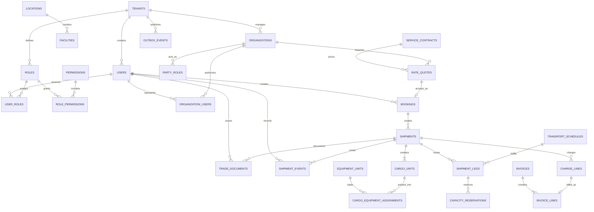

# Freight Shipping Database Design

This design assumes `ShippingApp` manages business-to-business multimodal freight (ocean, air, rail, and road), not last-mile parcel delivery. PostgreSQL stores parties, rate quotes, bookings, shipments, cargo units, containers, transport legs, capacity reservations, trade documents, milestones, charges, invoices, and settlement references. Carrier APIs, tracking feeds, optimization, and document objects remain integrated bounded contexts.

## Scope and principles

- Supports door-to-door and port-to-port quotes/bookings, multiple cargo units and containers, consolidated shipments, planned/actual legs, bills of lading or air waybills, customs references, exceptions, invoices, and payments.
- Accepted bookings snapshot parties, addresses, Incoterms, cargo, service, schedule, rate, and rules.
- Operational events and document versions are append-only. Corrections supersede or amend; they never erase legal history.
- Money uses `numeric(19,4)` plus currency; weights/volumes/dimensions use fixed SI decimals; ports use UN/LOCODE and timestamps use UTC plus local timezone context.
- Dangerous-goods classification, sanctions/customs decisions, and document binaries are managed by specialized services but referenced and audited here.

## Critical invariants

1. Booking, shipment, house/master document, container, and carrier reference numbers are unique in their issuing namespace.
2. Cargo units belong to one shipment, while a consolidation mapping explicitly models shared containers/master movements.
3. Booked weight, volume, and equipment cannot exceed confirmed capacity; reservations release exactly once.
4. A shipment's active itinerary has ordered, non-overlapping legs whose origin/destination chain is continuous unless an exception is recorded.
5. Legal document versions are immutable and form an explicit supersession/amendment chain.
6. Charge/invoice currency and totals reconcile, and payments/refunds do not exceed open amounts.
7. External carrier/customs events and API commands are idempotent and retain source identifiers/timestamps.
8. State transitions and outbox/audit records commit atomically.

## Identity and authorization tables

Authentication identities are separate from commercial organizations and shipment party roles.

| Table | Key columns | Purpose and constraints |
|---|---|---|
| `users` | `user_id`, `tenant_id`, `identity_subject`, `email_hash`, `status`, login timestamps | External identity-provider subject without stored credentials. |
| `roles` | `role_id`, `tenant_id`, `role_code`, `name`, `description`, `is_system` | Shipper operator, carrier operator, customs, finance, audit, or administrator role. |
| `permissions` | `permission_id`, `permission_code`, `description` | Global action catalog. |
| `user_roles` | `user_role_id`, `tenant_id`, user/role IDs, optional scope, assignment/expiry fields | Auditable assignment, optionally scoped to an organization, facility, or shipment. |
| `role_permissions` | `tenant_id`, `role_id`, `permission_id`, `granted_at` | Role-to-permission grants. |
| `organization_users` | organization/user IDs, relationship type, validity/status fields | Connects people to shipper, consignee, carrier, broker, or payer organizations. |

The access path is `users → organization_users → organizations`; authorization flows through roles and permissions. Bookings, issued trade documents, and shipment events retain their responsible user IDs.

## Entity relationship model



## Parties, locations, and contracts

Every tenant-owned relationship should include `tenant_id` in a composite foreign key. Global reference data may use separate controlled schemas.

| Table | Key columns | Purpose and constraints |
|---|---|---|
| `tenants` | `tenant_id`, code/name, base currency, timezone, `status` | Forwarder/carrier/legal entity. |
| `organizations` | `organization_id`, `tenant_id`, legal/display name, registration/tax hashes, encrypted contact/billing references, credit terms, `status` | Shipper, consignee, carrier, agent, broker, or payer organization. |
| `party_roles` | `party_role_id`, `organization_id`, role type, validity window, license/reference, `status` | Time-bounded operational role and qualification. |
| `locations` | `location_id`, type, UN/LOCODE, country/subdivision/postal codes, timezone, coordinates, `status` | Port, airport, rail ramp, city, or geographic place. |
| `facilities` | `facility_id`, `tenant_id`, `location_id`, owner organization, code/type, address reference, capabilities, `status` | Terminal, warehouse, CFS, yard, or depot. |
| `service_contracts` | `contract_id`, `tenant_id`, customer/carrier, trade lane/modes, currencies, effective window, terms/document reference, `version`, `status` | Negotiated rules and rates. |
| `rate_cards` | `rate_card_id`, `contract_id`, lane, mode, equipment/cargo conditions, base and surcharge rule versions, effective window | Versioned rate data, never edited retroactively. |

## Quote, booking, and shipment tables

| Table | Key columns | Purpose and constraints |
|---|---|---|
| `rate_quotes` | `quote_id`, `tenant_id`, customer, origin/destination, service/mode/equipment snapshots, cargo totals, currency and charge snapshot, route/schedule/rate versions, validity window, `status`, `idempotency_key` | Immutable commercial offer; unique tenant/idempotency key. |
| `bookings` | `booking_id`, `tenant_id`, `booking_number`, `quote_id NULL`, customer and party snapshots, Incoterm and named place, requested dates, service/mode, cargo/equipment totals, `status`, `version`, timestamps | Capacity/service request. Unique tenant booking number. |
| `shipments` | `shipment_id`, `tenant_id`, `shipment_number`, `booking_id`, shipment type, shipper/consignee/notify/payer snapshots, origin/destination, service terms, planned/actual dates, current status, active itinerary version, `version` | Operational shipment; booking may create multiple shipments. |
| `cargo_units` | `cargo_unit_id`, `shipment_id`, marks/numbers, package type/count, description ciphertext, HS-code reference, gross/net weight, volume, dimensions, declared value/currency, stackable/temperature/hazard flags | Physical/commercial cargo description. Positive quantities with unit-of-measure codes. |
| `dangerous_goods` | `dangerous_goods_id`, `cargo_unit_id`, UN number, class/division, packing group, proper shipping name, quantities, emergency/contact and declaration references, status | Restricted compliance detail with versioned validation. |
| `shipment_parties` | `shipment_id`, `organization_id`, role, immutable name/address/contact/reference snapshot, validity | Multiple party roles with legally preserved snapshots. |
| `consolidations` | `consolidation_id`, `tenant_id`, master shipment/reference, mode, origin/destination, `status` | Groups house shipments under a master movement. |
| `consolidation_members` | `consolidation_id`, `shipment_id`, allocated weight/volume/cost, load sequence | Explicit many-to-many allocation; unique consolidation/shipment. |

## Itinerary, equipment, and capacity

| Table | Key columns | Purpose and constraints |
|---|---|---|
| `transport_schedules` | `schedule_id`, carrier, mode, service/voyage/flight/train reference, vehicle/vessel reference, origin/destination facilities, planned/estimated/actual departure/arrival, source version, `status` | Carrier movement. External updates use carrier/source IDs and sequence. |
| `shipment_legs` | `leg_id`, `shipment_id`, itinerary version, sequence number, mode, carrier, schedule, origin/destination, planned/estimated/actual times, booking references, `status`, `version` | Ordered movement leg; unique shipment/version/sequence. |
| `capacity_pools` | `capacity_pool_id`, schedule/service/leg reference, equipment type, weight/volume/unit capacities, reserved/confirmed totals, `version` | Authoritative allocatable capacity projection. |
| `capacity_reservations` | `reservation_id`, booking/shipment/leg IDs, pool ID, requested/confirmed quantities, `status`, `expires_at`, `version` | Atomic reservation. Check nonnegative values and pool limits. |
| `equipment_units` | `equipment_unit_id`, owner/operator, equipment type, ISO code, tokenized container number, tare/max gross weights, inspection/seal/status fields | Container, ULD, trailer, or railcar. Unique issuer/type/number. |
| `cargo_equipment_assignments` | `cargo_unit_id`, `equipment_unit_id`, loaded weight/volume/package count, load/unload facilities/times, `status` | Packing/allocation mapping with capacity checks. |
| `equipment_events` | `event_id bigint`, equipment ID, event type, facility/location, source identifiers, event/receive times, seal/condition references | Append-only gate/load/discharge/empty-return history. |

Itinerary optimization happens outside PostgreSQL. Persist every itinerary version and activation decision. Old versions remain queryable because rates, documents, notifications, and service-level decisions may depend on them.

## Documents, milestones, and exceptions

| Table | Key columns | Purpose and constraints |
|---|---|---|
| `trade_documents` | `document_id`, `tenant_id`, shipment/booking IDs, type, issuer, document number, version, status, object/checksum/signature references, issued/effective timestamps, `supersedes_document_id NULL` | Bill of lading, sea waybill, air waybill, commercial invoice, packing list, certificate, or declaration metadata. |
| `document_parties` | `document_id`, role, organization reference, immutable party snapshot | Legal party presentation for that version. |
| `shipment_events` | `event_id bigint`, shipment ID, event type, leg/facility/equipment references, operational/public status, source/sequence, event/receive time, location, reason, metadata | Immutable milestone/event fact; unique source event. |
| `shipment_states` | `shipment_id`, current operational/public status, active leg/location, last applied source/sequence, `version` | Rebuildable current projection; late events cannot silently regress it. |
| `exception_cases` | `case_id`, shipment/leg/equipment/document IDs, type/severity, status, owner, SLA, financial/service impact, resolution, `version` | Delay, damage, rollover, customs hold, capacity, documentation, or loss workflow. |
| `customs_filing_refs` | `filing_ref_id`, shipment ID, jurisdiction/type, broker, opaque filing/reference IDs, status, submitted/released timestamps, version | Reference only; sensitive filing payload belongs in the customs system. |

## Charges, invoices, and settlement

| Table | Key columns | Purpose and constraints |
|---|---|---|
| `charge_lines` | `charge_id`, booking/shipment/leg IDs, payer/payee, charge code, basis/quantity/rate, amount/tax, currency, source/rule version, estimated/actual, `status`, `supersedes_charge_id` | Immutable freight, fuel, handling, demurrage, duty, insurance, adjustment, and other charge lines. |
| `invoices` | `invoice_id`, `tenant_id`, invoice number, issuer/payer, currency, issue/due dates, subtotal/tax/total/paid/balance, `status`, version | Receivable/payable invoice. Unique issuer/invoice number. |
| `invoice_lines` | `invoice_line_id`, `invoice_id`, `charge_id NULL`, description/code, amount/tax, accounting references | Immutable billed snapshot; a charge is billed only as policy permits. |
| `payment_allocations` | `allocation_id`, external payment/ledger reference, `invoice_id`, amount, currency, `status`, allocated/reversed timestamps | Allocation reference; money ledger may be a dedicated finance service. |

Invoice totals must equal their lines, and payment allocations must not exceed the invoice balance. Cross-currency settlement records explicit FX quote/rate and realized difference rather than mixing currencies.

## Complete PostgreSQL schema, constraints, and indexes

The following dependency-ordered DDL creates the complete relational model documented above, including parties, contracts, freight operations, capacity, equipment, documents, customs references, billing, audit, and event publication.

```sql
CREATE EXTENSION IF NOT EXISTS postgis;
CREATE EXTENSION IF NOT EXISTS pgcrypto;

CREATE TABLE tenants (
    tenant_id uuid PRIMARY KEY DEFAULT gen_random_uuid(),
    code text NOT NULL UNIQUE, name text NOT NULL,
    base_currency char(3) NOT NULL, timezone text NOT NULL,
    status text NOT NULL CHECK (status IN ('ACTIVE','SUSPENDED','CLOSED'))
);

CREATE TABLE users (
    user_id uuid PRIMARY KEY DEFAULT gen_random_uuid(),
    tenant_id uuid NOT NULL REFERENCES tenants(tenant_id),
    identity_subject text NOT NULL, email_hash bytea NULL,
    status text NOT NULL CHECK (status IN ('INVITED','ACTIVE','LOCKED','DISABLED')),
    last_login_at timestamptz NULL,
    created_at timestamptz NOT NULL DEFAULT clock_timestamp(),
    updated_at timestamptz NOT NULL DEFAULT clock_timestamp(),
    UNIQUE (tenant_id, user_id), UNIQUE (tenant_id, identity_subject)
);

CREATE TABLE roles (
    role_id uuid PRIMARY KEY DEFAULT gen_random_uuid(),
    tenant_id uuid NOT NULL REFERENCES tenants(tenant_id),
    role_code text NOT NULL, name text NOT NULL, description text NULL,
    is_system boolean NOT NULL DEFAULT false,
    created_at timestamptz NOT NULL DEFAULT clock_timestamp(),
    UNIQUE (tenant_id, role_id), UNIQUE (tenant_id, role_code)
);

CREATE TABLE permissions (
    permission_id uuid PRIMARY KEY DEFAULT gen_random_uuid(),
    permission_code text NOT NULL UNIQUE, description text NOT NULL
);

CREATE TABLE role_permissions (
    tenant_id uuid NOT NULL, role_id uuid NOT NULL,
    permission_id uuid NOT NULL REFERENCES permissions(permission_id),
    granted_at timestamptz NOT NULL DEFAULT clock_timestamp(),
    PRIMARY KEY (role_id, permission_id),
    FOREIGN KEY (tenant_id, role_id) REFERENCES roles(tenant_id, role_id)
);

CREATE TABLE user_roles (
    user_role_id uuid PRIMARY KEY DEFAULT gen_random_uuid(),
    tenant_id uuid NOT NULL, user_id uuid NOT NULL, role_id uuid NOT NULL,
    scope_type text NULL, scope_id uuid NULL,
    assigned_by_user_id uuid NULL,
    assigned_at timestamptz NOT NULL DEFAULT clock_timestamp(),
    expires_at timestamptz NULL,
    FOREIGN KEY (tenant_id, user_id) REFERENCES users(tenant_id, user_id),
    FOREIGN KEY (tenant_id, role_id) REFERENCES roles(tenant_id, role_id),
    FOREIGN KEY (tenant_id, assigned_by_user_id) REFERENCES users(tenant_id, user_id),
    CHECK ((scope_type IS NULL) = (scope_id IS NULL)),
    CHECK (expires_at IS NULL OR expires_at > assigned_at)
);

CREATE TABLE organizations (
    organization_id uuid PRIMARY KEY DEFAULT gen_random_uuid(),
    tenant_id uuid NOT NULL REFERENCES tenants(tenant_id),
    legal_name text NOT NULL, display_name text NOT NULL,
    registration_hash bytea NULL, tax_hash bytea NULL,
    contact_reference text NOT NULL, billing_reference text NULL,
    credit_terms jsonb NOT NULL DEFAULT '{}'::jsonb,
    status text NOT NULL CHECK (status IN ('ACTIVE','ON_HOLD','CLOSED')),
    UNIQUE (tenant_id, organization_id)
);

CREATE TABLE organization_users (
    tenant_id uuid NOT NULL, organization_id uuid NOT NULL, user_id uuid NOT NULL,
    relationship_type text NOT NULL CHECK
        (relationship_type IN ('OWNER','OPERATOR','LOGISTICS','CUSTOMS','FINANCE','VIEWER')),
    status text NOT NULL CHECK (status IN ('ACTIVE','SUSPENDED','REVOKED')),
    valid_from timestamptz NOT NULL DEFAULT clock_timestamp(), valid_to timestamptz NULL,
    PRIMARY KEY (organization_id, user_id, valid_from),
    FOREIGN KEY (tenant_id, organization_id) REFERENCES organizations(tenant_id, organization_id),
    FOREIGN KEY (tenant_id, user_id) REFERENCES users(tenant_id, user_id),
    CHECK (valid_to IS NULL OR valid_to > valid_from)
);

CREATE TABLE party_roles (
    party_role_id uuid PRIMARY KEY DEFAULT gen_random_uuid(),
    organization_id uuid NOT NULL REFERENCES organizations(organization_id),
    role_type text NOT NULL CHECK
        (role_type IN ('SHIPPER','CONSIGNEE','CARRIER','AGENT','BROKER','PAYER','NOTIFY')),
    valid_from date NOT NULL, valid_to date NULL,
    license_reference text NULL,
    status text NOT NULL CHECK (status IN ('ACTIVE','SUSPENDED','EXPIRED')),
    CHECK (valid_to IS NULL OR valid_to >= valid_from),
    UNIQUE (organization_id, role_type, valid_from)
);

CREATE TABLE locations (
    location_id uuid PRIMARY KEY DEFAULT gen_random_uuid(),
    location_type text NOT NULL CHECK (location_type IN ('PORT','AIRPORT','RAIL_RAMP','CITY','ADDRESS')),
    un_locode text NULL, country_code char(2) NOT NULL,
    subdivision_code text NULL, postal_code text NULL,
    timezone text NOT NULL, coordinates geography(Point,4326) NULL,
    status text NOT NULL CHECK (status IN ('ACTIVE','RETIRED')),
    UNIQUE (un_locode)
);

CREATE TABLE facilities (
    facility_id uuid PRIMARY KEY DEFAULT gen_random_uuid(),
    tenant_id uuid NOT NULL REFERENCES tenants(tenant_id),
    location_id uuid NOT NULL REFERENCES locations(location_id),
    owner_organization_id uuid NULL REFERENCES organizations(organization_id),
    code text NOT NULL,
    facility_type text NOT NULL CHECK (facility_type IN ('TERMINAL','WAREHOUSE','CFS','YARD','DEPOT')),
    address_reference text NULL, capabilities jsonb NOT NULL DEFAULT '{}'::jsonb,
    status text NOT NULL CHECK (status IN ('ACTIVE','CLOSED')),
    UNIQUE (tenant_id, facility_id), UNIQUE (tenant_id, code)
);

CREATE TABLE service_contracts (
    contract_id uuid PRIMARY KEY DEFAULT gen_random_uuid(),
    tenant_id uuid NOT NULL REFERENCES tenants(tenant_id),
    customer_id uuid NOT NULL REFERENCES organizations(organization_id),
    carrier_id uuid NULL REFERENCES organizations(organization_id),
    trade_lane jsonb NOT NULL, modes text[] NOT NULL,
    currencies char(3)[] NOT NULL,
    valid_from date NOT NULL, valid_to date NOT NULL,
    terms_reference text NOT NULL, version integer NOT NULL CHECK (version > 0),
    status text NOT NULL CHECK (status IN ('DRAFT','ACTIVE','EXPIRED','TERMINATED')),
    CHECK (valid_to >= valid_from)
);

CREATE TABLE rate_cards (
    rate_card_id uuid PRIMARY KEY DEFAULT gen_random_uuid(),
    contract_id uuid NOT NULL REFERENCES service_contracts(contract_id),
    lane_definition jsonb NOT NULL,
    mode text NOT NULL CHECK (mode IN ('OCEAN','AIR','ROAD','RAIL','MULTIMODAL')),
    equipment_conditions jsonb NOT NULL DEFAULT '{}'::jsonb,
    cargo_conditions jsonb NOT NULL DEFAULT '{}'::jsonb,
    currency char(3) NOT NULL, rate_definition jsonb NOT NULL,
    valid_from timestamptz NOT NULL, valid_to timestamptz NULL,
    version integer NOT NULL CHECK (version > 0),
    CHECK (valid_to IS NULL OR valid_to > valid_from)
);

CREATE TABLE rate_quotes (
    quote_id uuid PRIMARY KEY DEFAULT gen_random_uuid(),
    tenant_id uuid NOT NULL REFERENCES tenants(tenant_id),
    customer_id uuid NOT NULL REFERENCES organizations(organization_id),
    contract_id uuid NULL REFERENCES service_contracts(contract_id),
    origin_location_id uuid NOT NULL REFERENCES locations(location_id),
    destination_location_id uuid NOT NULL REFERENCES locations(location_id),
    service_snapshot jsonb NOT NULL, cargo_snapshot jsonb NOT NULL,
    route_snapshot jsonb NOT NULL, charge_snapshot jsonb NOT NULL,
    currency char(3) NOT NULL,
    total_amount numeric(19,4) NOT NULL CHECK (total_amount >= 0),
    rate_version text NOT NULL,
    valid_from timestamptz NOT NULL, valid_to timestamptz NOT NULL,
    status text NOT NULL CHECK (status IN ('DRAFT','OFFERED','ACCEPTED','EXPIRED','WITHDRAWN')),
    idempotency_key text NOT NULL,
    CHECK (origin_location_id <> destination_location_id),
    CHECK (valid_to > valid_from),
    UNIQUE (tenant_id, quote_id), UNIQUE (tenant_id, idempotency_key)
);

CREATE TABLE transport_schedules (
    schedule_id uuid PRIMARY KEY DEFAULT gen_random_uuid(),
    carrier_id uuid NOT NULL REFERENCES organizations(organization_id),
    mode text NOT NULL CHECK (mode IN ('OCEAN','AIR','ROAD','RAIL')),
    service_reference text NOT NULL, vehicle_reference text NULL,
    origin_facility_id uuid NOT NULL REFERENCES facilities(facility_id),
    destination_facility_id uuid NOT NULL REFERENCES facilities(facility_id),
    planned_departure timestamptz NOT NULL, planned_arrival timestamptz NOT NULL,
    estimated_departure timestamptz NULL, estimated_arrival timestamptz NULL,
    actual_departure timestamptz NULL, actual_arrival timestamptz NULL,
    source_version text NOT NULL,
    status text NOT NULL CHECK (status IN ('SCHEDULED','DELAYED','DEPARTED','ARRIVED','CANCELLED')),
    CHECK (planned_arrival > planned_departure),
    UNIQUE (carrier_id, mode, service_reference, planned_departure)
);

CREATE TABLE equipment_units (
    equipment_unit_id uuid PRIMARY KEY DEFAULT gen_random_uuid(),
    owner_id uuid NULL REFERENCES organizations(organization_id),
    operator_id uuid NULL REFERENCES organizations(organization_id),
    equipment_type text NOT NULL, iso_code text NULL,
    equipment_number_token text NOT NULL,
    tare_weight_kg numeric(16,3) NOT NULL CHECK (tare_weight_kg >= 0),
    max_gross_weight_kg numeric(16,3) NOT NULL CHECK (max_gross_weight_kg > 0),
    inspection_expires_on date NULL, seal_number text NULL,
    status text NOT NULL CHECK (status IN ('AVAILABLE','ALLOCATED','LOADED','IN_TRANSIT','MAINTENANCE','RETIRED')),
    CHECK (max_gross_weight_kg >= tare_weight_kg),
    UNIQUE (equipment_type, equipment_number_token)
);

CREATE TABLE bookings (
    booking_id       uuid PRIMARY KEY DEFAULT gen_random_uuid(),
    tenant_id        uuid NOT NULL REFERENCES tenants(tenant_id),
    created_by_user_id uuid NULL,
    booking_number   text NOT NULL,
    quote_id         uuid NULL UNIQUE REFERENCES rate_quotes(quote_id),
    customer_id      uuid NOT NULL REFERENCES organizations(organization_id),
    incoterm_code    text NULL,
    incoterm_place   text NULL,
    service_mode     text NOT NULL CHECK
        (service_mode IN ('OCEAN','AIR','ROAD','RAIL','MULTIMODAL')),
    requested_departure date NULL,
    total_weight_kg  numeric(16,3) NOT NULL CHECK (total_weight_kg > 0),
    total_volume_m3  numeric(16,4) NOT NULL CHECK (total_volume_m3 >= 0),
    status           text NOT NULL CHECK
        (status IN ('DRAFT','REQUESTED','PENDING_CARRIER','CONFIRMED','PARTIALLY_CONFIRMED','CANCELLED','EXPIRED')),
    idempotency_key  text NOT NULL,
    version          bigint NOT NULL DEFAULT 0,
    created_at       timestamptz NOT NULL DEFAULT clock_timestamp(),
    updated_at       timestamptz NOT NULL DEFAULT clock_timestamp(),
    FOREIGN KEY (tenant_id, created_by_user_id) REFERENCES users(tenant_id, user_id),
    CHECK ((incoterm_code IS NULL) = (incoterm_place IS NULL)),
    UNIQUE (tenant_id, booking_id),
    UNIQUE (tenant_id, booking_number),
    UNIQUE (tenant_id, idempotency_key)
);

CREATE TABLE shipments (
    shipment_id       uuid PRIMARY KEY DEFAULT gen_random_uuid(),
    tenant_id         uuid NOT NULL,
    shipment_number   text NOT NULL,
    booking_id        uuid NOT NULL,
    shipment_type     text NOT NULL CHECK (shipment_type IN ('HOUSE','MASTER','DIRECT')),
    origin_location_id uuid NOT NULL REFERENCES locations(location_id),
    destination_location_id uuid NOT NULL REFERENCES locations(location_id),
    party_snapshot    jsonb NOT NULL,
    service_snapshot  jsonb NOT NULL,
    status            text NOT NULL CHECK (status IN
        ('PLANNED','BOOKED','RECEIVED','IN_TRANSIT','CUSTOMS_HOLD','AVAILABLE',
         'DELIVERED','CANCELLED','CLOSED')),
    active_itinerary_version integer NOT NULL DEFAULT 1 CHECK (active_itinerary_version > 0),
    version            bigint NOT NULL DEFAULT 0,
    created_at         timestamptz NOT NULL DEFAULT clock_timestamp(),
    FOREIGN KEY (tenant_id, booking_id) REFERENCES bookings(tenant_id, booking_id),
    CHECK (origin_location_id <> destination_location_id),
    UNIQUE (tenant_id, shipment_id),
    UNIQUE (tenant_id, shipment_number)
);

CREATE TABLE shipment_parties (
    shipment_id uuid NOT NULL REFERENCES shipments(shipment_id),
    organization_id uuid NOT NULL REFERENCES organizations(organization_id),
    party_role text NOT NULL,
    party_snapshot jsonb NOT NULL,
    valid_from timestamptz NOT NULL DEFAULT clock_timestamp(),
    valid_to timestamptz NULL,
    PRIMARY KEY (shipment_id, organization_id, party_role, valid_from),
    CHECK (valid_to IS NULL OR valid_to > valid_from)
);

CREATE TABLE cargo_units (
    cargo_unit_id     uuid PRIMARY KEY DEFAULT gen_random_uuid(),
    tenant_id         uuid NOT NULL,
    shipment_id       uuid NOT NULL,
    marks_numbers     text NULL,
    package_type      text NOT NULL,
    package_count     integer NOT NULL CHECK (package_count > 0),
    description_ciphertext bytea NOT NULL,
    gross_weight_kg   numeric(16,3) NOT NULL CHECK (gross_weight_kg > 0),
    net_weight_kg     numeric(16,3) NULL CHECK (net_weight_kg >= 0),
    volume_m3         numeric(16,4) NOT NULL CHECK (volume_m3 >= 0),
    declared_value    numeric(19,4) NULL CHECK (declared_value >= 0),
    declared_currency char(3) NULL,
    hazardous         boolean NOT NULL DEFAULT false,
    FOREIGN KEY (tenant_id, shipment_id) REFERENCES shipments(tenant_id, shipment_id),
    CHECK (net_weight_kg IS NULL OR net_weight_kg <= gross_weight_kg),
    CHECK ((declared_value IS NULL) = (declared_currency IS NULL))
);

CREATE TABLE dangerous_goods (
    dangerous_goods_id uuid PRIMARY KEY DEFAULT gen_random_uuid(),
    cargo_unit_id uuid NOT NULL REFERENCES cargo_units(cargo_unit_id),
    un_number text NOT NULL, hazard_class text NOT NULL, division text NULL,
    packing_group text NULL, proper_shipping_name text NOT NULL,
    quantity numeric(16,4) NOT NULL CHECK (quantity > 0),
    unit_code text NOT NULL, emergency_reference text NOT NULL,
    declaration_reference text NOT NULL,
    status text NOT NULL CHECK (status IN ('DECLARED','VALIDATED','REJECTED','EXPIRED'))
);

CREATE TABLE consolidations (
    consolidation_id uuid PRIMARY KEY DEFAULT gen_random_uuid(),
    tenant_id uuid NOT NULL REFERENCES tenants(tenant_id),
    master_shipment_id uuid NULL REFERENCES shipments(shipment_id),
    master_reference text NOT NULL,
    mode text NOT NULL CHECK (mode IN ('OCEAN','AIR','ROAD','RAIL')),
    origin_location_id uuid NOT NULL REFERENCES locations(location_id),
    destination_location_id uuid NOT NULL REFERENCES locations(location_id),
    status text NOT NULL CHECK (status IN ('PLANNED','OPEN','CLOSED','DEPARTED','COMPLETED','CANCELLED')),
    CHECK (origin_location_id <> destination_location_id),
    UNIQUE (tenant_id, consolidation_id), UNIQUE (tenant_id, master_reference)
);

CREATE TABLE consolidation_members (
    consolidation_id uuid NOT NULL REFERENCES consolidations(consolidation_id),
    shipment_id uuid NOT NULL REFERENCES shipments(shipment_id),
    allocated_weight_kg numeric(16,3) NOT NULL CHECK (allocated_weight_kg > 0),
    allocated_volume_m3 numeric(16,4) NOT NULL CHECK (allocated_volume_m3 >= 0),
    allocated_cost numeric(19,4) NOT NULL DEFAULT 0 CHECK (allocated_cost >= 0),
    load_sequence integer NULL CHECK (load_sequence > 0),
    PRIMARY KEY (consolidation_id, shipment_id)
);

CREATE TABLE shipment_legs (
    leg_id            uuid PRIMARY KEY DEFAULT gen_random_uuid(),
    tenant_id         uuid NOT NULL,
    shipment_id       uuid NOT NULL,
    itinerary_version integer NOT NULL CHECK (itinerary_version > 0),
    sequence_no       integer NOT NULL CHECK (sequence_no > 0),
    mode              text NOT NULL CHECK (mode IN ('OCEAN','AIR','ROAD','RAIL')),
    carrier_id        uuid NOT NULL REFERENCES organizations(organization_id),
    schedule_id       uuid NULL REFERENCES transport_schedules(schedule_id),
    origin_location_id uuid NOT NULL REFERENCES locations(location_id),
    destination_location_id uuid NOT NULL REFERENCES locations(location_id),
    planned_departure timestamptz NOT NULL,
    planned_arrival   timestamptz NOT NULL,
    status            text NOT NULL CHECK
        (status IN ('PLANNED','CONFIRMED','DEPARTED','ARRIVED','CANCELLED','ROLLED')),
    version           bigint NOT NULL DEFAULT 0,
    FOREIGN KEY (tenant_id, shipment_id) REFERENCES shipments(tenant_id, shipment_id),
    CHECK (origin_location_id <> destination_location_id),
    CHECK (planned_arrival > planned_departure),
    UNIQUE (shipment_id, itinerary_version, sequence_no)
);

CREATE TABLE capacity_pools (
    capacity_pool_id uuid PRIMARY KEY DEFAULT gen_random_uuid(),
    tenant_id        uuid NOT NULL REFERENCES tenants(tenant_id),
    schedule_id      uuid NOT NULL REFERENCES transport_schedules(schedule_id),
    equipment_type   text NULL,
    weight_capacity_kg numeric(16,3) NOT NULL CHECK (weight_capacity_kg >= 0),
    volume_capacity_m3 numeric(16,4) NOT NULL CHECK (volume_capacity_m3 >= 0),
    unit_capacity    integer NOT NULL DEFAULT 0 CHECK (unit_capacity >= 0),
    reserved_weight_kg numeric(16,3) NOT NULL DEFAULT 0 CHECK (reserved_weight_kg >= 0),
    reserved_volume_m3 numeric(16,4) NOT NULL DEFAULT 0 CHECK (reserved_volume_m3 >= 0),
    reserved_units   integer NOT NULL DEFAULT 0 CHECK (reserved_units >= 0),
    version          bigint NOT NULL DEFAULT 0,
    CHECK (reserved_weight_kg <= weight_capacity_kg),
    CHECK (reserved_volume_m3 <= volume_capacity_m3),
    CHECK (reserved_units <= unit_capacity)
);

CREATE TABLE capacity_reservations (
    reservation_id   uuid PRIMARY KEY DEFAULT gen_random_uuid(),
    tenant_id        uuid NOT NULL REFERENCES tenants(tenant_id),
    booking_id       uuid NOT NULL REFERENCES bookings(booking_id),
    leg_id            uuid NULL REFERENCES shipment_legs(leg_id),
    capacity_pool_id uuid NOT NULL REFERENCES capacity_pools(capacity_pool_id),
    weight_kg        numeric(16,3) NOT NULL CHECK (weight_kg >= 0),
    volume_m3        numeric(16,4) NOT NULL CHECK (volume_m3 >= 0),
    units            integer NOT NULL DEFAULT 0 CHECK (units >= 0),
    status           text NOT NULL CHECK (status IN ('HELD','CONFIRMED','RELEASED','EXPIRED')),
    expires_at       timestamptz NULL,
    version          bigint NOT NULL DEFAULT 0,
    CHECK (weight_kg > 0 OR volume_m3 > 0 OR units > 0),
    CHECK (status <> 'HELD' OR expires_at IS NOT NULL)
);

CREATE TABLE cargo_equipment_assignments (
    cargo_unit_id uuid NOT NULL REFERENCES cargo_units(cargo_unit_id),
    equipment_unit_id uuid NOT NULL REFERENCES equipment_units(equipment_unit_id),
    loaded_weight_kg numeric(16,3) NOT NULL CHECK (loaded_weight_kg > 0),
    loaded_volume_m3 numeric(16,4) NOT NULL CHECK (loaded_volume_m3 >= 0),
    package_count integer NOT NULL CHECK (package_count > 0),
    load_facility_id uuid NULL REFERENCES facilities(facility_id),
    unload_facility_id uuid NULL REFERENCES facilities(facility_id),
    loaded_at timestamptz NULL, unloaded_at timestamptz NULL,
    status text NOT NULL CHECK (status IN ('PLANNED','LOADED','UNLOADED','CANCELLED')),
    PRIMARY KEY (cargo_unit_id, equipment_unit_id),
    CHECK (unloaded_at IS NULL OR loaded_at IS NOT NULL),
    CHECK (unloaded_at IS NULL OR unloaded_at >= loaded_at)
);

CREATE TABLE equipment_events (
    event_id bigint GENERATED ALWAYS AS IDENTITY PRIMARY KEY,
    equipment_unit_id uuid NOT NULL REFERENCES equipment_units(equipment_unit_id),
    event_type text NOT NULL,
    facility_id uuid NULL REFERENCES facilities(facility_id),
    location geography(Point,4326) NULL,
    source text NOT NULL, source_event_id text NOT NULL,
    occurred_at timestamptz NOT NULL, received_at timestamptz NOT NULL DEFAULT clock_timestamp(),
    seal_reference text NULL, condition_reference text NULL,
    UNIQUE (source, source_event_id)
);

CREATE TABLE trade_documents (
    document_id      uuid PRIMARY KEY DEFAULT gen_random_uuid(),
    tenant_id        uuid NOT NULL,
    issued_by_user_id uuid NULL,
    shipment_id      uuid NOT NULL,
    document_type    text NOT NULL,
    issuer_id        uuid NOT NULL REFERENCES organizations(organization_id),
    document_number  text NOT NULL,
    version_no       integer NOT NULL CHECK (version_no > 0),
    status           text NOT NULL CHECK (status IN ('DRAFT','ISSUED','SURRENDERED','VOIDED','SUPERSEDED')),
    object_ref       text NOT NULL,
    object_checksum  text NOT NULL,
    signature_ref    text NULL,
    supersedes_document_id uuid NULL REFERENCES trade_documents(document_id),
    issued_at        timestamptz NULL,
    FOREIGN KEY (tenant_id, shipment_id) REFERENCES shipments(tenant_id, shipment_id),
    FOREIGN KEY (tenant_id, issued_by_user_id) REFERENCES users(tenant_id, user_id),
    CHECK (status <> 'ISSUED' OR issued_at IS NOT NULL),
    CHECK (supersedes_document_id IS NULL OR version_no > 1),
    UNIQUE (issuer_id, document_type, document_number, version_no),
    UNIQUE (supersedes_document_id)
);

CREATE TABLE document_parties (
    document_id uuid NOT NULL REFERENCES trade_documents(document_id),
    party_role text NOT NULL,
    organization_id uuid NULL REFERENCES organizations(organization_id),
    party_snapshot jsonb NOT NULL,
    PRIMARY KEY (document_id, party_role)
);

CREATE TABLE shipment_events (
    event_id bigint GENERATED ALWAYS AS IDENTITY PRIMARY KEY,
    tenant_id uuid NOT NULL, shipment_id uuid NOT NULL,
    recorded_by_user_id uuid NULL,
    event_type text NOT NULL,
    leg_id uuid NULL REFERENCES shipment_legs(leg_id),
    facility_id uuid NULL REFERENCES facilities(facility_id),
    equipment_unit_id uuid NULL REFERENCES equipment_units(equipment_unit_id),
    operational_status text NOT NULL, public_status text NOT NULL,
    source text NOT NULL, source_event_id text NOT NULL, source_sequence bigint NULL,
    occurred_at timestamptz NOT NULL, received_at timestamptz NOT NULL DEFAULT clock_timestamp(),
    location geography(Point,4326) NULL, reason_code text NULL,
    metadata jsonb NOT NULL DEFAULT '{}'::jsonb,
    FOREIGN KEY (tenant_id, shipment_id) REFERENCES shipments(tenant_id, shipment_id),
    FOREIGN KEY (tenant_id, recorded_by_user_id) REFERENCES users(tenant_id, user_id),
    UNIQUE (source, source_event_id)
);

CREATE TABLE shipment_states (
    shipment_id uuid PRIMARY KEY REFERENCES shipments(shipment_id),
    operational_status text NOT NULL, public_status text NOT NULL,
    active_leg_id uuid NULL REFERENCES shipment_legs(leg_id),
    current_location_id uuid NULL REFERENCES locations(location_id),
    last_event_id bigint NULL REFERENCES shipment_events(event_id),
    last_source_sequence bigint NULL,
    version bigint NOT NULL DEFAULT 0
);

CREATE TABLE exception_cases (
    case_id uuid PRIMARY KEY DEFAULT gen_random_uuid(),
    shipment_id uuid NULL REFERENCES shipments(shipment_id),
    leg_id uuid NULL REFERENCES shipment_legs(leg_id),
    equipment_unit_id uuid NULL REFERENCES equipment_units(equipment_unit_id),
    document_id uuid NULL REFERENCES trade_documents(document_id),
    case_type text NOT NULL, severity text NOT NULL,
    status text NOT NULL CHECK (status IN ('OPEN','INVESTIGATING','RESOLVED','CLOSED')),
    owner_id text NULL, sla_deadline timestamptz NULL,
    financial_impact numeric(19,4) NULL, resolution text NULL,
    version bigint NOT NULL DEFAULT 0,
    CHECK (shipment_id IS NOT NULL OR leg_id IS NOT NULL OR equipment_unit_id IS NOT NULL OR document_id IS NOT NULL)
);

CREATE TABLE customs_filing_refs (
    filing_ref_id uuid PRIMARY KEY DEFAULT gen_random_uuid(),
    shipment_id uuid NOT NULL REFERENCES shipments(shipment_id),
    jurisdiction text NOT NULL, filing_type text NOT NULL,
    broker_id uuid NULL REFERENCES organizations(organization_id),
    external_filing_id text NOT NULL, external_reference text NULL,
    status text NOT NULL CHECK (status IN ('DRAFT','SUBMITTED','ACCEPTED','REJECTED','RELEASED')),
    submitted_at timestamptz NULL, released_at timestamptz NULL,
    version bigint NOT NULL DEFAULT 0,
    UNIQUE (jurisdiction, external_filing_id)
);

CREATE TABLE charge_lines (
    charge_id uuid PRIMARY KEY DEFAULT gen_random_uuid(),
    booking_id uuid NULL REFERENCES bookings(booking_id),
    shipment_id uuid NULL REFERENCES shipments(shipment_id),
    leg_id uuid NULL REFERENCES shipment_legs(leg_id),
    payer_id uuid NOT NULL REFERENCES organizations(organization_id),
    payee_id uuid NOT NULL REFERENCES organizations(organization_id),
    charge_code text NOT NULL, basis text NOT NULL,
    quantity numeric(19,4) NOT NULL CHECK (quantity >= 0),
    rate numeric(19,4) NOT NULL, amount numeric(19,4) NOT NULL,
    tax_amount numeric(19,4) NOT NULL DEFAULT 0,
    currency char(3) NOT NULL, rule_version text NOT NULL,
    charge_stage text NOT NULL CHECK (charge_stage IN ('ESTIMATED','ACTUAL','ADJUSTMENT')),
    status text NOT NULL CHECK (status IN ('ACTIVE','VOIDED','BILLED')),
    supersedes_charge_id uuid NULL REFERENCES charge_lines(charge_id),
    created_at timestamptz NOT NULL DEFAULT clock_timestamp(),
    CHECK (booking_id IS NOT NULL OR shipment_id IS NOT NULL OR leg_id IS NOT NULL)
);

CREATE TABLE invoices (
    invoice_id       uuid PRIMARY KEY DEFAULT gen_random_uuid(),
    tenant_id        uuid NOT NULL REFERENCES tenants(tenant_id),
    issuer_id        uuid NOT NULL REFERENCES organizations(organization_id),
    payer_id         uuid NOT NULL REFERENCES organizations(organization_id),
    invoice_number   text NOT NULL,
    currency         char(3) NOT NULL,
    issue_date       date NOT NULL,
    due_date         date NOT NULL,
    subtotal         numeric(19,4) NOT NULL CHECK (subtotal >= 0),
    tax_total        numeric(19,4) NOT NULL CHECK (tax_total >= 0),
    total            numeric(19,4) NOT NULL CHECK (total >= 0),
    paid_total       numeric(19,4) NOT NULL DEFAULT 0 CHECK (paid_total >= 0),
    status           text NOT NULL CHECK
        (status IN ('DRAFT','ISSUED','PARTIALLY_PAID','PAID','VOID','OVERDUE')),
    version          bigint NOT NULL DEFAULT 0,
    CHECK (due_date >= issue_date),
    CHECK (total = subtotal + tax_total),
    CHECK (paid_total <= total),
    UNIQUE (issuer_id, invoice_number)
);

CREATE TABLE invoice_lines (
    invoice_line_id uuid PRIMARY KEY DEFAULT gen_random_uuid(),
    invoice_id uuid NOT NULL REFERENCES invoices(invoice_id),
    charge_id uuid NULL UNIQUE REFERENCES charge_lines(charge_id),
    description text NOT NULL, charge_code text NOT NULL,
    amount numeric(19,4) NOT NULL, tax_amount numeric(19,4) NOT NULL DEFAULT 0,
    accounting_reference text NULL
);

CREATE TABLE payment_allocations (
    allocation_id uuid PRIMARY KEY DEFAULT gen_random_uuid(),
    external_payment_reference text NOT NULL,
    invoice_id uuid NOT NULL REFERENCES invoices(invoice_id),
    amount numeric(19,4) NOT NULL CHECK (amount > 0),
    currency char(3) NOT NULL,
    status text NOT NULL CHECK (status IN ('ALLOCATED','REVERSED')),
    allocated_at timestamptz NOT NULL, reversed_at timestamptz NULL,
    CHECK (status <> 'REVERSED' OR reversed_at IS NOT NULL),
    UNIQUE (external_payment_reference, invoice_id)
);

CREATE TABLE outbox_events (
    event_id bigint GENERATED ALWAYS AS IDENTITY PRIMARY KEY,
    tenant_id uuid NOT NULL REFERENCES tenants(tenant_id),
    aggregate_type text NOT NULL, aggregate_id uuid NOT NULL, event_type text NOT NULL,
    payload jsonb NOT NULL, occurred_at timestamptz NOT NULL DEFAULT clock_timestamp(),
    published_at timestamptz NULL,
    attempt_count integer NOT NULL DEFAULT 0 CHECK (attempt_count >= 0)
);

CREATE TABLE audit_events (
    audit_event_id bigint GENERATED ALWAYS AS IDENTITY PRIMARY KEY,
    tenant_id uuid NOT NULL REFERENCES tenants(tenant_id), actor_id text NULL,
    action text NOT NULL, resource_type text NOT NULL, resource_id text NOT NULL,
    occurred_at timestamptz NOT NULL DEFAULT clock_timestamp(),
    details jsonb NOT NULL DEFAULT '{}'::jsonb
);

CREATE UNIQUE INDEX ux_user_roles_global
    ON user_roles (user_id, role_id) WHERE scope_type IS NULL;
CREATE UNIQUE INDEX ux_user_roles_scoped
    ON user_roles (user_id, role_id, scope_type, scope_id) WHERE scope_type IS NOT NULL;
CREATE INDEX ix_user_roles_active
    ON user_roles (tenant_id, user_id, expires_at);
CREATE INDEX ix_users_email_hash
    ON users (tenant_id, email_hash) WHERE email_hash IS NOT NULL;
CREATE UNIQUE INDEX ux_organization_users_active
    ON organization_users (organization_id, user_id)
    WHERE status = 'ACTIVE' AND valid_to IS NULL;
CREATE INDEX ix_organization_users_user
    ON organization_users (tenant_id, user_id, status);

CREATE INDEX ix_booking_customer_history
    ON bookings (tenant_id, customer_id, created_at DESC);
CREATE INDEX ix_shipment_operational
    ON shipments (tenant_id, status, created_at)
    WHERE status NOT IN ('DELIVERED','CANCELLED','CLOSED');
CREATE INDEX ix_leg_facility_departure
    ON shipment_legs (origin_location_id, planned_departure, status);
CREATE INDEX ix_leg_shipment_itinerary
    ON shipment_legs (shipment_id, itinerary_version, sequence_no);
CREATE INDEX ix_capacity_reservation_expiry
    ON capacity_reservations (expires_at) WHERE status = 'HELD';
CREATE INDEX ix_document_shipment
    ON trade_documents (tenant_id, shipment_id, document_type, version_no DESC);
CREATE INDEX ix_invoice_payer_due
    ON invoices (tenant_id, payer_id, due_date)
    WHERE status IN ('ISSUED','PARTIALLY_PAID','OVERDUE');
CREATE INDEX ix_outbox_unpublished
    ON outbox_events (event_id) WHERE published_at IS NULL;
CREATE INDEX ix_location_coordinates ON locations USING gist (coordinates);
CREATE INDEX ix_cargo_shipment ON cargo_units (shipment_id);
CREATE INDEX ix_equipment_event_history
    ON equipment_events (equipment_unit_id, occurred_at DESC);
CREATE INDEX ix_shipment_event_history
    ON shipment_events (tenant_id, shipment_id, occurred_at DESC, event_id DESC);
CREATE INDEX ix_exception_sla ON exception_cases (sla_deadline)
    WHERE status IN ('OPEN','INVESTIGATING');
CREATE INDEX ix_charge_shipment ON charge_lines (shipment_id, status);
CREATE INDEX ix_payment_allocation_invoice ON payment_allocations (invoice_id, status);
CREATE INDEX ix_audit_resource_time
    ON audit_events (tenant_id, resource_type, resource_id, occurred_at DESC);
```

Itinerary continuity across adjacent legs, cargo totals versus booking/shipment totals, capacity totals across reservations, invoice totals versus all line rows, and payment allocations require locked transactional procedures or deferred triggers. Issued documents, shipment events, equipment events, and charge lines are immutable; changes append superseding records.

## Core flows

### Quote and confirm booking

1. Claim idempotency and validate party, lane, cargo, sanctions/restricted-goods decision, schedule, and rate validity.
2. Persist route/rate/cargo/party snapshots and itemized quote charges.
3. On acceptance, lock the relevant capacity pools in deterministic order, reserve within available limits, create the booking, state event, audit, and outbox records atomically.
4. Remote carrier confirmation runs as an idempotent saga step; confirm or release reservations based on the response/timeout policy.

### Activate or revise itinerary

Insert a complete new itinerary version, validate leg continuity/time ordering and capacity, then atomically mark it active and supersede the prior version. Generate downstream document/notification amendments; never edit legs that supported issued documents.

### Ingest carrier event

Deduplicate provider/source event ID, retain event and receive times, append the event, and update projections only if source priority/sequence and the state machine permit. Suspicious or contradictory events open an exception rather than disappearing.

### Issue legal document

Build the document from immutable party/cargo/itinerary snapshots, store the encrypted object and checksum/signature externally, and commit its metadata/version. Amendments create a new version linked through `supersedes_document_id` and retain the original.

## Consistency, indexing, and scale

- Use optimistic aggregate versions and row locks for capacity reservation, itinerary activation, invoice allocation, and document issuance.
- Index bookings/shipments by customer/date/status, legs by facility/time/status, equipment by tokenized number, events by shipment/time, and open exceptions by SLA.
- Use GiST for facility/service-area geography. Partition events, equipment history, audits, and outbox history by month; optionally tenant-hash subpartition.
- Add partial indexes for active capacity reservations, in-transit shipments, upcoming legs, missing documents, overdue invoices, open exceptions, and unpublished events.
- Workers use `FOR UPDATE SKIP LOCKED`; inbound adapters and consumers are idempotent. Use keyset pagination for operational histories.
- Reconcile capacity pools to active reservations, shipment projections to events, cargo/equipment totals, charges to invoice lines, and invoices to payment allocations.

## Security, compliance, and recovery

- Encrypt PII, commercial terms, contents, documents, seals, and precise tracking details; use short-lived object links and log every sensitive access.
- Apply tenant row-level security and least-privilege roles for operations, customs, finance, customer service, audit, and integrations.
- Record rule/screening versions and opaque decisions for sanctions, export control, dangerous goods, customs, and retention workflows.
- Run PostgreSQL with regional HA, point-in-time recovery, encrypted off-domain backups, and regularly tested failover/restore/document recovery.
- Operational commands/read-your-writes use the primary; replicas and a warehouse serve analytics and older tracking history.

## Validation checklist

- Concurrent bookings cannot oversell weight, volume, unit, or equipment capacity.
- Active itinerary legs are continuous, ordered, and tied to the correct version.
- Duplicate/late carrier events do not regress state or duplicate notifications.
- Cargo, consolidation, and equipment allocations reconcile to declared totals/capacity.
- Issued document versions are immutable, checksummed, and fully linked to amendments.
- Charge lines reconcile to invoices and payments cannot over-allocate balances.
- Restore/replay rebuilds shipment state and publishes missing events without duplicate external effects.
